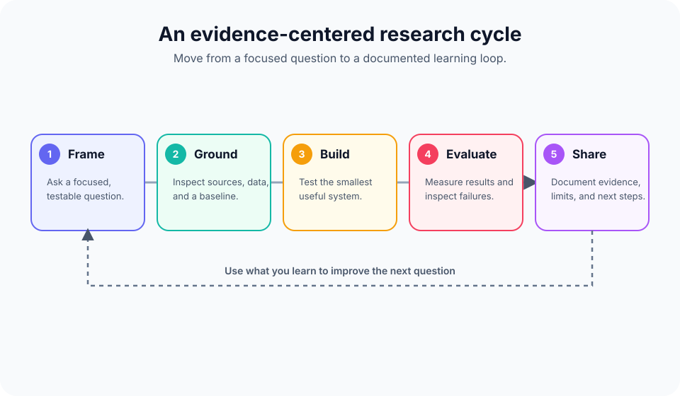
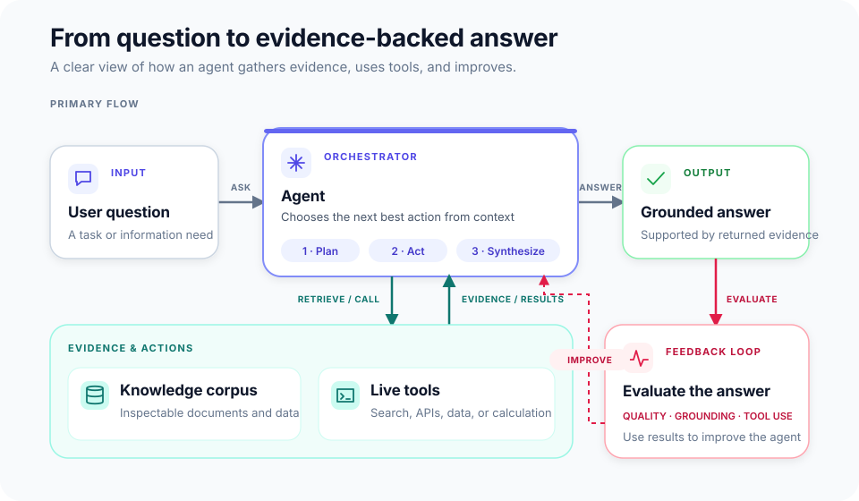
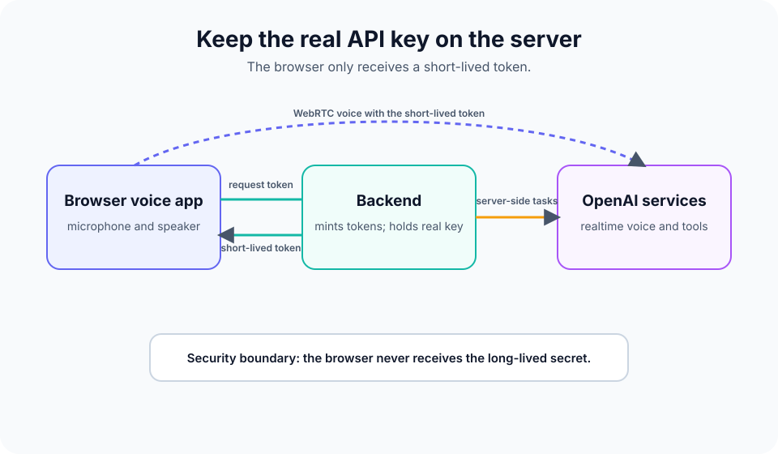

# Mui Research @ ASDRP · AI Agents

This is the working learning and research repository for the **Mui Research Group** in the [Aspiring Scholars Directed Research Program (ASDRP)](https://www.asdrp.org/). It supports talented high-school researchers as they move from learning how modern AI systems work to designing, implementing, evaluating, and communicating team research on AI/ML and agentic systems.

The companion [Mui Group research portal](https://sites.google.com/asdrp.org/mui) is the source for cohort logistics, meeting schedules, project materials, and current research updates. This repository is the hands-on counterpart: code, notebooks, tutorial explanations, slide decks, sample corpora, frozen reference outputs, and working voice applications.

## Why this repository exists

AI research is more than prompting a model until it produces an impressive answer. The group uses this repository to practice a research mindset:

- build a clear mental model before relying on a tool;
- turn an idea or concern into a focused, testable question;
- work in teams, with each researcher contributing a distinct and documented part;
- measure a system rather than judging it only by a few attractive examples;
- inspect failure modes, including hallucination, bias, safety, privacy, and unequal real-world impacts;
- communicate methods, evidence, limitations, and next steps clearly enough that others can reproduce and critique the work.

This aligns with the group’s broader goals: learn AI/ML and agentic foundations, understand current LLM toolchains, study algorithmic bias and consequential failures, and investigate ways to reduce harm. The materials are designed for advanced high-school students with basic Python familiarity; curiosity, careful reading, and collaboration matter more than arriving with prior ML experience.

## What is here

| Area | What it teaches | Main artifacts |
| --- | --- | --- |
| [`tutorials/`](./tutorials) | A 12-module path from retrieval-augmented generation (RAG) foundations to an evaluated agentic RAG capstone | Explanations, notebooks, slides, corpora, evaluation questions, frozen outputs |
| [`voiceagents/`](./voiceagents) | A hands-on real-time voice-agent minicourse that builds transcription, translation, and tool-using voice applications | Python CLIs, FastAPI services, Next.js apps, tutorials, slides, backend tests |
| [`feature_engineering/`](./feature_engineering) | A first-principles feature-store lab using Chronon and a real retail transaction log | Executable notebook, Chronon definitions, theory guide, diagrams, slides, and data documentation |

The three paths reinforce each other. The RAG track emphasizes retrieval quality, grounded generation, metrics, and agent evaluation. The voice track makes those systems tangible through real-time audio, browser and server transports, secure token handling, tool calls, and observability. The feature-engineering lab shows how to define, validate, and serve point-in-time-correct model inputs.



## Learning path 1: Agentic RAG and evaluation

[`tutorials/`](./tutorials) is an ordered, twelve-module curriculum. Each module has an explanatory guide; most include a runnable Jupyter notebook and slide deck. The recurring precious-metals corpus is deliberately small and inspectable, so researchers can see exactly what was retrieved and why.

| Module | Focus |
| --- | --- |
| 01 | What is RAG? |
| 02 | Embeddings and meaning |
| 03 | Similarity and vector search |
| 04 | Chunking a corpus |
| 05 | First real RAG system |
| 06 | Why evaluate? RAGAS setup |
| 07 | Retriever metrics |
| 08 | Additional retriever metrics |
| 09 | Generator metrics and LLM-as-judge |
| 10 | Reranking |
| 11 | From RAG to an agent; agent metrics |
| 12 | Capstone: compare, diagnose, and improve an agentic RAG system |

The later modules include `golden_questions.json` and `frozen/` reference artifacts. Treat them as reproducible baselines and teaching evidence, not as a substitute for running an experiment or explaining its result. The capstone is where a team should make its own defensible claims: establish a baseline, change one justified variable at a time, report metrics alongside qualitative failures, and state limitations.



### Run a RAG module

Requirements: Python and [uv](https://docs.astral.sh/uv/). From a module directory:

```bash
cd tutorials/01_what_is_rag
uv sync
uv run jupyter lab
```

Open that module’s notebook and read its `*_explanation.md` alongside it. Modules that use hosted services read shared credentials from `tutorials/.env`; start from [`tutorials/.env.example`](./tutorials/.env.example). Later modules may require Ollama Cloud, Cohere, or Metals.dev credentials. Never commit `.env` files or keys.

## Learning path 2: Real-time voice agents

[`voiceagents/`](./voiceagents) is an incremental build course. Begin at module 01; each module also stands on its own once its prerequisites are understood.

| Module | Build or concept |
| --- | --- |
| 01 | Audio foundations: sampling, PCM16, 24 kHz audio, and transports |
| 02 | A Realtime API WebSocket handshake and event stream |
| 03 | Live microphone transcription CLI |
| 04 | Live voice translation CLI |
| 05 | Full-duplex terminal voice assistant with interruption |
| 06 | FastAPI backend that mints short-lived browser tokens |
| 07 | Next.js/React browser voice assistant over WebRTC |
| 08 | Multi-mode capstone: transcribe, translate, and tool-using assist modes |
| 09 | Standalone production-minded capstone with tracing and deployment guards |

The first six modules are primarily Python. Modules 07 through 09 add a Next.js frontend; modules 08 and 09 pair it with a FastAPI backend. The final applications demonstrate three capabilities: live transcription, live translation, and an assistant that can call tools such as time lookup and web search.

### Run the voice course

Requirements: Python, [uv](https://docs.astral.sh/uv/), Node.js 18+, `npm`, a microphone, and a paid-tier OpenAI API key for Realtime API exercises.

```bash
cd voiceagents
cp .env.example .env
# Add OPENAI_API_KEY to .env. Do not commit it.

cd 01_voice_foundations
uv sync
uv run python src/main.py
```

Use each module’s README for its exact command. For the web capstones, run the FastAPI backend and Next.js app in separate terminals; see [`voiceagents/08_capstone_multimode/README.md`](./voiceagents/08_capstone_multimode/README.md) or [`voiceagents/09_capstone_openai/README.md`](./voiceagents/09_capstone_openai/README.md). The course’s [shared API facts](./voiceagents/docs/API_FACTS.md) record the intended models, endpoints, audio format, and event names.



## Learning path 3: Feature engineering and storage

[`feature_engineering/`](./feature_engineering) is a self-contained lab on feature stores, temporal correctness, and operational contracts. Using the [UCI Online Retail dataset](https://doi.org/10.24432/C5BW33), it builds historical purchase and cancellation features for a repeat-purchase prediction problem, then contrasts a valid chronological model with an intentionally leaked one.

The tutorial pairs a transparent NumPy reference implementation with genuine Chronon `GroupBy` and `Join` definitions. An optional local Spark backfill validates a small Chronon execution path; it is deliberately separate from the production deployment concerns of warehouse, stream, orchestration, online-store, and service integrations.

### Run the feature-engineering lab

Requirements: Python 3.12 or 3.13 and [uv](https://docs.astral.sh/uv/). No API key is required.

```bash
cd feature_engineering
cp .env.example .env
uv sync
uv run python _build_notebook.py
uv run jupyter lab
```

Start with [`feature_engineering/README.md`](./feature_engineering/README.md), then open `feature_store_tutorial.ipynb`. The companion [`FEATURE_STORE_THEORY.md`](./feature_engineering/FEATURE_STORE_THEORY.md) explains the concepts, diagrams, counterexamples, and production considerations. The initial notebook run downloads its public source data to an ignored local cache.

## Working as a research team

Use the curriculum to create research, not merely finish lessons. A practical team loop is:

1. **Frame** a narrow question with societal and technical context. Identify whose outcomes could be affected and what a useful success criterion would be.
2. **Ground** the work in relevant literature, datasets, and a baseline system. Keep sources, decisions, and assumptions visible to teammates.
3. **Build** the smallest implementation that can answer the question. Keep code, parameters, prompts, and data handling reproducible.
4. **Evaluate** with predeclared examples and metrics, then inspect failures. Separate measured results from interpretation.
5. **Iterate and communicate**: compare against the baseline, explain tradeoffs and limitations, prepare a proposal, progress report, talk, poster, abstract, or paper, and seek feedback.

Projects associated with the group span agentic long-term memory, multi-agent and game-theoretic systems, multimodal understanding, interpretable LLM failures, algorithmic fairness in areas such as health and dermatology, and gait analysis for health. These are directions for responsible inquiry, not pre-approved conclusions. A good project makes its data choices, risks, evaluation criteria, and uncertainty explicit.

## Responsible use and security

- Treat model output as a hypothesis, not an authoritative source. Verify factual and high-stakes claims with appropriate primary evidence.
- Do not place private, sensitive, student, medical, or otherwise restricted data into third-party services without proper authorization and safeguards.
- Examine datasets and outcomes for representation gaps, bias, misuse, and uneven impacts. A technically strong metric does not by itself establish fairness or safety.
- Keep API keys server-side. The voice web applications use short-lived ephemeral browser tokens so that a real API key is not shipped to the client.
- API calls can incur cost. Use minimal experiments, watch usage, and protect deployed paid endpoints with authentication, rate limits, and restrictive origins.
- Respect licenses, terms of use, attribution, and the program’s research expectations when using code, data, papers, or generated material.

## Repository conventions

- Start with the explanation/tutorial, then run the corresponding notebook or application.
- Read modules in order on a first pass; prerequisites are intentional.
- Use the included corpora, golden questions, and frozen outputs to understand a baseline before modifying it.
- Keep generated environments, notebooks’ checkpoints, artifacts, and secrets out of version control. The root [`.gitignore`](./.gitignore) covers common cases.
- Preserve a clear record of experiments: question, data version, configuration, run date, metric results, representative failures, and interpretation.

## Further information

- [Mui Group research portal](https://sites.google.com/asdrp.org/mui): schedule, cohort context, project links, and research materials.
- [`tutorials/`](./tutorials): Agentic RAG curriculum.
- [`voiceagents/README.md`](./voiceagents/README.md): voice-agent course overview and setup.
- [`voiceagents/docs/COURSE_DESIGN.md`](./voiceagents/docs/COURSE_DESIGN.md): instructional design for the voice course.
- [`feature_engineering/README.md`](./feature_engineering/README.md): feature-engineering lab overview, setup, and validation commands.

This repository is a learning laboratory: build carefully, question results, support teammates, and leave an evidence trail that makes the next research iteration better.
