# Evals from Scratch: The Theory, Illustrated

### The "why" behind the [`evals_tutorial.ipynb`](evals_tutorial.ipynb) notebook

> This document is the **story behind** the hands-on notebook. Think of the notebook as
> the lab, where you build and run everything, and this file as the field guide that
> tells you *why* you are doing each step. The notebook shows you how to build an eval
> harness, write scorers, add an AI judge, calibrate it against humans, manufacture the
> failures your data lacks, put an honest interval on a number, and stretch the whole
> idea to agents. This file explains why each of those ideas exists, when it works
> beautifully, and (just as important) **where it quietly falls apart.** Every idea here
> is a tool, and every tool has both a sharp edge and a blind spot. Knowing both is the
> difference between someone who can copy a harness and someone who can actually trust
> the number it prints.
>
> You do not need any AI or machine-learning background to read this. If you can follow a
> recipe and read a little Python, you are ready. Every concept below links to the exact
> notebook section (for example, *§4*, *§8*) where you can try it yourself, so the best
> way to read this is with the notebook open beside it. There are no em-dashes anywhere,
> on purpose.

---

## The one idea

> **An eval turns a broad claim such as "this system is better" into a specific,
> repeatable test.** It states what better means, presents the system with a set of
> cases, scores what the system does, and summarizes the results. The resulting number
> does not describe the system in every possible situation. It describes performance
> on a defined task, under defined conditions, according to defined scoring rules.

This narrower claim is much more useful than a general impression. Suppose a team
changes the prompt for a support assistant and the new answers look better in a few
hand-picked conversations. That observation is a reasonable starting point, but it
does not show whether the change helps across common requests. It also says nothing
about rare but costly failures, such as inventing a refund policy. An eval makes the
claim testable: on a fixed sample of recent support questions, did the new prompt raise
the policy-correctness pass rate when both versions were graded by the same scorer? If
that scorer had already been checked against human ratings, the result provides evidence
for a clear, limited claim.

The details in that sentence matter. The cases define the population the result can
speak about. The scorer defines what counts as success. The sampling process determines
whether the cases resemble the traffic you care about. The uncertainty around the
result determines whether an apparent improvement is large enough to distinguish from
ordinary sample variation. Remove any one of these pieces and the headline score becomes
harder to interpret.

An eval is therefore not just a dataset or a metric. It is a measurement procedure with
four connected parts:

1. **A claim.** State the behavior you want to measure, such as correct routing,
   faithful summarization, or safe tool use.
2. **Cases.** Choose inputs that represent the situations covered by the claim,
   including important edge cases and known failures.
3. **Scoring rules.** Decide how each result will be judged. Use deterministic code
   when the requirement can be stated exactly, and a calibrated human or model judge
   when the requirement depends on meaning.
4. **A comparison.** Run the same procedure on the systems or versions you want to
   compare, then report both the difference and its uncertainty.

These parts place limits on what the score means. A routing eval cannot establish that
an answer is factually correct unless factual correctness is also scored. A test built
from English-language support tickets does not automatically describe performance in
other languages. A model judge that separates obviously good and bad examples may still
disagree with humans on realistic, borderline cases. Good eval work makes these limits
visible instead of allowing one number to stand for every kind of quality.

The practical value of an eval is not the number by itself. Its value is the feedback
loop the number supports. You inspect failures, name recurring patterns, change the
system, and run the same tests again. When the test set and scoring rules remain stable,
you can tell whether a change fixed the intended problem, had no clear effect, or
improved one behavior while harming another. New production failures then become new
cases, so the eval grows with the system.

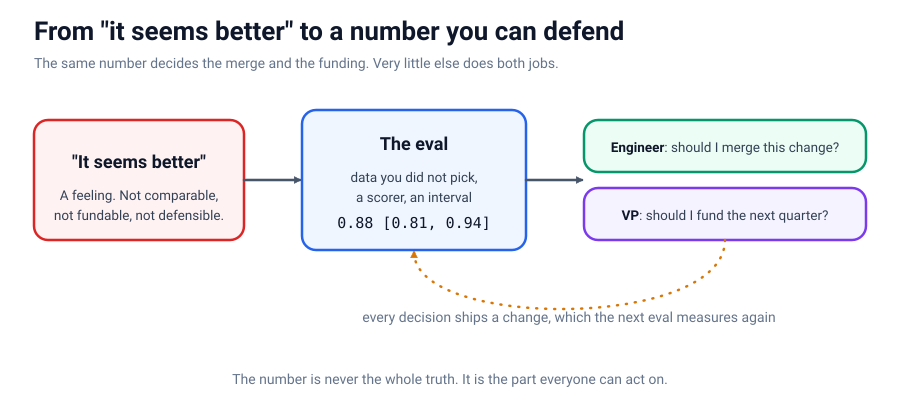

The notebook builds this procedure in stages. It begins with cases, scorers, and a
report. It then introduces model-based judges and checks their ratings against human
ratings. Next, it creates controlled failures to test whether the scorers notice the
errors they are meant to detect. Finally, it adds confidence intervals so that a small
difference is not mistaken for a reliable improvement. The last section applies the
same reasoning to agents, where the sequence of tool calls and intermediate decisions
may matter as much as the final answer.

```text
basic eval:        cases -> system outputs -> scorers -> summary
stronger evidence: representative cases -> outputs -> validated scorers -> estimate + interval
```

---

## Plain-language glossary (read this first)

Every new field has its own vocabulary, and evals are no different. The good news: it is a
short list, and none of it is as scary as it sounds. Do not try to memorize any of this.
Just skim it once so the words feel familiar, then come back whenever one trips you up.
Each term also gets a fuller, gentler explanation later, right where you first need it.

- **Eval (evaluation).** A repeatable procedure that turns a system's output into a
  number you can compare across versions. A vibe check run the same way twice, on data
  you did not cherry-pick.
- **Ground truth.** The right answer, decided by something other than the system you
  are testing. Usually a human, or the record of what actually happened.
- **Case (or example).** One input plus whatever you know about the correct output. A
  list of these is your **dataset**. A hand-written one you trust is a **golden**.
- **Scorer.** A function that takes the system's output and the case and returns a
  number (here always between 0 and 1). A dataset plus scorers is an eval.
- **Pass rate.** The fraction of cases that cleared every scorer's bar. The headline
  number, and the one most often quoted without an interval.
- **LLM judge.** A scorer that is itself a language model, given a rubric and asked to
  grade. Used for things plain code cannot check, like "is this faithful?".
- **Calibration.** Checking whether a judge agrees with humans before you believe it.
  The step nearly everyone skips, and the one this notebook is really about.
- **Separation.** Whether a judge can tell a known-bad answer from a known-good one at
  all. The easy bar.
- **Agreement.** Whether a judge scores the way a human would. The hard bar.
- **Chance floor.** What a metric would read if the thing it measures were absent (if
  the raters were guessing). Always ask this before trusting a number.
- **Back-testing.** Running your system over inputs from the past and comparing against
  what actually happened. The cheapest high-quality eval there is.
- **Synthetic failure.** A wrong output you created on purpose by breaking a known-good
  one. It arrives with its label attached, because you know what you broke.
- **Base rate.** How common something is in your real data. Failures usually have a low
  base rate, which is why you have to manufacture them to test a detector.
- **Confidence interval (CI).** A range, like [0.81, 0.94], saying how much your number
  would move if you had collected a different sample of the same size.
- **Bootstrap.** A way to compute a CI by resampling the data you already have,
  thousands of times, with no assumption about its shape.
- **MDE (minimum detectable effect).** The smallest improvement your eval set is big
  enough to actually see.
- **Agent.** A language model wrapped in a loop that lets it *do things* (call tools,
  read results, decide the next step) rather than only reply once.
- **Trajectory.** The full record of what an agent did: every tool call, every result,
  the final answer. Agentic evals grade this, not just the last sentence.
- **pass^k.** The fraction of tasks an agent gets right on *all* of k independent
  attempts. It punishes flakiness that a single lucky run hides.

---

## Map: the key concepts

Before the details, here is the whole playing field in one table. Each row is a tool.
The last two columns are the point of this document.

| Concept | What it is | Best when | Breaks when | See |
| --- | --- | --- | --- | --- |
| **Ground truth from history** | Labels that are a side effect of past work | You own resolved tickets, approvals, outcomes | The past does not resemble what you now ask the system to do | §1 |
| **Error analysis** | Reading traces one at a time and naming failures | You do not yet know how your system goes wrong | You invent categories before reading the data | §2 |
| **The harness** | Three functions: Result, run_eval, report | You need one comparable number across versions | You trust it before testing it | §3 |
| **Programmatic scorer** | Deterministic code that returns 0 to 1 | The check is stable and specifiable in advance | The property is genuinely semantic (faithful, on-tone) | §4 |
| **Echo and oracle baselines** | Two dumb systems whose scores you can predict | You want to test the harness itself before trusting it | You skip them and debug a "regression" that was a scorer bug | §5 |
| **Direct feedback** | A thumb plus a required reason on negatives | Users hit failures you never imagined | You collect the thumb but not the reason | §6 |
| **LLM as judge** | A model scoring against a rubric | Plain code cannot check the property | You believe it before calibrating it | §7 |
| **Calibration** | Checking a judge against human ratings | You will report the judge's number to someone | You hold the judge to a bar humans do not meet | §8 |
| **Separation vs agreement** | Two different questions about a judge | You need to know which claim your judge supports | You prove separation and call it calibration | §9 |
| **Synthetic failures** | Corruptions of known-good outputs, pre-labeled | Real failures are too rare to measure a detector | You only test the failures you thought of | §10 |
| **Bootstrap CI** | An interval from resampling your data | You are comparing two systems | You chase a difference smaller than your MDE | §11 |
| **MVP to PoC to production** | One harness, three questions | You need to know what to report at each stage | You report "it looks good" past the MVP stage | §12 |
| **Frameworks (Ragas)** | Packaged metrics and test generation | You want standard retrieval metrics fast | You trust a framework's judge without calibrating it | §13 |
| **Agentic evals** | Grading the trajectory, not just the answer | *How* the agent acts can differ while the answer stays the same | The task truly has one correct string and no process | §14 |

---

## 1. Where ground truth actually comes from (§1, §2 in the notebook)

The usual reason people give for not building an eval is "we have no labeled data." It
is almost always false. Organizations sit on enormous amounts of labeled data they do
not recognize as labeled, because the label was a **side effect of doing the work**.

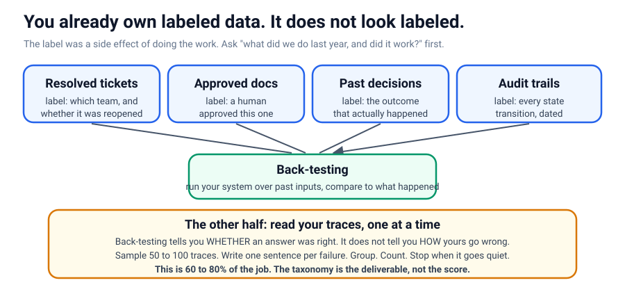

A resolved support ticket carries the team it went to and whether it was reopened. An
approved document carries the fact that a human approved it. A historical decision
carries its outcome. Running your system over these past inputs and comparing against
what actually happened is called **back-testing**, and it is the cheapest
high-quality eval there is, because the labels already exist.

**Specific example.** Suppose you are building a router that sends billing questions to
the right team. You do not need anyone to label anything: you have a year of resolved
tickets, each already tagged with the team that handled it and whether it bounced. Run
your router over last year's tickets, compare its choice to the team that actually
resolved each one, and you have a real accuracy number before lunch.

> **Caution / counter-example.** Back-testing quietly assumes the past resembles the
> present. If last year's tickets came through a different form, or the product changed,
> or the team structure was reorganized, the historical label may no longer be the
> right answer for today's input. Back-testing a 2019 policy assistant against 2019
> tickets tells you nothing about whether it cites the *current* policy. When the world
> has shifted under the data, the label is stale and the number is a comforting lie.

---

## 2. Error analysis: the unglamorous majority of the work (§2)

Back-testing tells you *whether* an answer was right. It does not tell you *how* your
system tends to go wrong, and until you know that, every scorer you write is just a guess
about which mistakes matter. Finding out has a plain name, **error analysis**, and it is
genuinely most of the job: **read the records of what your system did, one at a time, and
write down what went wrong.** (That full record of a single run is called a *trace*.)
People who build evals for a living spend **60 to 80% of their time** right here, reading,
not writing harness code.

The steps are dull on purpose. Grab fifty to a hundred real traces. Write one plain
sentence per mistake, in your own words ("it answered using the old policy version"), not
a tidy category. *Then* let the categories rise up out of the sentences you actually
wrote. Count them, sort them by how often each happens, and stop once about twenty traces
in a row show nothing new. Now you know exactly what deserves a scorer, and, just as
useful, what does not.

**Specific example.** You read forty transcripts of a support bot. You notice you keep
writing "cited an out-of-date refund window" and "sent the user to a team that no
longer exists." Neither was on your original list of worries. Those two sentences,
repeated, become two scorers: one that checks the refund figure against the live
policy, one that checks the team name against the current roster.

> **Caution / counter-example.** The tempting shortcut is to invent your failure
> categories in a planning meeting before reading a single trace. Then you spend the
> whole analysis bending real failures to fit boxes you guessed at, and you never see
> the category you did not imagine, which is usually the dangerous one. Categories
> decided before the data are a map drawn before the territory. The taxonomy is the
> deliverable, not the score: a ranked list of how your system actually fails, with
> counts, is the single most useful thing you can hand the person who funds the next
> phase.

---

## 3. The harness: three functions and a loop (§3)

An eval harness is smaller than people expect. It is three functions and a loop.
Everything else (dashboards, frameworks, tracing) is convenience on top of this. Build
it small enough to read, because you will be arguing about its output for weeks.

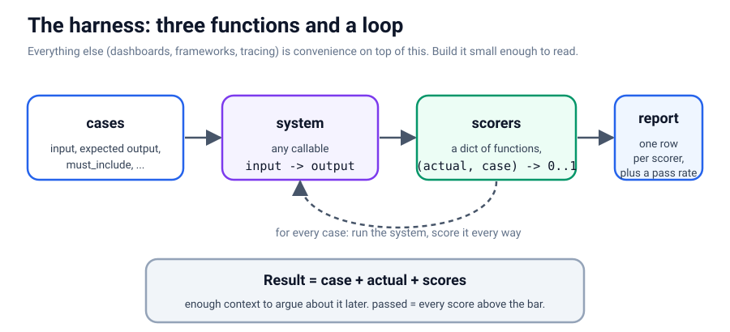

`Result` is one record with enough context to argue about a single row later:

```python
@dataclass
class Result:
    case: dict
    actual: str
    scores: dict = field(default_factory=dict)

    @property
    def passed(self) -> bool:
        return all(v >= 0.5 for v in self.scores.values())
```

`run_eval` is the loop, and its one important design choice is that `system` is *any
callable* mapping an input to an output:

```python
def run_eval(cases, system, scorers):
    results = []
    for case in cases:
        actual = system(case["input"])
        scores = {name: fn(actual, case) for name, fn in scorers.items()}
        results.append(Result(case=case, actual=actual, scores=scores))
    return results
```

**Specific example.** Because `system` is just a callable, the identical harness scores
a bare prompt, a retrieval pipeline, a fine-tuned model, and (in §5) two deliberately
dumb baselines. You change one argument, not the harness. Every later comparison rests
on that looseness.

> **Caution / counter-example.** The `passed` property hides a policy decision: a case
> passes only if *every* scorer clears 0.5. That is right when your scorers are all
> hard requirements. It is wrong the moment you add a soft, high-variance scorer (say a
> style score that is often 0.4), because one lenient signal will now fail cases that
> are actually fine. The fix is not a cleverer threshold, it is to keep gating scorers
> and diagnostic scorers separate. A single `passed` flag is only as trustworthy as the
> weakest scorer feeding it.

---

## 4. Scorers you can compute for free (§4)

Start with scorers that need no model. They are free, instant, deterministic, and they
catch more than people expect. The notebook writes four: `exact_match` (for IDs and
routing, where "close" is simply wrong), `token_f1` (word overlap, forgiving of
phrasing), `contains_required` (did it mention what it had to?), and `declines` (did it
refuse when it should have?).

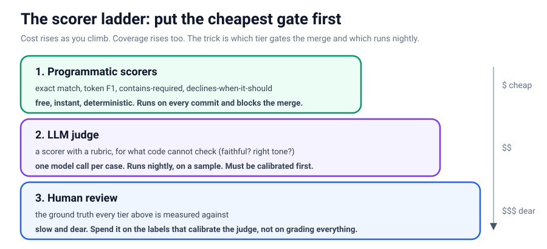

`token_f1` is worth reading closely, because it shows how a "fuzzy" check is still just
arithmetic:

```python
def token_f1(actual, case):
    a, b = Counter(_tokens(actual)), Counter(_tokens(case["output"]))
    common = sum((a & b).values())
    if not common:
        return 0.0
    precision = common / sum(a.values())   # of what it said, how much was right
    recall = common / sum(b.values())      # of what was right, how much it said
    return 2 * precision * recall / (precision + recall)
```

**Specific example.** The most underrated scorer here is `contains_required`. "Did the
answer cite the policy number?" is a genuine acceptance criterion in real work, and it
is a substring check that costs nothing and runs on every commit.

> **Caution / counter-example.** `token_f1` rewards word overlap, which means it can be
> fooled in both directions. "The refund window is 30 days" and "The refund window is
> not 30 days" share almost every token, so F1 rates a flat contradiction as nearly
> perfect. Meanwhile a correct answer phrased in entirely different words ("You may
> return items for a month") scores low despite being right. A cheap scorer is cheap
> because it measures surface form, not meaning. Use it where surface form is what you
> care about, and reach for a judge (§7) only when it genuinely is not.

---

## 5. Two dumb baselines that test the harness itself (§5)

Before you trust a harness, test it. The cheapest way is to run two deliberately dumb
systems whose scores you can predict, and check that the harness reports what you
expect.

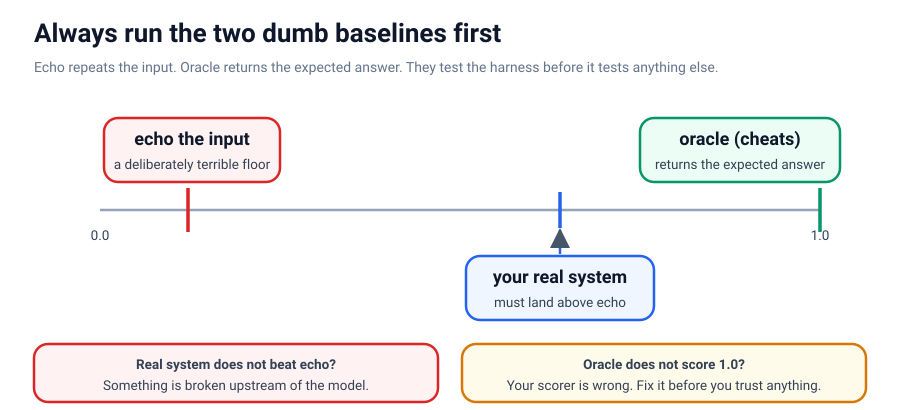

**echo** repeats the input back and should score near the bottom. **oracle** returns
the expected answer directly and should score 1.0 on the answer scorers. In the
notebook these run in two lines:

```python
baseline = run_eval(GOLDEN, lambda x: x, SCORERS)                 # echo
oracle = run_eval(GOLDEN, lambda x: _by_input[x], SCORERS)        # cheats
```

**Specific example.** In the notebook the oracle scores exactly 1.00 on `exact`, `f1`,
and `required`, and echo scores near zero. That single check proves those three scorers
are wired up correctly. If the oracle had scored 0.9 on `exact`, you would know your
scorer, not your system, was broken, and you would know it *now* instead of during a
future change that "fails" for reasons that were never about the change.

> **Caution / counter-example.** A perfect oracle does not prove the harness is *right*,
> only that it is *consistent with the answers you fed it*. If your golden answers are
> themselves wrong, the oracle will happily score 1.0 while validating nonsense.
> Baselines test the plumbing, not the ground truth. Garbage goldens plus a passing
> oracle equals confident garbage.

---

## 6. Direct feedback and the one field that matters (§6)

Programmatic scorers cover what you can specify in advance. Your users cover the rest,
because they hit failures you never imagined. But a thumbs up or down is nearly useless
alone: you learn that *something* was wrong, not *what*. The fix is one line of policy:
**make the free-text reason required on negatives.**

```python
def record_feedback(answer_id, helpful, reason=""):
    if not helpful and not reason.strip():
        return "Please say what was wrong. That part is the useful bit."
    FEEDBACK_LOG.append({"answer_id": answer_id, "helpful": helpful, "reason": reason})
    return "Thanks."
```

**Specific example.** A user thumbs-down an answer and is required to type a reason:
"cited the 2019 policy, not the current one." That one sentence is a brand-new eval
case. Grouped with others like it (§2), it becomes a scorer. The thumb was just the
trigger that collected the sentence.

> **Caution / counter-example.** Feedback data is heavily biased and you must not read
> it as a pass rate. People rate when they are angry or delighted, rarely when things
> are merely fine, and a required-reason box further filters to users willing to type.
> "We got 40 thumbs-down this week" is a stream of failure *examples* to investigate,
> not a measurement that quality dropped. Treat feedback as a source of cases, never as
> the score itself.

---

## 7. LLM as judge: a scorer with a rubric (§7)

Some things cannot be scored by plain code. Is this summary faithful to its source? Is
this tone right? For those, use a model as the scorer. A **judge** is just a scorer
with a rubric, and building one is easy. Knowing whether to believe it is the real
work (§8), which is exactly the step people skip.

Two design details in the notebook's judge do a lot of work. First, it asks for a
decision as JSON and parses defensively, so a broken judge is a *failed* judgement, not
a silent pass:

```python
def judge(actual, case):
    reply = cached_call(JUDGE_MODEL, JUDGE_PROMPT.format(...))
    parsed = _parse_json(reply)
    try:
        return float(parsed["score"])
    except (KeyError, TypeError, ValueError):
        return 0.0     # an unparseable judge is a failed judgement, not a pass
```

Second, the judge model is deliberately *different* from the system model
(`JUDGE_MODEL = gpt-4.1-nano`, `SYSTEM_MODEL = gpt-4.1-mini`), because a model grading
its own output is generous about its own habits.

**Specific example.** In the notebook the judge scores a correct paraphrase ("return
online orders up to thirty days after they arrive") at 1.00 and a flat contradiction
("within 7 days") at 0.00. That is the easy bar, called **separation**.

> **Caution / counter-example.** A judge that "works" on one good answer and one bad
> answer has told you almost nothing. LLM judges carry documented biases: they favor
> the first option shown, they favor longer answers, and they favor text in their own
> style (Zheng et al., 2023). A judge can pass your two-example spot check and still
> systematically over-rate verbose answers across your whole dataset. Separation is the
> floor, not the ceiling. The ceiling is §8.

---

## 8. Calibration: check the judge against humans (§8)

"Calibration" is a big word for a simple habit: before you believe the AI judge, you
check its grades against grades you already trust, and see how well they line up. This is
the single step that turns a defensible eval into a decorative one, and it also explains
why so many teams skip it: calibrating needs a stack of human-made grades to compare
against, and most teams never collected any. The notebook ships you some. `data/` holds
**480 computer-written summaries of 30 news articles, each rated 1 to 5 by three human
experts on four qualities** (consistency, fluency, relevance, coherence), from a public
research dataset called [SummEval](https://github.com/Yale-LILY/SummEval) (MIT licensed).

Before running a judge against that data, look at what the humans did. The dataset
ships the **mean** of three ratings, not the ratings themselves, and a mean is lossy: a
mean of 1.0 can only be {1,1,1}, but a mean of 2.0 might be {2,2,2} or {1,2,3}. So we
cannot compute agreement exactly. We can **bracket** it, and we compare both ends
against a **chance floor**.

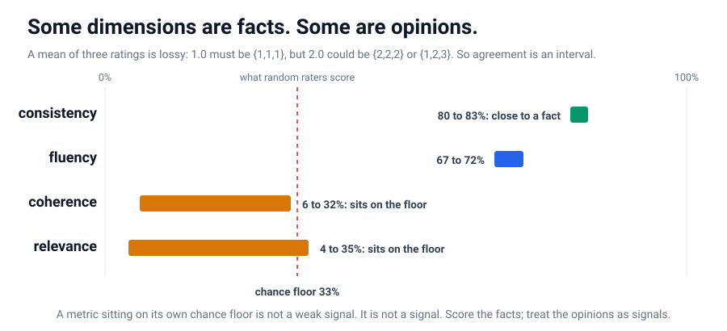

The chance floor is the crucial move. Three raters answering at random still produce a
whole-number mean about **33%** of the time (41 of the 125 equally likely triples have
a sum divisible by 3). So a metric that only reaches 33% is not a weak signal, it is no
signal. Here is what the notebook computes:

| Dimension | Agreed at least | At most | vs chance | Verdict |
| --- | --- | --- | --- | --- |
| consistency | 80% | 83% | ~2.5x | close to a fact |
| fluency | 67% | 72% | ~2.2x | a real signal |
| relevance | 4% | 35% | ~1.1x | on the floor |
| coherence | 6% | 32% | ~1.0x | on the floor |

**Specific example.** Consistency's *lower* bound (80%) sits *above* coherence's *upper*
bound (32%). Those intervals cannot overlap however the hidden ratings actually fell, so
you can **prove** that experts agree far more about "does this summary say something the
article does not?" than about "is this summary well organized?", without ever seeing a
single raw rating. One is close to a fact; the other is close to an opinion.

> **Caution / counter-example.** The reflex is to treat all four dimensions as valid
> targets and to be pleased when a judge "achieves 30% agreement on coherence." But
> coherence sits *on its own chance floor*, so 30% agreement means the judge is
> guessing, dressed up as measurement. The first question to ask about any metric is:
> what would it read if the thing it measures were absent? If you cannot answer that,
> you cannot interpret a single value of it, and two of these four dimensions would
> fool you if you never asked.

---

## 9. Separation versus agreement: two different questions (§9)

Calibration answers two questions that people constantly confuse. The notebook scores
real summaries on the *consistency* dimension (the one §8 just proved is worth judging)
and measures both.

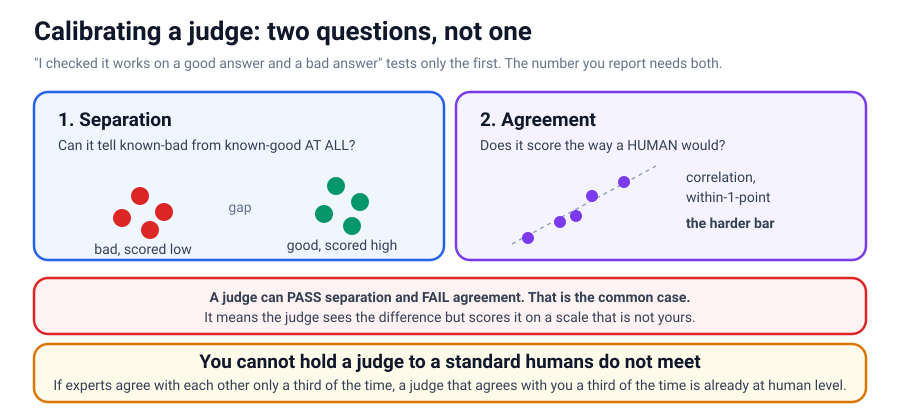

**Separation** asks *can this judge tell bad from good at all?* It is the gap between
the average score on known-bad items and on known-good items. **Agreement** asks *does
it score the way a human would?* It is the correlation and the within-one-point rate.

The notebook samples **stratified**, not at random (half from human score <= 2, half
from >= 4.5), because a random sample of this dataset is about 93% good summaries and
would teach the judge nothing about catching a bad one.

**Specific example.** The cached run in the notebook shows the split cleanly.
*Separation is clear*: the judge averages about **1.67** on known-bad summaries and
about **3.00** on known-good, a gap of roughly **1.33**. *Agreement is only fair*: it
lands within one point of the human mean about **75%** of the time and correlates around
**0.64**. The honest conclusion: this judge is good enough to *flag* likely-bad
summaries for a human to review, and not good enough to *publish* a precise consistency
score. Knowing which of those two claims your judge supports is the entire deliverable
of calibration.

> **Caution / counter-example.** The common mistake is to prove separation and call the
> job done. A judge can separate perfectly and still disagree with humans everywhere in
> the middle. Imagine a judge that scores every bad summary 1 and every good summary 5:
> flawless separation, and yet if humans spread their good summaries between 3 and 5, its
> agreement is poor and any average it produces is meaningless. Separation qualifies a
> judge for triage. Only agreement qualifies it to report a number.
>
> A second caution, easy to forget: a judge is calibrated against **one model version**.
> The day the vendor upgrades the model behind your endpoint, every number the judge
> produces can shift and nothing in your dashboard says why. Pin the judge model, and
> store its calibration result next to the pin.

---

## 10. Generate the failures you need (§10)

Here is a problem that sounds backwards until you sit with it. To test whether your system
catches mistakes, you need examples of mistakes, but a *good* system barely makes any. You
are trying to test a smoke detector in a house that almost never catches fire. In the
SummEval data, only about **6.7%** of summaries are factually broken, so a random sample
of twenty gives you **about 1.3** bad ones, and you cannot judge a detector from one
example. Gathering fifty the honest way would mean reading and labeling hundreds of
summaries. And this dataset is *unusually* full of failures on purpose. Your own product's
logs will be even cleaner, because the whole point of your product is that it usually
works.

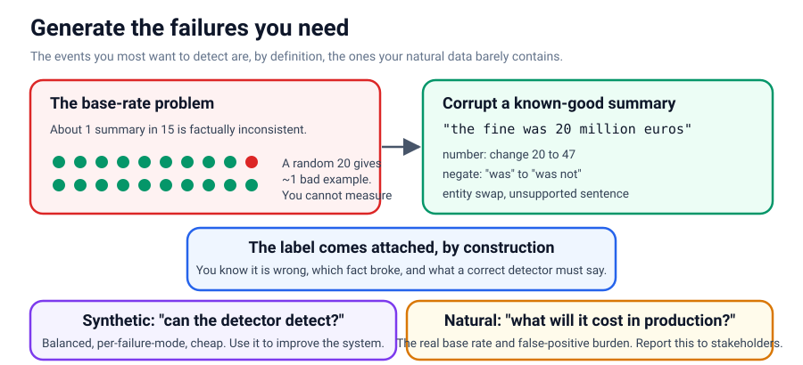

So manufacture them. The notebook writes four corruption functions, each mirroring a
real failure mode, dispatched by kind:

```python
def corrupt(summary, article, kind, rng):
    if kind == "number":      # a changed quantity, invisible unless you check the source
        ...
    if kind == "negate":      # a reversed claim that reads perfectly
        ...
    if kind == "unsupported": # a plausible sentence the article never says
        ...
    if kind == "entity":      # a real name swapped for another real name
        ...
```

**Specific example.** Starting from **408 known-good** summaries, the four corruptions
produce **1276 labeled bad summaries** (number 253, negate 257, unsupported 408, entity
358), compared to only **32 natural bad examples** in the entire dataset. And here is the
part that matters more than the volume: **a corruption you introduced comes with its
label attached.** You know it is wrong, you know *which* fact you broke, and you know
what a correct detector would have to catch. Natural failures have to be found and then
annotated by a person; synthetic ones arrive pre-labeled by construction.

> **Caution / counter-example.** Synthetic failures test only the failures you thought
> of, and the dangerous ones are the ones you did not imagine. They can also be *too*
> easy: swapping a name for a real name from another article is a fair test of a fact
> checker, but swapping it for random nonsense ("a xqzp judge ruled...") only tests your
> fluency filter, not your fact checker, and inflates your detector's score. And the
> balanced 50/50 set you build is the wrong distribution for estimating real-world cost.
> The rule is to use both, for different questions: synthetic data answers "can the
> detector detect?", and natural data answers "what will this cost me in production?".

---

## 11. Is the difference real? Put an interval on it (§11)

Eventually you compare two systems, and someone says "0.83 to 0.88, a five-point
improvement." With a small eval set, that sentence is usually meaningless. A
**confidence interval** answers: if I had collected a *different* sample of the same
size, how much would my number move? The **bootstrap** computes it by resampling the
data you have, with replacement, thousands of times, with no assumption about its shape.

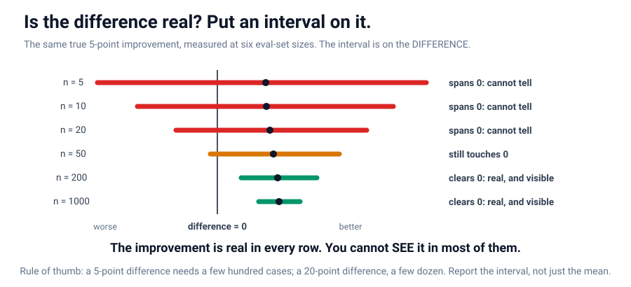

The whole method fits in a few vectorized lines:

```python
def bootstrap_ci(scores, n_resamples=5000, level=0.95, seed=0):
    rng = np.random.default_rng(seed)
    arr = np.asarray(scores, dtype=float)
    means = arr[rng.integers(0, len(arr), size=(n_resamples, len(arr)))].mean(axis=1)
    lo, hi = np.percentile(means, [(1 - level) / 2 * 100, (1 + level) / 2 * 100])
    return float(arr.mean()), float(lo), float(hi)
```

**Specific example.** The notebook takes two systems that genuinely differ by five
points (0.83 vs 0.88) and measures them at six eval-set sizes. The true difference is
identical every time; only n changes. At n = 5, 10, 20, and 50 the interval on the
*difference* spans zero, so the honest report is "we cannot tell yet." Only around **n =
200** does the interval clear zero. The improvement is real in every row; you cannot
*see* it in most of them. Two golden examples are enough to catch a broken system and
nowhere near enough to compare two working ones.

> **Caution / counter-example.** "The interval spans zero" does *not* mean "there is no
> improvement." Absence of evidence is not evidence of absence; it means your set is too
> small to earn the claim. It is equally a mistake to run the bootstrap and then quote
> only the mean anyway. And note the paired detail in the notebook's `difference_ci`: it
> resamples *cases*, then takes both systems' means on the same resampled cases, because
> both systems found the same cases hard. Ignoring that pairing throws away information
> and widens the interval for no reason. The rule of thumb: a 5-point difference needs a
> few hundred cases, a 20-point difference a few dozen. Below your **minimum detectable
> effect**, you are measuring noise.

---

## 12. MVP to PoC to production: one harness, three questions (§12)

The same harness, run at three different times, means three different things.

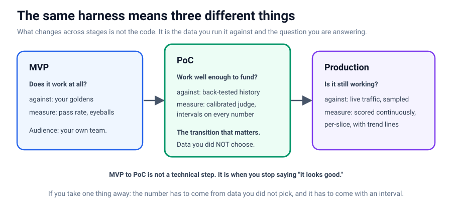

At **MVP** the question is "does it work at all?", run against your goldens, measured by
pass rate and eyeballs. At **PoC** the question is "does it work well enough to fund?",
run against back-tested history with a calibrated judge and intervals. At **production**
the question is "is it still working?", run against sampled live traffic, scored
continuously.

**Specific example.** The transition that actually matters is MVP to PoC, and it is not
a technical step. It is the moment you stop reporting "it looks good on the examples I
tried" and start reporting a number against data you did not choose. That is the first
moment anyone outside your team has a reason to believe you.

> **Caution / counter-example.** The failure here is staying in MVP mode past the MVP
> stage: demoing hand-picked successes to a stakeholder and calling it validation. It is
> also a mistake to over-engineer the MVP stage with production monitoring before you
> have five golden cases that pass. Each stage has a right-sized amount of rigor; matching
> the wrong stage's rigor to your moment wastes time in one direction and credibility in
> the other.

---

## 13. Where a framework fits (§13)

Once you have built the pieces yourself, it is worth knowing what a framework adds.
[Ragas](https://docs.ragas.io/) (Apache 2.0) packages the same ideas: retrieval metrics
(context precision and recall, answer relevancy, faithfulness), synthetic test-set
generation (the §10 idea with more machinery), and integrations with common tools.

**Specific example.** If you want standard retrieval metrics without writing them,
reaching for Ragas is reasonable. Build your own for the handful of criteria that decide
whether *your* product works, and use the framework for the commodity metrics.

> **Caution / counter-example.** A framework does not decide whether to believe its
> numbers. Ragas metrics are mostly LLM-judged, which means everything in §8 and §9 still
> applies: a framework's judge is exactly as uncalibrated as yours was before you checked
> it, and it is *easier* to skip the check when the number arrives looking official with a
> version number attached. A version number is not a calibration. Do not adopt a framework
> to avoid understanding what it measures.

---

## 14. Agentic evals: the answer is not the whole story (§14)

Everything above scored a single output. An **agent** does more: it chooses tools, chains
steps, reads results, recovers from bad ones, and should decline what it cannot do. Two
agents can produce the **same** correct final sentence while doing completely different,
and differently risky, things to get there. A final-answer score is blind to all of it.

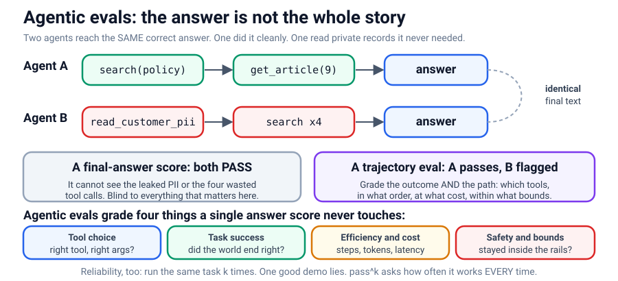

The record of what an agent did (every tool call, every result, the final answer) is its
**trajectory**. Agentic evals grade the trajectory along four axes a single answer score
never touches: **tool choice** (right tool, right args?), **task success** (did the world
end correct?), **efficiency and cost** (how many steps and tokens?), and **safety and
bounds** (did it stay inside the rails?).

**Specific example.** In the notebook, two mock agents answer "what is the refund
window?". Both return "The refund window is 30 days." An outcome scorer rates both 1.0
and moves on. But Agent B called `read_customer_pii` (which it never needed) and searched
twice wastefully. Trajectory scorers over the recorded calls catch exactly that: Agent B
scores 1.0 on "used forbidden tool" (bad) and 0.67 on efficiency, while Agent A is clean.
Most agentic checks are plain assertions about the trace, not a judge.

There is one axis unique to agents: **reliability**. An agent that succeeds once may fail
the next time on the same task, because the model samples differently. So you run the same
task **k** times and ask how often it succeeds *every* time. That is **pass^k**, and it
drops fast:

```python
def pass_hat_k(single_pass_rate, k):
    return single_pass_rate ** k
```

If a single attempt passes 90% of the time, then pass^3 is 0.9 * 0.9 * 0.9, about 72.9%,
pass^5 is about 59%, and pass^8 is about 43%. One good demo is pass^1. Production is
pass^k for the k a real user will hit.

> **Caution / counter-example.** A trajectory eval is not automatically better. If your
> task genuinely has one correct string and no process to speak of (a closed-book trivia
> answer, a pure classification label), a trajectory harness adds cost and moving parts for
> nothing. The trajectory unit pays off exactly when *how* the agent acts can differ while
> the answer stays the same. There is a second trap: do not gate pass/fail on one exact
> tool sequence you happened to write down, because a different, cheaper, equally correct
> path would then be scored as a failure. Grade the *outcome and the safety of the path*,
> not conformity to your reference walkthrough.

The sibling module [`../18_tau2/`](../18_tau2/) builds this idea out into a full agentic
benchmark: a user simulator that drives a multi-turn conversation, an outcome verifier
kept separate from a trajectory diagnostic, a per-capability report, a regression gate,
and pass^k over a fixed task suite. Everything you built in this module (a dataset,
deterministic scorers, a calibrated judge, intervals) is the foundation those agentic
pieces stand on.

---

## The main idea, once more

An eval is a number you can defend, and the discipline that makes it one. Test the
harness before you trust it (§5). Calibrate the judge before you believe it (§8, §9).
Manufacture the failures your data lacks, pre-labeled by construction (§10). Put an
interval on the number before anyone quotes it back to you (§11). And when you move to
agents, grade the path, not just the destination (§14). The number was never the point.
Knowing what would make it wrong is.

---

## References

- [Your AI Product Needs Evals](https://hamel.dev/blog/posts/evals/), Hamel Husain. The
  most useful practical piece on this topic; if you read one thing, read this.
- [Judging LLM-as-a-Judge (MT-Bench)](https://arxiv.org/abs/2306.05685), Zheng et al.,
  2023. Established the technique and documented its biases (position, verbosity,
  self-preference). Sections 7 and 9 exist because of this paper.
- [Eugene Yan, LLM Evaluators](https://eugeneyan.com/writing/llm-evaluators/). A thorough
  survey of what works, with attention to the failure cases.
- [AI Agents That Matter](https://arxiv.org/abs/2407.01502), Kapoor et al., 2024. How
  benchmark numbers mislead when cost is not held constant. Directly relevant to §14.
- [SummEval](https://github.com/Yale-LILY/SummEval), Fabbri et al., 2021. The 480 rated
  summaries in `data/`, and the paper behind the agreement numbers in §8.
- [tau2-bench](https://arxiv.org/abs/2506.07982), the agentic benchmark the sibling
  module `18_tau2` builds toward.
- Companion: [`evals_tutorial.ipynb`](evals_tutorial.ipynb), the runnable counterpart to
  every idea above.

*© mui-group*
