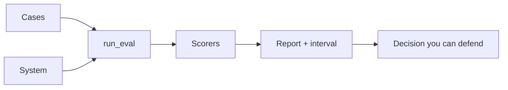

# Topic 20: Evals from Scratch, for LLMs and Agents

> "It seems better" is not something anyone can act on. An **eval** (short for
> evaluation) turns that feeling into a number you can trust and defend: comparable
> across versions, repeatable, and honest about its own uncertainty. This module builds
> one from nothing, and assumes no AI or machine-learning background to start.

Imagine your school swaps in a new essay-grading app and a teacher says "I think it grades
better than the old one." That is a feeling, and a principal cannot spend money on a
feeling. To settle it, you would take essays a human already graded, run both apps, and
count how often each matches the human. Now "better" is a number. That is the whole idea of
this module, and everything here is a careful version of that one move.

Most eval tutorials hand you a framework and a dashboard and hope for the best. This one
has you build the entire grading machine yourself, in about forty lines, so you understand
every number it prints and can say exactly what would make it wrong. Then it stretches the
same idea to agents, where the final answer is only part of what you grade.

The tutorial is written to be easier and more in depth than a typical practical-evals
walkthrough. It is aimed at a curious beginner (think an advanced high-school researcher),
so every concept comes with a plain-language explanation, a specific example, a
counter-example or caution about where it breaks, and a clean diagram. It is
self-contained: it depends only on the pinned dependencies and the two data files in
`data/`, never on any shared helper package.

## What you build



The arc, section by section, mirrors how a real eval grows:

1. **Ground truth** you already own (back-testing) and the trace-reading that tells
   you what to measure at all.
2. **The harness**: a `Result` record, a `run_eval` loop, and a `report`.
3. **Deterministic scorers** (exact match, token F1, required substrings, declines),
   then two dumb **baselines** (echo and oracle) that test the harness itself.
4. **Direct feedback**, and the one field that makes a thumbs-down worth collecting.
5. **LLM as judge**, and the **calibration** against real human ratings that decides
   whether to believe it. This is the part nearly everyone skips.
6. **Synthetic failures** you generate because your real data barely contains any,
   each one pre-labeled by construction.
7. **Bootstrap confidence intervals** that decide whether a difference is real.
8. **MVP to PoC to production**, where a **framework** (Ragas) fits, and finally
   **agentic evals**: outcome versus trajectory, and pass^k reliability.

## The big ideas, in one place

- **Plain-code scorers** (just small functions that return a number) are free, instant,
  and give the same answer every time. Run them on every change. They catch far more than
  people expect.
- **An AI judge** is one of those scorers, except the scorer is itself an AI following a
  grading rubric. Building one is easy. The real work is knowing whether to trust it: can
  it tell good from bad at all (*separation*), and does it grade the way a human would
  (*agreement*)? Answering that needs a batch of human grades to compare against.
- **A number without an interval invites a comparison the data cannot support.** The same
  real five-point improvement is invisible until you test on a few hundred cases.
- **For agents, the final answer is not the whole story.** Two agents can give the exact
  same correct answer while one of them leaks a secret along the way. Grade the path, not
  just the destination.

## Files

- [`evals_tutorial.ipynb`](evals_tutorial.ipynb): the hands-on tutorial, in 15
  sections with a glossary.
- [`EVALS_THEORY.md`](EVALS_THEORY.md): the illustrated "why" behind each step, with
  a specific example and a caution or counter-example for every concept.
- [`_build_notebook.py`](_build_notebook.py): the source of truth. Regenerate the
  notebook by editing this and re-running it.
- [`assets/`](assets/): the reusable SVG diagrams shared by the notebook, theory, and
  slides.
- [`slides/index.html`](slides/index.html): the Reveal.js teaching deck.
- [`data/`](data/): the SummEval calibration data, with provenance and an agreement
  table in [`data/README.md`](data/README.md).
- [`artifacts/`](artifacts/): a small shipped cache of real judge responses so the
  calibration sections show genuine numbers with no API key. See
  [`artifacts/README.md`](artifacts/README.md).

## Run the notebook

This project uses `uv`. Dependencies live in the external
[`pyproject.toml`](pyproject.toml).

```bash
cd topics/20_evals
uv sync
cp .env.example .env
uv run python _build_notebook.py
uv run jupyter lab
```

Put real secrets only in `.env`, which is ignored by Git. The notebook loads them
with `load_dotenv(find_dotenv())`. Only the two LLM-judge sections (§7 and §9) need a
key; the harness, the deterministic scorers, the baselines, the synthetic-failure
generator, and the bootstrap all run offline. Every model call is cached to
`artifacts/`, so a second run is instant and free.

## Local validation (spends no API credits)

```bash
cd topics/20_evals
uv sync
uv run python _build_notebook.py
uv run python -c 'import nbformat; nbformat.read("evals_tutorial.ipynb", as_version=4); print("notebook ok")'
xmllint --noout assets/*.svg
```

The API-backed cells should be executed only after `.env` is configured and cost,
provider availability, and model access are understood. Because the real judge
responses are already cached in `artifacts/`, running the notebook top to bottom
without a key still reproduces the calibration numbers exactly.

## A caution worth carrying

A calibrated judge is calibrated against **one model version**. The day the model
behind your endpoint changes, every number the judge produces can move, and nothing
in a dashboard will say why. Pin the judge model, and store its calibration result
next to the pin, so a model change re-runs calibration before it re-runs anything
else. The companion module [`../18_tau2/`](../18_tau2/) builds the full agentic
version of this idea: a user simulator, an outcome check separate from a trajectory
diagnostic, and pass^k over a fixed task suite.

## Primary references

- [Your AI Product Needs Evals](https://hamel.dev/blog/posts/evals/), Hamel Husain
- [Judging LLM-as-a-Judge (MT-Bench)](https://arxiv.org/abs/2306.05685), Zheng et al., 2023
- [LLM Evaluators](https://eugeneyan.com/writing/llm-evaluators/), Eugene Yan
- [AI Agents That Matter](https://arxiv.org/abs/2407.01502), Kapoor et al., 2024
- [SummEval](https://github.com/Yale-LILY/SummEval), Fabbri et al., 2021
- [tau2-bench paper](https://arxiv.org/abs/2506.07982)

© mui-group
