# Feature Stores: Giving Models the Right Past

### A plain-language companion to [`feature_store_tutorial.ipynb`](feature_store_tutorial.ipynb)

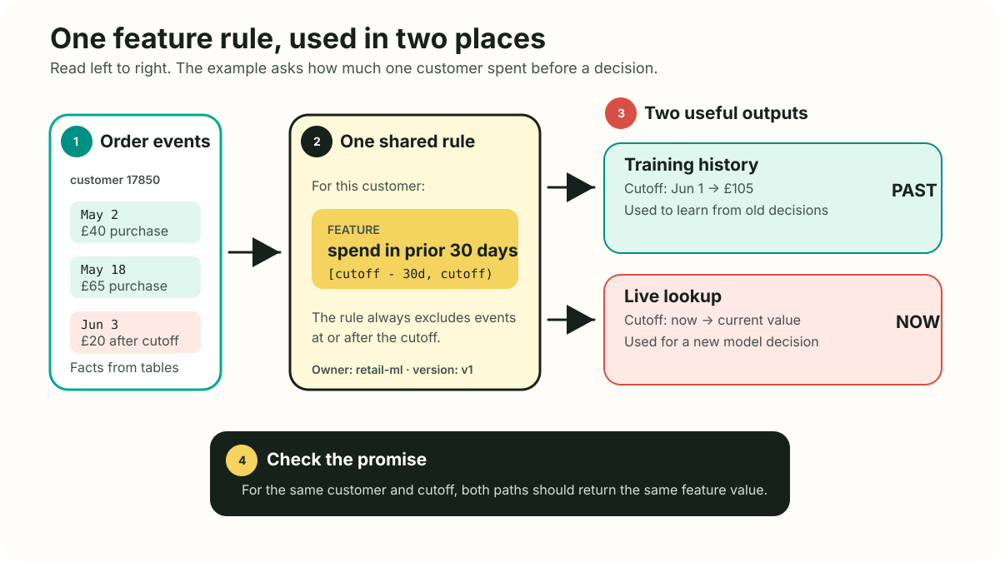

A feature is one fact a model uses to make a prediction. For example, “how many
orders did this customer make in the last 30 days?” A feature store is easiest to
understand as a promise:

> For a named entity and a named decision time, produce the feature value that a
> reviewed definition says was eligible, deliver it through the required access
> path, and retain enough evidence to explain where it came from.

That promise is larger than a table. A number can be valid-looking and still be
wrong for a model because it came from the future, used the wrong customer, or
was too old. This guide explains how to avoid those mistakes without pretending
that the ideas are magic.

## Start here: the whole lesson in five ideas

1. A model makes a decision at a particular time.
2. A feature summarizes information about one thing, such as one customer.
3. Training examples must use only information available before that decision.
4. The same feature meaning must be used when training and when making a live prediction.
5. A team must be able to explain, test, update, and own the feature.

If the technical words become distracting, return to these five ideas. Terms such
as *backfill*, *offline store*, and *online store* describe ways of doing this
work. They are not the goal.

The running example is the real [UCI Online Retail dataset](https://doi.org/10.24432/C5BW33).
It contains 541,909 transaction line items recorded by a UK online retailer from
1 December 2010 through 9 December 2011. At each completed order, the notebook
asks whether that customer will place another completed order in the following
30 days. The dataset is small enough to inspect closely, yet rich enough to expose
missing entity keys, cancellations, multiple line items per invoice, temporal
windows, censored labels, and late-information problems. The [UCI dataset page](https://archive.ics.uci.edu/dataset/352/online+retail)
documents the fields and CC BY 4.0 license.

This guide marks two kinds of statements:

- **General principle** is an idea that works across tools.
- **Chronon behavior** is something Chronon does. Another tool may do it
  differently, so check its documentation.

The requested industry sources are useful perspectives, not neutral standards.
The [Databricks guide](https://www.databricks.com/blog/what-feature-store-complete-guide-ml-feature-engineering),
[IBM overview](https://www.ibm.com/think/topics/feature-store),
[Chalk overview](https://chalk.ai/blog/what-is-a-feature-store),
[AWS SageMaker Feature Store documentation](https://docs.aws.amazon.com/sagemaker/latest/dg/feature-store.html),
and [Featurestore.org landscape](https://www.featurestore.org/) agree on many core
problems, but each reflects a different product or ecosystem position. The design
must be checked against primary product documentation and local requirements.

## Concept map

| Section | Main question | Notebook |
|---:|---|---|
| 1 | What is a feature store? | §0 |
| 2 | What does a modern architecture contain? | §0, §12 |
| 3 | What are the decision, entity, and contract? | §2, §11 |
| 4 | Which clock defines historical truth? | §2, §6 |
| 5 | How does a point-in-time join work? | §5, §6 |
| 6 | How does leakage enter? | §6, §9 |
| 7 | What do windows really mean? | §5 |
| 8 | How does Chronon describe sources? | §7 |
| 9 | How do `GroupBy`, accuracy, and windows fit? | §7 |
| 10 | How does a `Join` build training data? | §7 |
| 11 | What does the tiled architecture optimize? | §7, §12 |
| 12 | What makes a backfill trustworthy? | §5, §8 |
| 13 | Why are offline and online paths different? | §10 |
| 14 | What is training-serving skew? | §9, §10 |
| 15 | How are freshness and reliability measured? | §10, §11 |
| 16 | Who owns and may access a feature? | §11, §12 |
| 17 | How should definitions evolve? | §7, §11 |
| 18 | When is a feature store worth its cost? | §12 |
| 19 | What should a final design review ask? | Final design review |

---

## 1. A feature store is a system of feature truth

### General principle

A model feature is an input value used by a model. A feature store is the system
that manages selected feature definitions and values across their lifecycle. That
lifecycle normally includes:

1. defining a feature against source data;
2. computing historical values for training and backtesting;
3. maintaining current values for batch or online inference;
4. recording metadata, ownership, lineage, and versions;
5. checking data quality, freshness, delivery, and consistency.

This definition explains why “a database of columns” is incomplete. A database can
store `purchase_order_value_sum_30d = 145.20`, but it does not by itself say which
customer the value describes, whether the current order was excluded, which
currency is used, which source corrections were visible, who owns the pipeline,
or whether an online model received the same value.

The phrase **single source of truth** should mean one governed semantic definition
and lineage graph. It need not mean one physical database. Historical training
queries need large scans and time travel. An online request needs a small keyed
lookup with predictable tail latency. One logical definition can produce several
physical materializations.

The [IBM overview](https://www.ibm.com/think/topics/feature-store) describes the
common combination of ingestion, transformations, storage layers, serving,
registry metadata, and orchestration. The [Databricks guide](https://www.databricks.com/blog/what-feature-store-complete-guide-ml-feature-engineering)
similarly emphasizes discovery, reuse, lineage, point-in-time correctness, and
training-serving consistency. These are useful architecture patterns, not a rule
that every deployment must contain a separately branded product for each box.

### Online Retail example

The raw dataset has invoice line items. The notebook creates reusable historical
features such as:

```text
purchase_order_id_count_30d
purchase_order_value_sum_90d
days_since_last_order
cancel_refund_value_sum_30d
```

Each value is keyed by `customer_id` and evaluated at a prediction timestamp. The
same definition can create a historical training column and a current customer
lookup. That shared meaning is the feature-store value proposition.

### Counterexample and caution

A single batch model with five inexpensive features, one owner, no online path,
and a reliable versioned SQL pipeline may not need a feature-store platform.
Adding a registry, stream processor, online database, and control plane can create
more failure modes than it removes. Point-in-time SQL plus disciplined contracts
may be the right solution.

Also, raw data can be a valid model input. “Derived and reusable” describes a
strong feature-store candidate, not the only possible definition of a feature.
The current order value is a valid model feature in this tutorial, but it is
request context rather than stored customer history.

**Notebook reference: §0 defines the logical system and explicitly lists the
warehouse, stream processor, orchestrator, model registry, vector database, and
catalog that a feature store usually does not replace.**

---

## 2. Modern architecture: one contract, several execution paths

### General principle

A modern feature platform usually connects five layers:

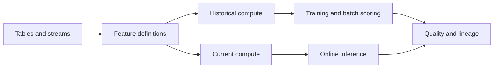

- **Sources** provide events, entity snapshots, mutations, and request context.
- **Definitions** name keys, transformations, windows, time rules, and ownership.
- **Historical compute** reconstructs values for old decision times.
- **Current compute** maintains or calculates values needed now.
- **Registry and control plane** support discovery, review, lineage, deployment,
  access, and lifecycle state.
- **Observability** checks the entire path from source to model impact.

Offline and online are access patterns, not moral categories. An offline path is
optimized for large historical reads, joins, backfills, training, and batch
scoring. An online path is optimized for current keyed reads at low latency. Some
systems materialize both. Some provide only offline management. Some calculate
selected values on demand. [AWS documents](https://docs.aws.amazon.com/sagemaker/latest/dg/feature-store.html)
feature groups that may use an online store, an offline store, or both. That is an
AWS implementation choice, not a universal storage law.

### Online Retail example

The historical path creates one row for every completed order in the prediction
spine, then evaluates prior customer behavior at that row's `prediction_ts`. The
current path can maintain the latest 7, 30, and 90-day customer aggregates in a
key-value store. At inference, the model combines those stored values with fields
from the current order, such as `current_order_value` and `item_count`.

The separation is important. Current-order context should not be copied into a
feature named “prior spend.” Conversely, a 90-day history should not be recomputed
by scanning the entire transaction table during every web request.

### Counterexample and caution

Two paths governed by one definition are not automatically equal. They may read
different source feeds, use different watermark rules, apply different defaults,
or deploy different versions. A shared DSL reduces duplicated logic, but it does
not remove distributed-system delay or bad source semantics.

“Online store” also does not imply “fresh.” A key-value lookup can answer in one
millisecond with a value that is seven days old. Freshness and lookup latency need
separate measurements.

**Notebook reference: §0 introduces definition, materialization, and delivery;
§10 implements an explicitly named `TeachingFeatureCache`; §12 maps the same
logical objects to a production Chronon topology.**

---

## 3. Start with the decision, entity, and feature contract

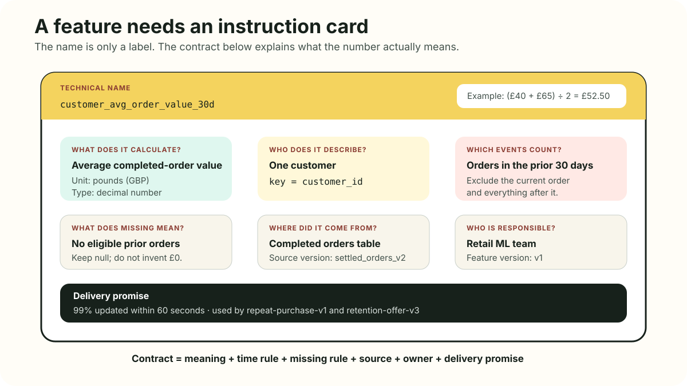

### General principle

Feature design should start with the model decision, not with an attractive table.
Four questions establish the frame:

1. What event or schedule triggers a prediction?
2. What does one prediction row represent?
3. Which entity keys connect that row to historical state?
4. Which values are already known at that instant?

An **entity** is the subject whose state or history the feature summarizes. It can
be a customer, account, item, merchant, device, location, or a composite such as
`(customer_id, product_id)`. Entity keys are part of feature meaning. An order
count keyed by customer is not interchangeable with an order count keyed by
country.

A **feature contract** turns that meaning into an operable agreement. At minimum,
record:

| Contract field | Question it answers |
|---|---|
| Name and description | What does the value mean? |
| Entity and key mapping | Whose value is it? |
| Type and unit | Is `42` GBP, items, or days? |
| Source and lineage | Which records produced it? |
| Time and availability rule | Which records were eligible? |
| Null and default policy | What do absent history and zero mean? |
| Freshness and serving SLO | How current and how fast must it be? |
| Owner and on-call route | Who decides and who responds? |
| Sensitivity and access | Who may discover or retrieve it? |
| Version and consumers | Which meaning and which dependencies apply? |

### Online Retail example

The notebook's decision is made when a completed invoice is recorded. One example
is one completed order. The entity is `customer_id`. The target is another
completed order in the next 30 days. The current order is request context. Prior
orders and cancellations are historical sources.

A concise contract from §11 is:

```python
{
    "name": "purchase_order_value_sum_30d",
    "entity": "customer_id",
    "dtype_unit": "float64 GBP",
    "time_rule": "[t-30d, t)",
    "null_policy": "zero means no eligible orders",
    "owner": "retail-ml",
    "version": "v1",
}
```

The order's own value is known at this tutorial's decision time, so
`current_order_value` may be a feature. It remains on the left side of the join.
It must not enter `purchase_order_value_sum_30d`, whose name promises prior history.

### Counterexample and caution

The UCI file records completed invoices, not a production checkout request. A real
application might predict before payment, after payment authorization, after
fulfillment, or after settlement. The fields known at those moments differ. A
feature contract copied from this tutorial without redefining the firing point
would be misleading.

Entity IDs also need stability. Missing `CustomerID` rows cannot be assigned to a
customer history without an identity-resolution policy. Guessing from country,
invoice, or product would create false entity joins.

**Notebook reference: §2 states the prediction unit, entity, request context,
feature boundary, and label boundary; §11 builds a small registry table with
units, null rules, freshness, ownership, versions, and consumers.**

---

## 4. The three clocks: event, availability, and prediction time

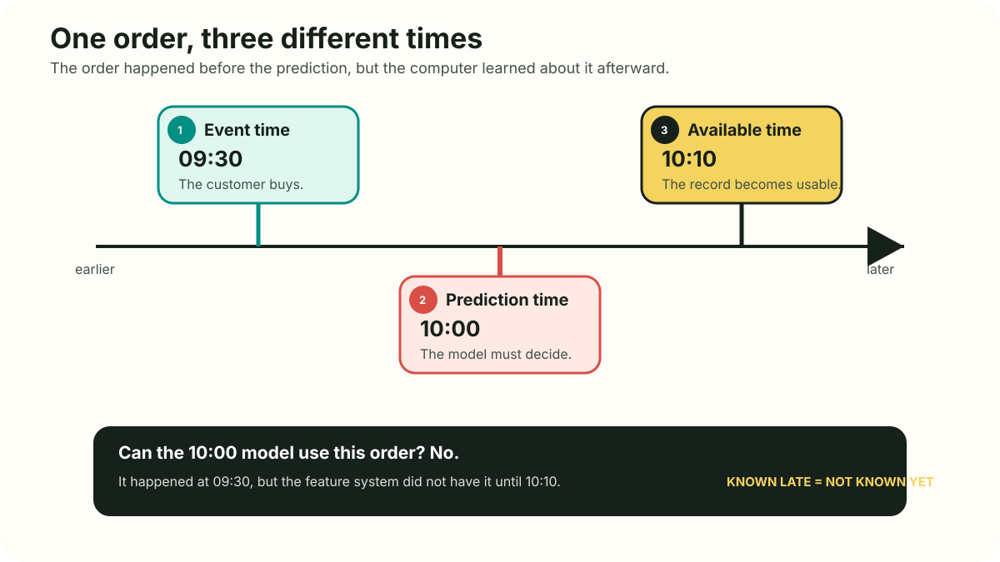

### General principle

Time is not one column. Three clocks answer different questions:

- **Event time:** When did the real-world event occur?
- **Availability time:** When could the feature pipeline actually use the event?
- **Prediction time:** When did, or would, the model act?

Suppose a purchase happens at 09:30, a model predicts at 10:00, and the purchase
arrives in the warehouse at 10:10. An event-time reconstruction includes it because
09:30 is before 10:00. A production-available reconstruction excludes it because
the live model could not have seen it.

These create two legitimate historical truths:

1. **Event truth** asks what had happened by the prediction time.
2. **Production-available truth** asks what the production system could have known.

Production-available truth is usually the stronger choice for exact
training-serving fidelity. Event truth is still useful when arrival lag is small,
when ingestion history was not retained, or when the modeling question explicitly
targets eventual historical facts. The chosen truth must be named.

### Online Retail example

`InvoiceDate` is the event timestamp in the UCI data. The tutorial uses the current
completed order's `InvoiceDate` as `prediction_ts`. It has no ingestion or
availability timestamp, so the main backfill demonstrates event-time correctness.

§6 makes the missing clock concrete:

```python
event_truth = delayed.loc[
    delayed["event_ts"] < prediction_ts, "amount"
].sum()

available_truth = delayed.loc[
    (delayed["event_ts"] < prediction_ts)
    & (delayed["available_ts"] <= prediction_ts),
    "amount",
].sum()
```

The two sums intentionally differ. That is not an implementation bug. They answer
different historical questions.

### Counterexample and caution

A point-in-time API cannot reconstruct availability time if the source never
recorded it. Replaying today's corrected warehouse table at an old event timestamp
can expose records that were late, deleted, or revised after the original decision.

Processing time is sometimes used as a practical proxy for availability time, but
they are not always equal. A record can reach a broker, wait in a failed consumer,
be transformed, and become readable much later. Define the clock at the boundary
that matters to the model.

**Notebook reference: §2 introduces the three clocks and names the missing UCI
availability clock; §6 executes a fixture where event truth is £42 and
production-available truth is £0.**

---

## 5. Point-in-time joins: ask what was eligible at each decision

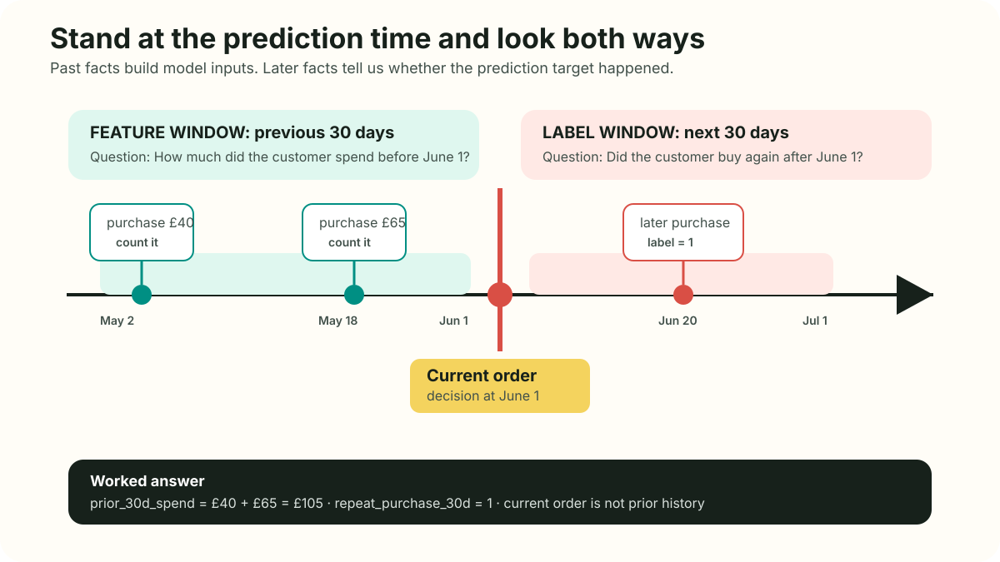

### General principle

A conventional equality join matches keys. A point-in-time join matches keys and
enforces a temporal eligibility rule for every left-side prediction row.

For a prediction at time `t`, the notebook uses:

```text
feature window: [t - window, t)
label window:   (t, t + 30 days]
```

The feature interval is half-open. It includes the start and excludes the right
boundary. Therefore, the current order and every other event timestamped exactly
at `t` are absent from historical aggregates. The label interval looks forward,
excludes orders at exactly `t`, and includes an order exactly 30 days later.

This boundary gives a causal division:

- the left side holds the example key, prediction time, and request context;
- the right side contributes only eligible historical feature values;
- a later label process attaches outcomes after their horizon matures.

The notebook's local reference calculation makes the boundary explicit:

```python
right = np.searchsorted(history_times, anchor_times, side="left")
left = np.searchsorted(
    history_times,
    anchor_times - days * DAY_NS,
    side="left",
)
```

`side="left"` on the right cutoff excludes values equal to the anchor. Prefix
sums then compute each window sum without rescanning all events.

### Online Retail example

Customer C1 has orders of £10 on 1 January, £20 at the 10 January prediction, and
£999 on 11 January. At 10 January, prior 30-day spend is £10. The current £20 is
request context. The £999 future order creates a positive label, but it is not a
feature.

That tiny fixture proves more than a large result table because each eligible and
ineligible value is visible.

### Counterexample and caution

“Use the latest customer row” is not point-in-time correctness. The latest row when
training runs in December can include purchases that happened after a historical
prediction in March. The training result then changes as new future data arrives.

An as-of join with `event_ts <= prediction_ts` can still be wrong when the current
event is already present on the right. The exact equality rule depends on whether
the decision occurs before or after the current event is consumed. This tutorial
chooses the conservative strict boundary and tests it.

**Notebook reference: §5 implements `window_stats` and
`build_point_in_time_features`; §6 asserts the exact £10 boundary result.**

---

## 6. Leakage taxonomy: point-in-time correctness is necessary, not sufficient

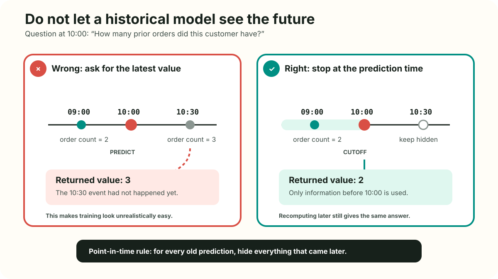

### General principle

**Leakage** occurs when training uses information that would not be valid for the
real prediction. It has several forms:

| Leakage type | Online Retail failure | Guardrail |
|---|---|---|
| Latest-value leakage | December customer totals enrich a March order | point-in-time join |
| Window-boundary leakage | current order enters “prior 30-day spend” | strict fixture test |
| Target leakage | future-order count is a model input | explicit allowlist |
| Availability leakage | a late invoice appears before it was readable | preserved availability time |
| Revision leakage | corrected price replaces the original observed value | source versions or change log |
| Cross-entity leakage | customer aggregate includes current order's future label | label cutoff inside aggregation |
| Global-statistics leakage | imputer or scaler fits on test-period values | fit preprocessing on training only |
| Split leakage | random train/test rows mix future behavior into training | chronological split |
| Label censoring | recent examples with incomplete horizons become negatives | maturity cutoff |
| Grain leakage | line items from one invoice appear as separate predictions | normalize to order events |

The explicit forbidden feature in §9 is pedagogically useful:

```python
future_start = np.searchsorted(times, times, side="right")
future_end = np.searchsorted(times, times + 30 * DAY_NS, side="right")
future_count = future_end - future_start
```

`future_count` is legitimate for constructing `repeat_purchase_30d`. It is
forbidden as a predictor. The same column can be correct in the label pipeline and
catastrophic in the feature list.

### Online Retail example

The notebook compares a causal model against a model that adds
`leak_future_order_count_30d`. The forbidden model should achieve a strikingly
better offline score because its input nearly states the answer. That improvement
is evidence of a broken experiment, not a stronger model.

The label itself also needs time. An order on 8 December cannot receive a complete
30-day repeat-purchase label from a dataset that ends on 9 December. The notebook
sets `label_is_observed` and excludes immature rows from supervised training.

### Counterexample and caution

Not every use of a future value is leakage. A future window is required to define
a supervised outcome. It becomes leakage when that value, or a proxy derived from
it, enters the inputs available to the model.

A point-in-time join also cannot detect a semantically post-outcome field whose
timestamp looks old. For example, a “customer status at order time” column might
have been backfilled later using the eventual repeat-purchase outcome. Temporal
types do not replace source review.

**Notebook reference: §6 tests boundaries and availability; §9 uses a
chronological split, compares causal and forbidden feature lists, and collects the
leakage taxonomy.**

---

## 7. Windowed features: business memory with exact boundaries

### General principle

A window defines how much history a feature remembers. Different windows express
different hypotheses:

- 7-day order count captures very recent activity;
- 30-day spend captures a monthly purchasing rhythm;
- 90-day cancellation value captures a longer return pattern;
- lifetime aggregates summarize all retained history;
- recency measures the distance to the latest eligible event.

Counts, sums, and averages answer different questions. A customer with one £1,000
order and a customer with ten £100 orders have equal spend but different frequency.
An average is undefined when the count is zero. Replacing that null with zero says
“the average prior order was £0,” which is not the same as “no prior order exists.”

The notebook preserves this distinction:

```python
averages = np.divide(
    sums,
    counts,
    out=np.full(len(row_index), np.nan),
    where=counts > 0,
)
```

It also derives a smoothed ratio:

```python
cancel_value_ratio_90d = (
    cancel_refund_value_sum_90d
    / (purchase_order_value_sum_90d + 1.0)
)
```

The `+ 1.0` prevents division by zero, but it is a modeling decision with GBP
units, not harmless numerical housekeeping. It belongs in the contract.

### Online Retail example

Purchase and cancellation histories are separate event streams. Both are keyed by
`customer_id`, but they have different event values and may need different
freshness. The notebook computes 7, 30, and 90-day purchase features and 30 and
90-day cancellation features. Invariants check that shorter-window counts do not
exceed longer-window counts.

### Counterexample and caution

More windows are not automatically better. Hundreds of nearly identical windows
increase storage, computation, monitoring, and multiple-testing risk. Start with
domain-relevant horizons and add complexity only when evaluation justifies it.

Window semantics can also differ across systems. Calendar months are not always
30 days. Time zones and daylight-saving transitions can make “one day” differ
from 24 elapsed hours. Chronon's documented windows use hour or day units, but a
team still must define source timestamp normalization and business-calendar needs.

**Notebook reference: §5 implements half-open 7, 30, and 90-day windows, prefix
sums, recency, cancellation history, null behavior, and monotonic window tests.**

---

## 8. Chronon `Source`: define the shape and timeline of input data

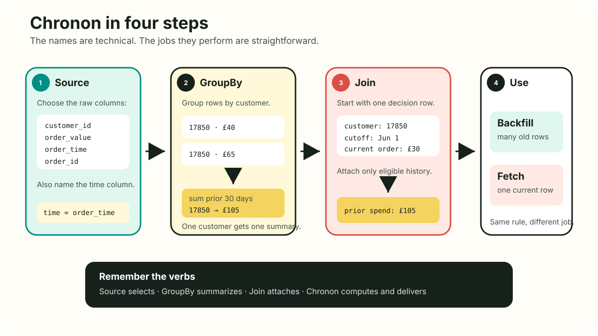

### Chronon behavior

Chronon's [`Source` documentation](https://chronon.ai/authoring_features/Source.html)
describes inputs to feature pipelines. The major distinction is between event
history and entity state:

- `EventSource` represents append-like facts such as orders and cancellations.
- `EntitySource` represents snapshots and, when supplied, mutation history for
  stateful records such as a customer profile.

A streaming `EventSource` can pair a historical warehouse table with a topic. The
table supports backfills. The topic supplies incremental events for current online
state. A `Query` selects fields, filters rows, and specifies the event-time column.

The notebook closely references this definition:

```python
source = Source(events=EventSource(
    table="retail.orders",
    topic="retail.orders.v1",
    query=Query(
        selects=select(
            "customer_id", "order_id", "order_value", "item_count"
        ),
        time_column="ts",
    ),
))
```

The logical contract expects `ts` to be epoch milliseconds even though the local
pandas code uses readable timestamps.

### Online Retail example

Normalized completed orders belong in an event source. Cancellation invoices
belong in another event source because their amount, meaning, and update behavior
differ. A customer profile table with one state per customer would more naturally
be an entity source, but the public UCI data does not provide a trustworthy profile
change history.

### Counterexample and caution

Adding a topic name does not prove that table and topic have identical semantics.
They can disagree on filtering, deduplication, timestamps, currency conversion, or
late-event treatment. The pair needs a source contract and parity tests.

An `EntitySource` based only on today's customer table cannot faithfully reconstruct
old customer state. Historical snapshots or mutations are needed. A current country
value joined onto every old order can introduce revision leakage if customers move
or the field is corrected.

**Notebook reference: §4 first converts line-item storage into order and
cancellation event tables; §7 imports and inspects the corresponding Chronon
definitions.**

---

## 9. Chronon `GroupBy`, aggregations, and accuracy

### Chronon behavior

[`GroupBy`](https://chronon.ai/authoring_features/GroupBy.html) is Chronon's primary
feature-definition object. It combines:

- one or more compatible sources;
- entity keys;
- aggregations and optional windows;
- metadata, ownership, and versioning information;
- an accuracy mode;
- an online-serving flag.

The tutorial's purchase definition is structurally:

```python
v1 = GroupBy(
    sources=[source],
    keys=["customer_id"],
    aggregations=[Aggregation(
        input_column="order_value",
        operation=Operation.SUM,
        windows=[
            Window(7, DAYS),
            Window(30, DAYS),
            Window(90, DAYS),
        ],
    )],
    accuracy=Accuracy.TEMPORAL,
    online=True,
)
```

Chronon documents two accuracy modes:

- `SNAPSHOT` computes values at daily midnight boundaries.
- `TEMPORAL` supports real-time online updates and point-in-time-correct backfills.

This is not merely a performance switch. It changes the historical question. A
prediction at 15:00 joined to a snapshot feature receives the prior midnight state,
while a temporal feature can include eligible events through the precise cutoff.

Chronon also documents **sawtooth windows**, which combine pre-aggregated hops with
a recent partial segment so a query need not store and scan every raw event while
still including the newest eligible events. This is an implementation technique;
the user-facing feature contract should still describe the intended time range.

### Online Retail example

The repeat-purchase model acts at invoice timestamps throughout the day, so
`TEMPORAL` matches its intended history. A midnight snapshot could be appropriate
for a daily retention campaign scored once every morning. It would be misleading
for the tutorial's per-order decision unless the model was trained with the same
midnight semantics.

`online=True` asks Chronon to create or schedule the maintenance needed for online
serving. It does not mean every consumer must use the feature online, nor does it
replace a real online-store integration.

### Counterexample and caution

Temporal accuracy cannot repair a source that lacks the necessary clock. If the
warehouse contains only daily corrected totals, setting `TEMPORAL` does not invent
intra-day or original-production history.

Approximate aggregations may be necessary for scale, but approximation parameters
are part of feature meaning. A unique-count sketch with a changed precision is a
new statistical contract even if its column name stays constant.

**Notebook reference: §7 explains every field in the purchase `GroupBy`, previews
the compiled Thrift JSON, and distinguishes temporal from logical pandas time.**

---

## 10. Chronon `Join`: the prediction spine is the historical question

### Chronon behavior

A Chronon [`Join`](https://chronon.ai/authoring_features/Join.html) combines a left
driver source with one or more right-side `GroupBy` definitions. The left side
defines which entity keys and prediction timestamps need historical feature values.
The right parts define which feature groups are evaluated at those times.

```python
v1 = Join(
    left=prediction_events,
    right_parts=[
        JoinPart(group_by=purchases_v1, prefix="purchase"),
        JoinPart(group_by=cancellations_v1, prefix="cancel"),
    ],
    online=True,
    check_consistency=True,
    sample_percent=1.0,
)
```

Prefixes prevent collisions and make provenance visible. Key mappings can connect
a left-side key name to a different right-side entity name. The mapping must be
semantically valid, not merely type-compatible.

Chronon documents that an event left side with temporal right-side features can
produce millisecond point-in-time backfills. A batch right side is midnight
accurate by default unless temporal accuracy is requested and supported. The left
side matters to offline backfills. Current online fetches use supplied keys and
implicitly ask for current values.

Labels point in the opposite temporal direction from features. Chronon's
`LabelPart` supports attaching later outcomes after feature backfills. In this
tutorial, the local spine carries a mature label, while the feature allowlist keeps
that label and its future-order count out of the model inputs.

### Online Retail example

Every completed order supplies `customer_id`, `prediction_ts`, request-context
fields, and later `repeat_purchase_30d`. Purchase and cancellation `GroupBy`
definitions enrich that row using only earlier events. The resulting dataset is
the training table for one model version.

### Counterexample and caution

A wide feature table with no explicit prediction spine is dangerous. There is no
single “customer value on 5 March” unless a cutoff, source versions, key mappings,
and null policy are defined.

Changing the left source can change the row population, decision time, and label
distribution even when every right-side feature stays identical. Treat the spine
as a first-class versioned data product.

**Notebook reference: §5 builds the local order spine; §7 explains Chronon's left
source, right parts, prefixes, consistency settings, and label separation.**

---

## 11. Chronon's tiled architecture: move work from reads to writes

### Chronon behavior

Chronon's [tiled architecture documentation](https://chronon.ai/Tiled_Architecture.html)
describes an online optimization for windowed aggregations. In the traditional
path, individual events are stored and a request may fetch and aggregate many
events. In the tiled path, a stateful Flink job pre-aggregates events into
intermediate representations called tiles. A request merges a small number of
tiles instead of scanning all contributing events.

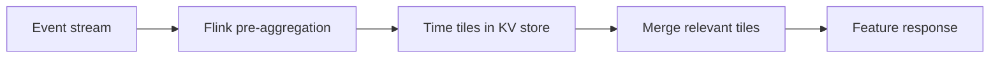

This trades write-path state and complexity for lower read amplification. It is
particularly relevant for hot keys and long windows. Chronon's documentation
states that this feature is being open-sourced and requires Flink, so it should
not be presented as automatically active in every Chronon deployment.

Tiling is related to, but distinct from, the semantic feature window. The model
still asks for a 30-day customer spend. Tiles are an internal way to answer that
question efficiently.

### Online Retail example

A wholesale customer can have many invoice events. Serving 90-day spend by reading
and summing every order at each request scales with event count. Hourly or daily
pre-aggregated tiles can reduce that work while preserving the defined boundary,
provided the newest partial interval and late-event corrections are handled.

### Counterexample and caution

Tiling is unnecessary for a customer with three orders per year. It adds state,
operational dependencies, and correction logic. Measure key frequency, window
sizes, p99 latency, and storage before adopting it.

Pre-aggregation can also hide errors if tests inspect only final values. Validate
tile merge behavior around window starts, exact cutoffs, late events, deletions,
and partial current tiles.

**Notebook reference: §7 establishes the `Source` to `GroupBy` to `Join` object
model; §12 explains that production streaming and KV integration are separate from
the local semantic runner. The notebook does not claim to benchmark tiling.**

---

## 12. Backfills: historical computation is a reproducibility problem

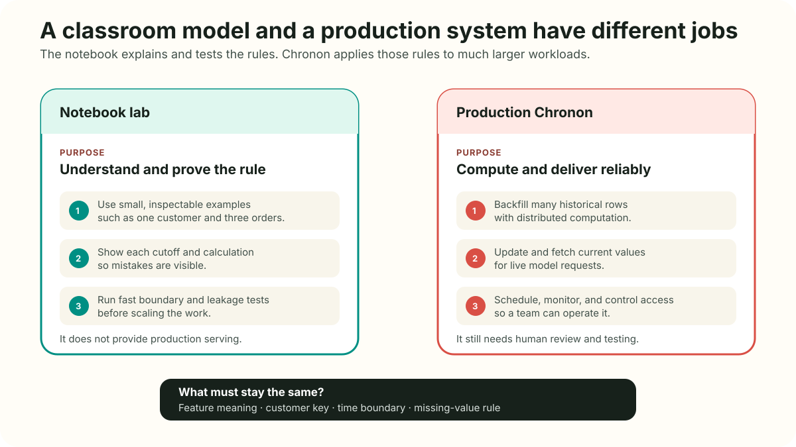

### General principle

A **backfill** computes feature values for historical entity-time rows. It supports
training, evaluation, backtesting, recovery, and migration to a new definition.
A trustworthy backfill needs more than a scalable query:

- a versioned prediction spine;
- a versioned feature definition;
- stable or versioned source data;
- explicit event and availability semantics;
- deterministic key mapping and deduplication;
- a label maturity policy;
- idempotent reruns and partial-failure recovery;
- manifests that record code, source, time range, and outputs.

Chronon advertises scalable point-in-time backfills from raw history. Its primary
documentation describes the left `Join` source as the backfill driver and Spark as
the batch execution engine. Compilation turns Python definitions into Thrift JSON;
compilation alone does not compute data.

### Online Retail example

The notebook's NumPy reference builder is intentionally transparent. It sorts each
customer's events, uses `searchsorted` to find boundaries, and uses prefix sums for
range totals. It provides a readable semantic oracle for fixture tests and model
experiments.

The notebook separately authors real Chronon objects and documents the optional
Spark-backed path. The distinction matters:

- the local runner answers, “Did we define the cutoff correctly?”
- production Chronon answers, “Can we compute, deploy, refresh, and monitor this
  definition at organizational scale?”

### Counterexample and caution

Recomputing an old row today may use corrected source data that was unavailable to
the original model. That result can be historically more accurate and still fail
to reproduce production. Decide whether a backfill targets corrected event truth
or original production-available truth.

A successful Spark job is not proof of a correct dataset. It may complete with
missing partitions, duplicate events, shifted keys, or immature labels. Run
semantic invariants after computation.

**Notebook reference: §5 implements the transparent backfill; §6 proves it with
fixtures and invariants; §8 distinguishes the optional real Chronon runtime from
the semantic reference instead of presenting a fallback as a Chronon result.**

---

## 13. Offline and online patterns: different workloads, aligned meaning

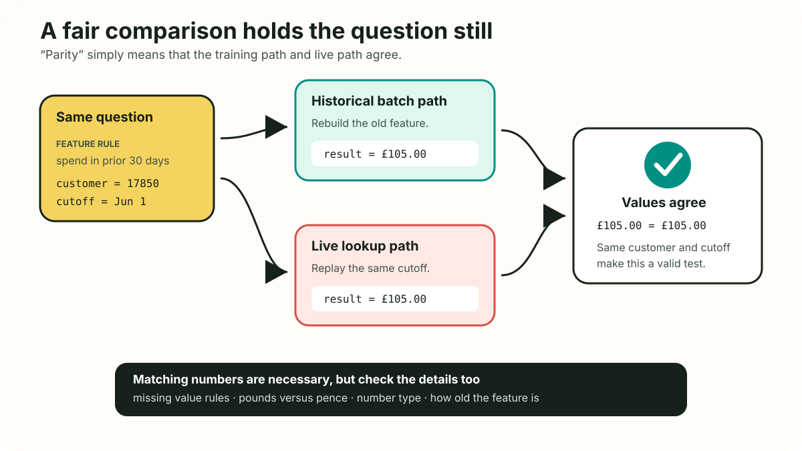

### General principle

Offline storage retains historical values or enough source history to reconstruct
them. It supports broad scans and joins. Online storage usually retains current
state optimized for keyed reads and high request volume. [AWS Feature Store](https://docs.aws.amazon.com/sagemaker/latest/dg/feature-store.html)
documents an online store that retains latest records and an append-oriented
offline history. [Chalk's overview](https://chalk.ai/blog/what-is-a-feature-store)
also frames online and offline as different access patterns. Those details are
product-specific examples of a general split.

Common materialization patterns include:

1. **Batch only:** compute daily features for training and batch scoring.
2. **Batch to online:** compute snapshots, then bulk-load current entity values.
3. **Batch plus stream:** seed historical state in batch and update from events.
4. **On demand:** compute cheap request-time features from live services.
5. **Hybrid:** retrieve stored history and combine it with current request context.

### Online Retail example

The hybrid pattern is natural. Fetch stored customer history such as prior
30-day spend and cancellation count, then combine it with current order value and
item count. The online key is `customer_id`.

The notebook's teaching cache stores a vector and `computed_at`. `vector_at`
recomputes the expected offline value for the same customer and cutoff. The parity
checker aligns version, key, cutoff, null behavior, and numeric tolerance.

```python
offline_vector = vector_at(example_customer, serve_time)
parity = compare_vectors(offline_vector, fetched["values"])
assert parity["matches"].all()
```

The notebook corrupts one value to prove the checker detects a mismatch.

### Counterexample and caution

Comparing today's online value to a backfill from last week is not a parity test.
The cutoffs differ. Comparing values without type, default, and feature-version
checks can also hide incompatible meanings.

The `TeachingFeatureCache` is a dictionary. It is not a Chronon online store and
does not provide distribution, persistence, concurrent update safety, access
control, or latency SLOs. Chronon production serving needs an implementation of
its online API backed by a real key-value system.

**Notebook reference: §10 defines `vector_at`, `TeachingFeatureCache`, exact-cutoff
parity comparison, a deliberate corruption test, and freshness metadata.**

---

## 14. Training-serving skew: same name does not guarantee same value

### General principle

Training-serving skew is any relevant difference between feature inputs used for
training and those used during inference. It can arise from:

- duplicated transformation code in different languages;
- different source feeds or filters;
- different cutoff and late-data rules;
- different nulls, defaults, types, or units;
- different feature versions;
- stale online materialization;
- request-context fields present in only one path;
- preprocessing fitted on the wrong population.

The [IBM overview](https://www.ibm.com/think/topics/feature-store) and
[Databricks guide](https://www.databricks.com/blog/what-feature-store-complete-guide-ml-feature-engineering)
both present shared definitions and serving paths as ways to reduce skew. “Reduce”
is the careful word. A platform cannot make a delayed topic equal an already
corrected warehouse table without an explicit policy.

### Online Retail example

The causal training model uses an allowlist named `CAUSAL_FEATURES`. Its
preprocessing pipeline is fit only on the early chronological training period.
The current online vector should use the same feature names, units, boundaries,
and null treatment.

A nightly online load would produce snapshot semantics. A model trained on exact
intra-day temporal values would then see a different distribution in service. The
solution is not merely to refresh faster. Training should reconstruct the same
availability policy the serving system can meet.

### Counterexample and caution

Perfect numerical parity on sampled requests does not prove the model is sound.
Both paths can implement the same incorrect definition. Parity tests consistency;
fixture tests and contract review test meaning.

Small expected differences can also exist during streaming propagation. Chronon's
[online-offline consistency documentation](https://docs.chronon.ai/test_deploy_serve/Online_Offline_Consistency.html)
explains that network, stream, and KV-write delay can create short mismatches. A
useful alert distinguishes expected lag from persistent semantic divergence.

**Notebook reference: §9 trains chronologically and exposes target leakage; §10
checks value parity; §11 places parity alongside quality, freshness, serving, and
model-impact monitoring.**

---

## 15. Freshness and observability: a green job can serve a bad feature

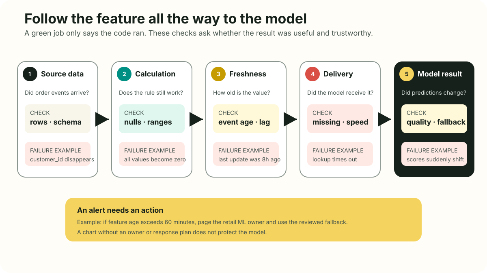

### General principle

Freshness is a chain of delays, not one timestamp:

```text
source lag       = ingest time - event time
compute lag      = materialized time - ingest time
end-to-end lag   = readable time - event time
feature age      = decision time - latest contributing event time
lookup latency   = response time - request time
```

A useful SLO separates freshness from serving performance. For example:

```text
customer_order_count_7d
  99% readable within 60 seconds
  p99 fetch below 20 milliseconds
  missing-key rate below 0.1%
  parity mismatch below 0.01%
```

Observability should cover layers:

1. **Source health:** partitions, schema, duplicate IDs, watermarks.
2. **Data quality:** nulls, ranges, units, cardinality, heavy hitters.
3. **Freshness:** event, ingest, compute, readable, and materialized times.
4. **Parity:** same key, cutoff, definition, type, and value.
5. **Serving:** latency percentiles, errors, missing keys, fallback use.
6. **Lineage:** affected features, datasets, models, owners, and versions.
7. **Impact:** model quality, business outcomes, incidents, and cost.

Chronon documents sampled query logging and offline recomputation when
`sample_percent` and `check_consistency` are enabled. This is a Chronon mechanism
for one observability layer, not a substitute for the others.

### Online Retail example

The landed UCI CSV contains missing customer IDs even though the catalog page says
the dataset has no missing values. The notebook trusts the landed evidence, reports
the discrepancy, and excludes unkeyed rows from customer features. It does not
silently pretend those customers do not exist.

§11 compares baseline and recent null rate, a 99th percentile feature value, and
label prevalence. Each metric includes an interpretation, but not an automatic
verdict.

### Counterexample and caution

A distribution shift is not automatically a bug. Holiday shopping can change
spend and repeat-purchase rates. An alert needs an owner and a playbook that can
separate source failure, real behavior change, and contract change.

Raw feature count is usually a vanity metric. More meaningful platform outcomes
include reduced feature incidents, faster reviewed backfills, SLO attainment,
validated reuse, parity mismatch, and cost per training or serving workload.

**Notebook reference: §3 audits landed data before transformation; §10 separates
fast lookup from freshness; §11 builds a registry, drift summary, and layered
response checklist.**

---

## 16. Ownership, governance, privacy, and security

### General principle

Centralizing features can improve governance, but it also centralizes attractive
behavioral data. Governance must cover both metadata and values:

- producer and operational owner;
- review and publication rules;
- role-based discovery and retrieval;
- sensitivity classification;
- encryption and audit logging;
- retention and deletion propagation;
- purpose limitation and approved consumers;
- incident and deprecation procedures.

Lineage should be bidirectional. A consumer should see where a feature came from.
An owner should see every training dataset, model, and service that depends on it.
That dependency graph makes schema review, incident response, and deletion work
possible.

AWS specifically warns that feature-group names, descriptions, and tags should not
contain PII or confidential information in its [Feature Store documentation](https://docs.aws.amazon.com/sagemaker/latest/dg/feature-store.html).
That is good general hygiene even outside AWS: metadata often has broader
visibility than protected values.

### Online Retail example

`CustomerID` is an entity key linked to purchasing behavior, country, order value,
and cancellations. Even if the public identifier is pseudonymous, a production
equivalent would require strict access and retention rules. A derived feature such
as high cancellation value can be sensitive because it may drive customer
treatment.

The contract's `owner`, `consumers`, and sensitivity fields should govern both the
offline training table and the current online value. Deleting a customer only from
the online cache is incomplete if historical tables, query logs, backfills, and
training datasets retain the same entity.

### Counterexample and caution

A registry entry does not create accountability when its owner is a mailing list
that nobody monitors. Ownership needs decision rights, an escalation path, and
time allocated for maintenance.

Removing direct identifiers does not guarantee anonymity. Fine-grained purchase
patterns can support re-identification. Minimize collection, restrict joins, and
involve privacy and legal reviewers for the actual jurisdiction and purpose.

**Notebook reference: §11 includes owners and consumers in the contract; §12 adds
access, retention, deletion, and operational ownership to the production rollout.**

---

## 17. Versioning and lifecycle: semantic changes need migrations

### General principle

A feature version should identify a stable semantic contract, not merely a code
snapshot. Create a new version when changing any behavior that can alter model
inputs, including:

- source or source version;
- entity key or identity rule;
- window or boundary;
- cancellation and deduplication policy;
- type, unit, null, or default behavior;
- accuracy or freshness mode;
- approximation method;
- access or retention semantics.

A safe migration normally follows:

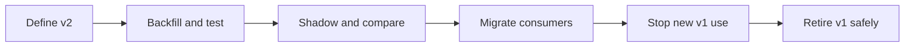

The manifest for a training run should pin the feature definitions, join or spine,
source snapshots, time range, preprocessing, and model code. Otherwise, a model
cannot be reproduced from a feature name alone.

### Chronon behavior

Chronon's [`GroupBy` documentation](https://chronon.ai/authoring_features/GroupBy.html)
states that the compiler protects an online `GroupBy` from casual modification and
recommends a new version. The [`Join` documentation](https://chronon.ai/authoring_features/Join.html)
also recommends a join containing the exact feature list for each model version,
particularly when old and new versions need to run together.

### Online Retail example

Suppose `cancel_refund_value_sum_90d.v1` counts every cancellation invoice. A new
policy excludes administrative reversals. That is not a bug fix hidden under the
same name. Publish `v2`, backfill both, compare entity-time differences, retrain or
shadow consumers, and then deprecate `v1`.

### Counterexample and caution

Versioning every comment or description edit creates noise. Version changes should
track behavior and contract changes. Conversely, “the schema did not change” is
not a reason to reuse a version when semantics changed.

Keeping every version forever is also not governance. Retention costs grow and
users may discover obsolete definitions. Deprecation needs dates, consumer
evidence, replacement guidance, and deletion policy.

**Notebook reference: §7 explains Chronon's compiled online protection and v2
migration; §11 records versions and consumers; §12 includes canary, migration, and
deprecation in the rollout.**

---

## 18. Adoption and when not to use a feature store

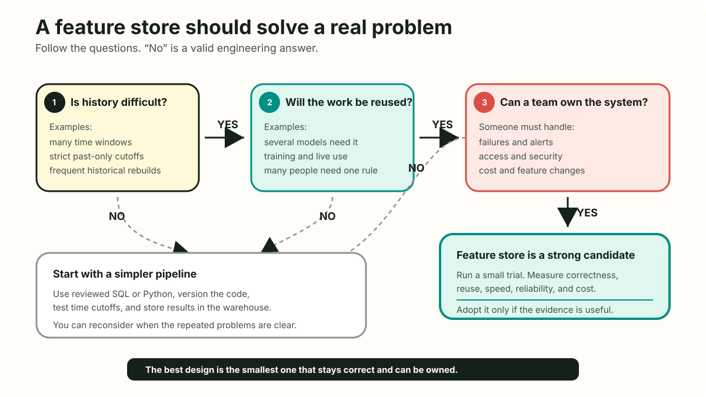

### General principle

A feature store tends to earn its cost when several of these conditions hold:

- multiple models reuse changing entity history;
- historical training requires difficult point-in-time joins;
- both offline and low-latency online access are needed;
- duplicated definitions create incidents;
- freshness, lineage, and access need formal SLOs;
- backfills and model promotion are slow or unreliable;
- a dedicated team can own the platform and integrations.

The [Databricks guide](https://www.databricks.com/blog/what-feature-store-complete-guide-ml-feature-engineering)
recommends starting with one painful production use case and expanding after value
is proven. The [Featurestore.org landscape](https://www.featurestore.org/) shows
that implementations vary widely, from integrated vendor products to open-source
and in-house platforms. Product selection should follow workload and ownership,
not category popularity.

Poor candidates for storage include one-off notebook columns, cheap stateless
request transforms, raw documents, and values known only in the current request.
A user embedding keyed by user can be a feature. Similarity search over many
embeddings belongs in a vector database. A feature store can integrate with that
database, but the two solve different primary problems.

### Online Retail example

This dataset could support several models that reuse customer recency, frequency,
spend, and cancellation history: repeat purchase, retention offer, demand
forecasting, and customer-service prioritization. Shared definitions, historical
cutoffs, and online lookup could justify a feature platform in a real organization.

The tutorial itself does not require production Chronon to compute 541,909 rows.
That is a useful counterexample. Its purpose is to expose the semantics and show
how those semantics map to Chronon. A small pandas or SQL pipeline is enough for
the lesson's runtime.

### Counterexample and caution

Do not adopt a feature store merely because inference is online. A simple keyed
table may suffice. Do not adopt one merely because several teams exist if they
share no entities or meanings. Batch-only systems can still gain point-in-time
joins, contracts, and lineage without an online store.

A platform with no durable owner turns reuse into shared failure. Before measuring
feature count, measure incidents, migration time, compute cost, reuse with semantic
review, and time from experiment to reliable deployment.

**Notebook reference: §12 gives positive and negative adoption signals, separates
feature stores from vector databases, and proposes extensions only after the core
contract is sound.**

---

## 19. Final design checklist

Use this checklist before approving a new feature or feature set.

**Notebook reference: §2 through §12 develop these checks in sequence, from the
prediction contract and temporal fixtures to serving parity, monitoring, and the
final design review.**

### Decision and entity

1. What exact event or schedule triggers the prediction?
2. What does one training and inference row represent?
3. Which entity keys are stable, and how are aliases resolved?
4. Which current-request fields are known and trustworthy at that instant?

**Online Retail test:** one row is one completed order, keyed by `customer_id`.
The current order stays on the spine.

### Time and leakage

5. What are event, availability, and prediction time?
6. Is the historical boundary `< t`, `<= t`, or a snapshot boundary, and why?
7. Is every label mature, and can it leak through another aggregate?
8. Are preprocessing and evaluation split chronologically where deployment is
   forward in time?

**Online Retail test:** features use `[t-window, t)`, labels use `(t, t+30d]`,
and recent censored examples are excluded from supervised training.

### Contract and computation

9. Are name, description, type, unit, source, null, default, and approximation
   rules explicit?
10. Can a tiny fixture prove the boundary and one counterexample?
11. Can a backfill be rerun idempotently from pinned inputs?
12. Does the chosen Chronon `Source`, `GroupBy`, `Join`, and accuracy mode express
    the actual decision rather than merely compile?

**Online Retail test:** the £10, £20, £999 fixture proves that current and future
orders cannot enter prior spend.

### Delivery and observation

13. Is the feature batch-only, online, on-demand, or hybrid?
14. What are freshness, p99 latency, missing-key, and fallback SLOs?
15. How are same-version, same-key, same-cutoff offline and online values compared?
16. Which alerts have an owner and a response playbook?

**Online Retail test:** `computed_at` and feature values are both returned, and one
deliberate corruption must fail parity.

### Governance and lifecycle

17. Who owns meaning, runtime, security, retention, and deletion?
18. Which values and metadata are sensitive, and who may access them?
19. Which models and datasets consume the feature?
20. What is the v1 to v2 migration and retirement plan?

**Online Retail test:** customer behavior features require value-level access
controls, lineage to repeat-purchase consumers, and deletion across every
materialization and log.

If the design cannot answer these questions, more infrastructure will not make the
feature trustworthy.

---

## Source notes and further reading

### Primary technical sources

- [Chronon overview](https://chronon.ai/contents.html)
- [Chronon sources](https://chronon.ai/authoring_features/Source.html)
- [Chronon GroupBy](https://chronon.ai/authoring_features/GroupBy.html)
- [Chronon Join and LabelPart](https://chronon.ai/authoring_features/Join.html)
- [Chronon tiled architecture](https://chronon.ai/Tiled_Architecture.html)
- [Chronon online-offline consistency](https://docs.chronon.ai/test_deploy_serve/Online_Offline_Consistency.html)
- [Chronon testing and serving workflow](https://chronon.ai/test_deploy_serve/Test.html)
- [Chronon repository and quickstart](https://github.com/airbnb/chronon)
- Daqing Chen, [Online Retail](https://doi.org/10.24432/C5BW33), UCI Machine
  Learning Repository, CC BY 4.0.

### Requested industry perspectives

- [Databricks: feature-store guide](https://www.databricks.com/blog/what-feature-store-complete-guide-ml-feature-engineering)
- [Featurestore.org: ecosystem landscape](https://www.featurestore.org/)
- [IBM: feature-store overview](https://www.ibm.com/think/topics/feature-store)
- [Chalk: feature-store overview](https://chalk.ai/blog/what-is-a-feature-store)
- [AWS SageMaker Feature Store](https://docs.aws.amazon.com/sagemaker/latest/dg/feature-store.html)

These perspectives help identify recurring needs such as reuse, historical
correctness, current serving, discovery, and governance. Claims about guaranteed
consistency, universal architecture, comparative performance, or product
superiority remain vendor claims until verified against primary documentation and
the organization's own workload.

© mui-group
