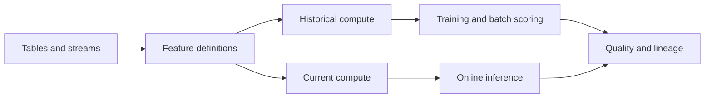
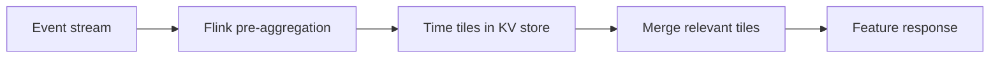
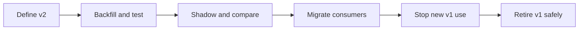

# Feature Stores: Giving Models the Right Past

### A plain-language companion to [`feature_store_tutorial.ipynb`](feature_store_tutorial.ipynb)


A feature is one fact a model uses to make a prediction. For example, "how many
orders did this customer make in the last 30 days?" A feature store is easiest to
understand as a promise:

> For a named entity and a named decision time, produce the feature value that a
> reviewed definition says was eligible, deliver it through the required access
> path, and retain enough evidence to explain where it came from.

Each phrase there is doing work. An **entity** is the thing whose history you
summarize, such as one customer. A decision time is the moment the model made, or
would have made, a call. *Eligible* means the value was allowed to be used at that
moment, which rules out anything that had not happened yet.

That promise is larger than a table. A number can look completely valid and still
be wrong for a model, because it came from the future, described the wrong
customer, or was too old. None of those mistakes produces an error message: the
pipeline runs, the column fills, and the model quietly learns the wrong lesson. This
guide explains how to avoid them without pretending that the ideas are magic.

## Start here: the whole lesson in five ideas

1. A model makes a decision at a particular time, and that time is part of the problem.
2. A feature summarizes information about one thing, such as one customer.
3. Training examples must use only information available before that decision, because the live model never has more.
4. The same feature meaning must be used when training and when making a live prediction, or the model meets inputs it never studied.
5. A team must be able to explain, test, update, and own the feature, because a number nobody can account for cannot be fixed.

If the technical words become distracting, return to these five ideas. Terms such
as *backfill*, which means recomputing historical feature values from the source
history, *offline store*, which keeps the full history arranged for big scans and
model training, and *online store*, which keeps only current values arranged for
fast lookups by key, are names for ways of doing this work. They are not the goal.

The running example is the real [UCI Online Retail dataset](https://doi.org/10.24432/C5BW33).
It contains 541,909 transaction line items recorded by a UK online retailer from
1 December 2010 through 9 December 2011. A line item is one product line on one
invoice, so a single order can occupy several rows. At each completed order, the
notebook asks whether that customer will place another completed order in the
following 30 days. The dataset is small enough to inspect closely, yet rich enough
to expose missing entity keys, cancellations, multiple line items per invoice, time
windows, censored labels, meaning labels whose outcome window has not finished yet,
and information that arrives after the moment it describes. The [UCI dataset page](https://archive.ics.uci.edu/dataset/352/online+retail)
documents the fields and CC BY 4.0 license.

This guide marks two kinds of statements:

- **General principle** is an idea that works across tools.
- **Chronon behavior** is something Chronon does. Another tool may do it
  differently, so check its documentation.

Keeping those apart matters when you switch tools, because principles travel and
product behavior does not follow.

The requested industry sources are useful perspectives, not neutral standards.
The [Databricks guide](https://www.databricks.com/blog/what-feature-store-complete-guide-ml-feature-engineering),
[IBM overview](https://www.ibm.com/think/topics/feature-store),
[Chalk overview](https://chalk.ai/blog/what-is-a-feature-store),
[AWS SageMaker Feature Store documentation](https://docs.aws.amazon.com/sagemaker/latest/dg/feature-store.html),
and [Featurestore.org landscape](https://www.featurestore.org/) agree on many core
problems, but each is written by a company with a product to place, so each
reflects a different ecosystem position. Check any design against the primary
product documentation and against what your own team needs, rather than treating a
vendor diagram as a specification.

## Concept map

Each row names a section, its main question, and where the notebook runs the idea.

| Section | Main question | Notebook |
|---:|---|---|
| 1 | What is a feature store? | §0 |
| 2 | What does a modern architecture contain? | §0, §12 |
| 3 | What are the decision, entity, and contract? | §2, §11 |
| 4 | Which clock defines historical truth? | §2, §6 |
| 5 | How does a point-in-time join work? | §5, §6 |
| 6 | How does leakage enter? | §6, §9 |
| 7 | What do windows really mean? | §5 |
| 8 | How does Chronon describe sources? | §7 |
| 9 | How do `GroupBy`, accuracy, and windows fit? | §7 |
| 10 | How does a `Join` build training data? | §7 |
| 11 | What does the tiled architecture optimize? | §7, §12 |
| 12 | What makes a backfill trustworthy? | §5, §8 |
| 13 | Why are offline and online paths different? | §10 |
| 14 | What is training-serving skew? | §9, §10 |
| 15 | How are freshness and reliability measured? | §10, §11 |
| 16 | Who owns and may access a feature? | §11, §12 |
| 17 | How should definitions evolve? | §7, §11 |
| 18 | When is a feature store worth its cost? | §12 |
| 19 | What should a final design review ask? | Final design review |

---

## 1. A feature store is a system of feature truth

### General principle

A model feature is an input value used by a model. A feature store is the system
that manages selected feature definitions and values across their whole lifecycle.
That lifecycle normally includes:

1. defining a feature against source data;
2. computing historical values for training and backtesting;
3. maintaining current values for batch or online inference;
4. recording metadata, ownership, lineage, and versions;
5. checking data quality, freshness, delivery, and consistency.

**Lineage** is the recorded trail of where a value came from: which sources and which
version of the definition produced it. **Freshness** is how up to date a value is, which
is a different question from how fast you can look it up.

That lifecycle explains why calling a feature store "a database of columns" is
incomplete. A database can store `purchase_order_value_sum_30d = 145.20`, but it
does not tell you which customer that value describes, whether the current order
was excluded from the sum, whether the unit is pounds or items, which corrections
to the source were visible when it was computed, who owns the pipeline, or whether
the online model received the same number. Each unanswered question is a way for the
value to be wrong while still looking fine.

The phrase **single source of truth** should mean one reviewed definition of what a
feature means, plus one recorded trail of where its values came from. It need not
mean one physical database. Historical training queries need large scans and the
ability to ask what a table looked like at a past moment. An online request wants one
small lookup by key, finishing quickly even in the unlucky cases, which is what
predictable tail latency means. Those two jobs pull hardware in opposite directions, so
one logical definition may produce several
**materializations**, meaning stored copies of the feature's values, computed ahead
of time and saved in different shapes.

The [IBM overview](https://www.ibm.com/think/topics/feature-store) describes the
common combination of ingestion, transformations, storage layers, serving,
registry metadata, and orchestration. The [Databricks guide](https://www.databricks.com/blog/what-feature-store-complete-guide-ml-feature-engineering)
similarly emphasizes discovery, reuse, lineage, point-in-time correctness, and
training-serving consistency. Those are useful architecture patterns, not a rule that
every deployment must contain a separately branded product for each box.

### Online Retail example

The raw dataset has invoice line items. The notebook creates reusable historical
features such as:

```text
purchase_order_id_count_30d
purchase_order_value_sum_90d
days_since_last_order
cancel_refund_value_sum_30d
```

Each value is keyed by `customer_id`, so the number belongs to exactly one
customer, and each is evaluated at a prediction timestamp. The same definition can
then produce both a column in a
historical training table and a live lookup for a customer shopping right now. That
shared meaning is what a feature store is actually selling. Without it, the
training column and the live lookup are two separate programs, and nothing keeps
them agreeing.

### Counterexample and caution

A single batch model with five inexpensive features, one owner, no online path,
and a reliable versioned SQL pipeline may not need a feature-store platform. Every
extra component is another thing that can fail: a registry, a stream processor that
reads a continuous feed of new events, an online database, and a control plane can
easily create more failure modes than they remove. You would notice this as a team
debugging its own platform instead of its model. Point-in-time SQL plus disciplined
contracts may be the right solution.

Also, raw data can be a valid model input. "Derived and reusable" describes a
strong candidate for a feature store, not the only possible definition of a
feature. The current order's value is a valid model feature here, but it is
**request context**, meaning a fact that arrives with the request itself and is
therefore known at the moment of the decision, rather than stored customer history.

**Notebook reference: §0 sets out the logical pieces of a feature store and names
the neighboring systems it usually does not replace: the warehouse, stream
processor, orchestrator, model registry, vector database, and catalog.**

---

## 2. Modern architecture: one contract, several execution paths

### General principle

A modern feature platform usually connects five layers, read left to right below:



- **Sources** provide events, entity snapshots, mutations, and request context. An
  **entity snapshot** is a record of what an entity looked like on a given day, as
  opposed to a stream of individual events.
- **Definitions** name keys, transformations, windows, time rules, and ownership.
- **Historical compute** reconstructs values for old decision times.
- **Current compute** maintains or calculates values needed now.
- **Registry and control plane** support discovery, review, lineage, deployment,
  access, and lifecycle state.
- **Observability** checks the entire path from source to model impact, so a break
  anywhere becomes visible instead of quietly degrading predictions.

Offline and online are just two different access patterns. An offline path is
optimized for large historical reads, joins, backfills, training, and batch
scoring. An online path is optimized for reading the current value for one key at
low latency, because a customer is waiting on a page load. Systems differ: some
store both, some manage only the offline side, and some calculate selected values
on demand. [AWS documents](https://docs.aws.amazon.com/sagemaker/latest/dg/feature-store.html)
feature groups that may use an online store, an offline store, or both. That is an
AWS implementation choice, not a law about how storage has to work, so do not
carry the assumption into another product.

### Online Retail example

The historical path creates one row for every completed order in the prediction
**spine**, which is the list of historical examples, one row per decision, each
carrying its key and its timestamp. Features are attached to that spine by
evaluating prior customer behavior as of the row's `prediction_ts`. The current
path can instead keep the latest 7, 30, and 90-day customer totals in a
**key-value store**, a database built to return the value for one key very quickly.
At inference the model combines those stored values with fields from the current
order, such as `current_order_value` and `item_count`.

Keeping those two kinds of input separate is important. Current-order facts must not be
folded into a feature whose name promises "prior spend," or the feature secretly
contains the very order being decided about. Going the other way, a 90-day history
should not be recomputed by scanning the entire transaction table during every web
request, because that scan is far too slow to sit inside a page load.

### Counterexample and caution

Two paths governed by one definition are not automatically equal. They may read
different source feeds, use different **watermark** rules, meaning different
answers to "have we now received every event up to this time?", apply different
defaults for missing values, or deploy different versions. Writing the logic once in
a shared language removes duplicated code, but it cannot remove the delay that comes
from spreading work across many machines, and it cannot fix a source whose meaning
was wrong to begin with.

"Online store" also does not imply "fresh." A key-value lookup can answer in one
millisecond with a value that is seven days old, because speed of retrieval says
nothing about age of content. Measure freshness and lookup latency separately, or
you will report a healthy dashboard while serving stale numbers.

**Notebook reference: §0 separates the three jobs of defining a feature, storing
its computed values, and delivering them to a reader; §10 builds a deliberately
named `TeachingFeatureCache` class that stands in for a real online store; §12
maps the same logical objects onto a production Chronon deployment.**

---

## 3. Start with the decision, entity, and feature contract


### General principle

Feature design should start with the model's decision, not with a table that happens
to look convenient. Browsing for convenient columns is how teams end up with features
that cannot be served. Four questions establish the frame:

1. What event or schedule triggers a prediction?
2. What does one prediction row represent?
3. Which entity keys connect that row to historical state?
4. Which values are already known at that instant?

An **entity** is the subject whose state or history the feature summarizes. It can
be a customer, account, item, merchant, device, location, or a combination such as
`(customer_id, product_id)`. The key is part of what the feature means, not a
storage detail. An order count keyed by customer answers a question about a person,
while the same count keyed by country answers one about a market, so the two are not
interchangeable.

A **feature contract** turns that meaning into a written agreement you can operate
against, covering the feature's meaning, keys, type, time rule, owner, version,
freshness target, what a null means, and where the data came from. At minimum,
record:

| Contract field | Question it answers |
|---|---|
| Name and description | What does the value mean? |
| Entity and key mapping | Whose value is it? |
| Type and unit | Is `42` GBP, items, or days? |
| Source and lineage | Which records produced it? |
| Time and availability rule | Which records were eligible? |
| Null and default policy | What do absent history and zero mean? |
| Freshness and serving SLO | How current and how fast must it be? |
| Owner and on-call route | Who decides and who responds? |
| Sensitivity and access | Who may discover or retrieve it? |
| Version and consumers | Which meaning and which dependencies apply? |

The serving row uses the idea of a **service level objective**, usually shortened to
SLO, which is a written target for how a service must behave, such as "99 percent of
values are readable within 60 seconds." Writing that target down turns a vague wish for
fresh data into something you can measure. Every other row works the same way: leave it
blank and someone downstream guesses.

### Online Retail example

In the notebook, the decision is made when a completed invoice is recorded, so one
training example is one completed order. The entity is `customer_id`. The target is
another completed order from that customer within the next 30 days. The order that
triggered the decision is request context, while prior orders and prior cancellations
are historical sources that must be summarized.

A concise contract from §11 is:

```python
{
    "name": "purchase_order_value_sum_30d",
    "entity": "customer_id",
    "dtype_unit": "float64 GBP",
    "time_rule": "[t-30d, t)",
    "null_policy": "zero means no eligible orders",
    "owner": "retail-ml",
    "version": "v1",
}
```

Read `time_rule` as a promise: everything from 30 days before the decision up to,
but not including, the decision itself.

The order's own value is known at this tutorial's decision time, so
`current_order_value` may be a feature. It stays on the left side of the join, where
request context belongs. It must not enter `purchase_order_value_sum_30d`, whose
name promises prior history only. If it did, a customer placing a £20 order would
show £20 of "prior" spend that never existed before the decision.

### Counterexample and caution

The UCI file records completed invoices, not a live checkout request. A real
application might predict before payment is taken, after payment is authorized,
after the parcel ships, or after the money settles. The fields known at those moments
differ, so the set of legal features changes with the moment you pick. Copying this
tutorial's contract into a system that fires at a different point would be
misleading, because it would promise fields that do not exist yet. You would notice
in production as a feature that is null far more often than it was in training.

Entity IDs also need to be stable. Rows with a missing `CustomerID` cannot be
attached to any customer history unless you first write down a policy for identity
resolution, meaning how you decide that two records describe the same person.
Guessing from country, invoice, or product would stitch strangers into one fake
customer, producing history that is confidently wrong rather than merely absent.

**Notebook reference: §2 fixes what one prediction row is, which entity it belongs
to, which fields count as request context, and where the feature window and the
label window stop; §11 builds a small registry table recording units, null rules,
freshness, ownership, versions, and consumers.**

---

## 4. The three clocks: event, availability, and prediction time


### General principle

Time is not one column. Three clocks answer different questions:

- **Event time:** When did the real-world event occur?
- **Availability time:** When could the feature pipeline actually use the event?
- **Prediction time:** When did, or would, the model act?

Suppose a £42 purchase happens at 09:30, a model predicts at 10:00, and the record
lands in the warehouse, the large storage system that holds your historical tables,
at 10:10. Rebuild history using event time and the £42 counts, because 09:30 comes
before 10:00. Rebuild history using what was actually available and it does not,
because at 10:00 the live model could not see a row that would not exist for another
ten minutes.

These create two legitimate historical truths:

1. **Event truth** asks what had happened by the prediction time.
2. **Production-available truth** asks what the production system could have known.

Neither is a bug. Production-available truth is usually the stronger choice when you
want training inputs to match serving inputs exactly, because it reproduces the model's
real ignorance rather than an idealized past. Event truth is still useful when
records arrive with very little delay, when nobody kept a record of when data became
readable, or when the modeling question really is about what eventually turned out
to be true. The chosen truth must be named, or two people reading the same training
table will disagree about what it means.

### Online Retail example

`InvoiceDate` is the event timestamp in the UCI data, and the tutorial uses the
current completed order's `InvoiceDate` as its `prediction_ts`. The file has no
column saying when each row became readable by a pipeline, so the availability clock
does not exist here. That is why the main backfill demonstrates event-time
correctness: you cannot enforce a rule using a column you do not have.

§6 makes the missing clock concrete by inventing the two timestamps the real dataset
lacks:

```python
event_truth = delayed.loc[
    delayed["event_ts"] < prediction_ts, "amount"
].sum()

available_truth = delayed.loc[
    (delayed["event_ts"] < prediction_ts)
    & (delayed["available_ts"] <= prediction_ts),
    "amount",
].sum()
```

Both filters require the event to have happened before the prediction. Only the
second also requires it to have been available by then, so with the late £42 event
the first sum returns 42 and the second returns 0. The two sums are meant to differ, so
this is not an implementation bug: the two expressions answer different historical
questions.

### Counterexample and caution

No point-in-time tool can reconstruct availability time if the source never recorded
it, because there is nothing to filter on. Replaying today's corrected warehouse
table at an old event timestamp then exposes records that were late, records since
deleted, and records revised long after the original decision. You would notice this
as a model that scores beautifully in backtests and clearly worse on its first day
live.

Processing time, meaning when your job happened to handle the record, is sometimes
used as a stand-in for availability time, but the two are not always equal. A record
can reach a message broker on schedule, sit in a crashed consumer, get transformed
later, and only become readable hours after that. Define the clock at the boundary
that matters to the model.

**Notebook reference: §2 lays out the three clocks and points out that the UCI file
has no availability clock; §6 runs a small fixture in which rebuilding by event time
comes to £42 while rebuilding by what production could see comes to £0.**

---

## 5. Point-in-time joins: ask what was eligible at each decision


### General principle

A conventional equality join matches keys, and that is all it checks. A
**point-in-time join** is a lookup that returns only what was known at each past
prediction time, so it matches keys and also enforces a rule about time separately for
every prediction row on the left, because each row has its own decision moment.

For a prediction at time `t`, the notebook uses:

```text
feature window: [t - window, t)
label window:   (t, t + 30 days]
```

The brackets are not decoration. The feature interval is half-open, which means it
includes the start instant and excludes the right boundary. Because the right
boundary is excluded, the current order and every other event
stamped exactly at `t` are left out of the historical totals. The label interval
points the other way: it looks forward, excludes anything stamped exactly at `t`, and
does include an order landing exactly 30 days later.

This boundary gives a clean division between cause and effect:

- the left side holds the example key, prediction time, and request context;
- the right side contributes only eligible historical feature values;
- a later label process attaches outcomes after their horizon matures.

The notebook's own reference calculation makes the boundary explicit:

```python
right = np.searchsorted(history_times, anchor_times, side="left")
left = np.searchsorted(
    history_times,
    anchor_times - days * DAY_NS,
    side="left",
)
```

`np.searchsorted` finds where a value would slot into a sorted list, so these two
lines locate the first and last positions in a customer's event history that fall
inside the window. `side="left"` on the right cutoff excludes events whose time equals
the anchor, which is the half-open rule in code. Prefix sums, meaning running totals
computed once up front, then give each window's sum by subtracting two numbers instead
of rescanning all events.

### Online Retail example

Customer C1 has orders of £10 on 1 January, £20 at the 10 January prediction, and
£999 on 11 January. At the 10 January decision, prior 30-day spend is £10, because
only the £10 order falls inside `[t - 30d, t)`. The £20 is the order being decided
about, so it is request context on the left side and not part of any "prior" total.
The £999 order on 11 January falls inside the forward-looking label window, so it
makes this example a positive case, but it must never appear as an input.

That tiny fixture is more convincing than a large result table, because every eligible
and ineligible value is visible and you can verify the £10 by hand.

### Counterexample and caution

"Use the latest customer row" is not point-in-time correctness, natural as it looks in
SQL. If training runs in December, the latest row for a customer already includes
purchases made after a historical prediction in March, so a March example is scored
with June and September information. You would notice this as
a training script whose numbers change every month as future data piles up, with
offline accuracy better than production ever achieves.

An as-of join written with `event_ts <= prediction_ts` can still be wrong, because
that comparison lets through an event stamped exactly at the prediction time, which is
usually the current event itself. Whether equality is safe depends on whether the
decision happens before or after the current event has been consumed by the pipeline.
This tutorial takes the conservative option, excludes events at exactly `t`, and tests
the boundary.

**Notebook reference: §5 implements the window helper `window_stats` and the
feature builder `build_point_in_time_features`; §6 asserts that the boundary case
comes out at exactly £10.**

---

## 6. Leakage taxonomy: point-in-time correctness is necessary, not sufficient


### General principle

**Leakage** occurs when training uses information that would not have been available,
or would not have been legal to use, for the real prediction. A correct point-in-time
join removes one family of leaks, but only one. Each row below names another way
information travels backwards in time, plus the guardrail that stops it.

| Leakage type | Online Retail failure | Guardrail |
|---|---|---|
| Latest-value leakage | December customer totals enrich a March order | point-in-time join |
| Window-boundary leakage | current order enters "prior 30-day spend" | strict fixture test |
| Target leakage | future-order count is a model input | explicit allowlist |
| Availability leakage | a late invoice appears before it was readable | preserved availability time |
| Revision leakage | corrected price replaces the original observed value | source versions or change log |
| Cross-entity leakage | customer aggregate includes current order's future label | label cutoff inside aggregation |
| Global-statistics leakage | imputer or scaler fits on test-period values | fit preprocessing on training only |
| Split leakage | random train/test rows mix future behavior into training | chronological split |
| Label censoring | recent examples with incomplete horizons become negatives | maturity cutoff |
| Grain leakage | line items from one invoice appear as separate predictions | normalize to order events |

The last row is about the unit of a row. Because one UCI invoice spans many product
lines, treating each line as its own prediction makes one order look like several
decisions, which inflates any score computed over those rows.

The notebook deliberately builds one forbidden feature in §9 so you can see the damage
it does:

```python
future_start = np.searchsorted(times, times, side="right")
future_end = np.searchsorted(times, times + 30 * DAY_NS, side="right")
future_count = future_end - future_start
```

Both calls use `side="right"`, which looks strictly after the anchor, so `future_count`
counts each customer's orders in the next 30 days. That is what you need to build the
label `repeat_purchase_30d`, and it is forbidden as an input to the model. The same
column is correct in the label pipeline and catastrophic in the feature list.

### Online Retail example

The notebook trains one model on causal features only, then trains a second that also
gets `leak_future_order_count_30d`. The second model should score strikingly better
offline, because that input nearly announces the answer it is supposed to predict. That
jump is evidence of a broken experiment, not a stronger model, and an implausibly good
score is usually the first symptom of leakage anyone notices.

The label itself also needs time to finish. An order placed on 8 December cannot be
given a complete 30-day repeat-purchase label when the dataset stops on 9 December,
because only one of those 30 days actually happened. Calling such a row a negative
records an unfinished experiment as a failure. The notebook flags each row with
`label_is_observed` and keeps immature rows out of supervised training.

### Counterexample and caution

Not every use of a future value is leakage. A future window is required to define a
supervised outcome, so the label pipeline is entitled to read the future. It becomes
leakage only when that value, or something derived from it that carries the same
information, ends up among the inputs the model can see.

A point-in-time join also cannot catch a field that describes events after the outcome
but wears an old timestamp. A column called "customer status at order time" might have
been filled in later using the eventual repeat-purchase result, while every row still
carries the original order's timestamp. No temporal filter can see that, because nothing
in the data looks wrong. Temporal types do not replace source review.

**Notebook reference: §6 tests the window boundary and the availability rule; §9
splits the data by time rather than at random, trains one model on causal features
and one on a deliberately forbidden feature, and gathers the full list of leakage
types.**

---

## 7. Windowed features: business memory with exact boundaries

### General principle

A window defines how much history a feature remembers. Choosing one is a modeling
claim, not a technical setting, because different windows express different hypotheses:

- 7-day order count captures very recent activity;
- 30-day spend captures a monthly purchasing rhythm;
- 90-day cancellation value captures a longer return pattern;
- lifetime aggregates summarize all retained history;
- recency measures the distance to the latest eligible event.

Counts, sums, and averages answer different questions, so which one you pick changes
what the model can learn. Consider two customers over the same 90 days: one places a
single £1,000 order, the other ten orders of £100. Their sums are identical at £1,000,
yet the second is clearly the more habitual shopper, and a model given only the sum
cannot tell them apart.

Averages need extra care. An average is undefined when the count is zero, since you
cannot divide by nothing. Quietly replacing that missing value with zero tells the model
"the average prior order was £0," which is a false statement about a customer whose real
situation is "no prior order exists." The notebook preserves the distinction:

```python
averages = np.divide(
    sums,
    counts,
    out=np.full(len(row_index), np.nan),
    where=counts > 0,
)
```

`where=counts > 0` divides only where there is something to divide, and `out` leaves
`nan`, the usual marker for a missing number, everywhere else, so the column says
"unknown" rather than "zero."

It also derives a smoothed ratio, meaning one adjusted so it stays defined even when
the denominator would be zero:

```python
cancel_value_ratio_90d = (
    cancel_refund_value_sum_90d
    / (purchase_order_value_sum_90d + 1.0)
)
```

The `+ 1.0` prevents division by zero for a customer with no prior purchases. But that
1.0 is one pound sterling, not an abstract nudge, so it shifts the ratio for
small-spending customers more than for large ones. That makes it a modeling decision
rather than harmless numerical housekeeping, and it belongs in the contract.

### Online Retail example

Purchase and cancellation histories are separate event streams. Both are keyed by
`customer_id`, but their amounts mean different things and they may need different
freshness targets, so they stay apart. The notebook computes 7, 30, and 90-day purchase
features and 30 and 90-day cancellation features. It then checks **invariants**,
statements that must be true of every row and are therefore easy to test: a customer's
7-day order count can never exceed their 30-day count, because the shorter window sits
inside the longer one. If that check fails, the window logic is broken.

### Counterexample and caution

More windows are not automatically better. Hundreds of nearly identical windows cost
more storage and computation, add pipelines to monitor, and raise the multiple-testing
risk, which is the danger that if you try enough slightly different features one will
look useful purely by chance. Start with domain-relevant horizons and add complexity
only when evaluation justifies it.

What a window means can also differ between systems. A calendar month is not always 30
days. Time zones and daylight-saving changes can make "one day" stop being 24 elapsed
hours. Chronon's documented windows use hour or day units, but a team still must define
how source timestamps are normalized and whether the business needs a real calendar.
You would notice a mismatch as features that shift every spring and autumn for no
business reason.

**Notebook reference: §5 builds the half-open 7, 30, and 90-day windows using
prefix sums, plus recency, cancellation history, explicit null behavior, and tests
that a shorter window never exceeds a longer one.**

---

## 8. Chronon `Source`: define the shape and timeline of input data


### Chronon behavior

Chronon's [`Source` documentation](https://chronon.ai/authoring_features/Source.html)
describes inputs to feature pipelines. The major distinction is between event
history and entity state:

- `EventSource` represents append-like facts such as orders and cancellations,
  meaning records that are added and not meant to change afterwards.
- `EntitySource` represents snapshots and, when supplied, mutation history for
  stateful records such as a customer profile, meaning records that get edited over
  time.

The distinction matters because the two are replayed differently: you rebuild an event
history by adding events up, but you rebuild entity state by asking what the record said
on a particular day.

A streaming `EventSource` can pair a historical warehouse table with a **topic**, a
continuous feed of new events that systems read as they arrive. Backfills read the
table, since it holds the long past, while the topic supplies the newest events so
online values stay current. A `Query` then selects fields, filters rows, and names the
column that holds the event time.

The notebook stays close to the documented definition:

```python
source = Source(events=EventSource(
    table="retail.orders",
    topic="retail.orders.v1",
    query=Query(
        selects=select(
            "customer_id", "order_id", "order_value", "item_count"
        ),
        time_column="ts",
    ),
))
```

The logical contract expects `ts` to be epoch milliseconds, meaning milliseconds since
1 January 1970, even though the local pandas code uses readable timestamps. Hand one
format to code expecting the other and the timestamps land in the wrong decade, so every
window silently comes back empty.

### Online Retail example

Completed orders, once normalized from line items up to whole orders, belong in an event
source. Cancellation invoices belong in a second event source, because their amounts,
their meaning, and the way they get updated all differ from purchases. A customer profile
table holding one state per customer would more naturally be an entity source, but the
public UCI data provides no trustworthy profile change history to replay.

### Counterexample and caution

Writing a topic name next to a table name does not prove the two carry the same meaning.
They can quietly disagree about which rows are filtered out, whether duplicates are
removed, which timestamp is authoritative, how currency is converted, and what happens to
late events. The pair needs a source contract plus parity tests comparing both feeds over
the same period. You would notice their absence when an online feature sits a few percent
above its offline twin and nobody can say which is right.

An `EntitySource` built only from today's customer table cannot faithfully rebuild what a
customer looked like in the past, because the old values are gone; you need historical
snapshots or a log of changes. Joining a customer's current country onto every old order
is revision leakage in action: if the customer moved, or someone fixed a typo, those old
training rows now carry information that did not exist at the decision.

**Notebook reference: §4 turns the line-item table into separate order and
cancellation event tables; §7 imports those Chronon definitions and looks at what
they contain.**

---

## 9. Chronon `GroupBy`, aggregations, and accuracy

### Chronon behavior

[`GroupBy`](https://chronon.ai/authoring_features/GroupBy.html) is Chronon's primary
feature-definition object. It combines:

- one or more compatible sources;
- entity keys;
- aggregations and optional windows;
- metadata, ownership, and versioning information;
- an accuracy mode;
- an online-serving flag.

Gathering all of that into one object means no consumer can take the numbers and leave
the rules behind.

The tutorial's purchase definition has this shape:

```python
v1 = GroupBy(
    sources=[source],
    keys=["customer_id"],
    aggregations=[Aggregation(
        input_column="order_value",
        operation=Operation.SUM,
        windows=[
            Window(7, DAYS),
            Window(30, DAYS),
            Window(90, DAYS),
        ],
    )],
    accuracy=Accuracy.TEMPORAL,
    online=True,
)
```

Chronon documents two accuracy modes:

- `SNAPSHOT` computes values at daily midnight boundaries.
- `TEMPORAL` supports real-time online updates and point-in-time-correct backfills.

That is not merely a performance switch; it changes which historical question you are
asking. A prediction made at 15:00 and joined to a snapshot feature is handed the state as
of the previous midnight, so anything the customer did that morning is invisible. The same
prediction joined to a temporal feature can include every eligible event right up to the
exact cutoff.

Chronon also documents **sawtooth windows**, which combine pre-aggregated hops, meaning
totals already computed for small time slices, with a recent partial segment. That is the
idea of **tiling**: precompute partial totals so a long window is answered by adding a few
pieces instead of rescanning everything, while the partial segment keeps the newest
eligible events in the answer. Tiling is an implementation technique, so the feature
contract a user reads should still state the intended time range plainly.

### Online Retail example

The repeat-purchase model fires at invoice timestamps spread across the whole day, so
`TEMPORAL` matches the history it is supposed to see. A midnight snapshot would suit a
daily retention campaign scored once every morning, where everyone already agrees the
data is a day old. For a per-order decision it would be misleading, unless the model was
trained with the same midnight semantics.

`online=True` asks Chronon to create or schedule the maintenance needed for online
serving. It does not force every consumer to read the feature online, and it does not
replace a real online-store integration. Assuming the flag alone creates a serving path
is how teams discover at launch that nothing is being written.

### Counterexample and caution

Temporal accuracy cannot repair a source that lacks the clock it needs. If your warehouse
only holds daily corrected totals, setting `accuracy=Accuracy.TEMPORAL` does not invent
within-the-day detail, and it does not recover what the numbers looked like before they
were corrected. The setting describes how Chronon uses the timestamps you gave it.

Approximate aggregations may be necessary for scale, but their parameters are part of
feature meaning, not free tuning knobs. A unique-count sketch, which estimates how many
distinct values were seen without keeping them all, gives a different statistical
guarantee once its precision changes. That is a new contract even though the column name
stayed constant.

**Notebook reference: §7 walks through every field of the purchase `GroupBy`, previews
the compiled definition as JSON produced from Chronon's Thrift schema, where Thrift is
the format used to describe those objects, and separates Chronon's temporal accuracy
from the logical time handling in the local pandas code.**

---

## 10. Chronon `Join`: the prediction spine is the historical question

### Chronon behavior

A Chronon [`Join`](https://chronon.ai/authoring_features/Join.html) combines a left
driver source with one or more right-side `GroupBy` definitions. The left side is
the spine: the list of historical examples, one row per decision, each carrying its
entity key and its timestamp. It tells Chronon which entity keys and prediction
timestamps need historical feature values. The right parts name which feature groups
get evaluated at those times, and Chronon works out, row by row, what each group
would have reported at that row's moment.

```python
v1 = Join(
    left=prediction_events,
    right_parts=[
        JoinPart(group_by=purchases_v1, prefix="purchase"),
        JoinPart(group_by=cancellations_v1, prefix="cancel"),
    ],
    online=True,
    check_consistency=True,
    sample_percent=1.0,
)
```

Prefixes prevent collisions and make provenance visible: `purchase` and `cancel` go
on the front of the generated column names, so the two groups' sums cannot collide.
Key mappings can connect a left-side key name to a different right-side entity name.
The mapping must be semantically valid, not merely type-compatible, because two
columns can both be integers and still describe entirely different things.

Chronon documents that an event left side with temporal right-side features can
produce millisecond point-in-time backfills, so each row's cutoff is that row's own
timestamp rather than a rounded one. A batch right side is midnight accurate by
default unless temporal accuracy is requested and supported, which means a decision
made at 15:00 is answered with the state as of the previous midnight. The left side
matters to offline backfills. Current online fetches use supplied keys and
implicitly ask for current values, since a decision happening now has no past moment
to reconstruct.

Labels point in the opposite temporal direction from features. A feature looks
backward from the decision; a label looks forward, so it is not knowable until its
outcome window closes. Chronon's `LabelPart` supports attaching those later outcomes
after feature backfills have run. In this tutorial, the local spine carries a mature
label, while the feature allowlist keeps that label and its future-order count out
of the model inputs, so the answer never becomes one of the questions.

### Online Retail example

Every completed order supplies `customer_id`, `prediction_ts`, request-context
fields, and later the label `repeat_purchase_30d`. The purchase and cancellation
`GroupBy` definitions enrich that row using only earlier events. Take the fixture
customer who spends £10 on 1 January, £20 on 10 January, and £999 on 11 January. At
the 10 January row the join fills in £10 of prior 30-day spend, the £20 stays on the
left as request context, and the £999 order the next day turns the label positive.
One such row per completed order is the training table for one model version.

### Counterexample and caution

A wide feature table with no explicit prediction spine is dangerous. There is no
single "customer value on 5 March" unless a cutoff, source versions, key mappings,
and null policy are defined. Without those, two people can each write an honest
query for that phrase and get two different numbers.

Changing the left source can change the row population, decision time, and label
distribution even when every right-side feature stays identical. You would notice it
as a model score that jumps after a change nobody believes touched the features,
with the row count or the share of positive labels moving while every definition
file is unchanged. Treat the spine as a first-class versioned data product with its
own name, version, and owner.

**Notebook reference: §5 builds the local order spine in code; §7 walks through
Chronon's left source, right parts, prefixes, consistency settings, and the way
labels are kept apart from features.**

---

## 11. Chronon's tiled architecture: move work from reads to writes

### Chronon behavior

Chronon's [tiled architecture documentation](https://chronon.ai/Tiled_Architecture.html)
describes an online optimization for windowed aggregations. **Tiling** means
precomputing partial totals for small time slices, so a long window is answered by
adding a few pieces together instead of rescanning everything. In the traditional
path, individual events are stored and a request may have to fetch and aggregate
many of them. In the tiled path, a stateful Flink job pre-aggregates events into
intermediate representations called tiles, and a request merges a small number of
tiles instead of scanning every contributing event. A request's work then grows with
the number of tiles rather than the number of events behind the key.



The tiles in that diagram sit in a KV store, short for **key-value store**: a
database built to return the value for one key very quickly. The trade is write-path
state and complexity in exchange for lower read amplification, meaning the read side
touches much less data. It pays off most for hot keys, which are keys with very many
events behind them, and for long windows. Chronon's documentation states that this
feature is being open-sourced and requires Flink, so it should not be presented as
automatically active in every Chronon deployment.

Tiling is related to, but distinct from, the semantic feature window. The model
still asks for a 30-day customer spend, and that question is unchanged. Tiles are
only an internal way to answer it efficiently.

### Online Retail example

A wholesale customer can have many invoice events. Serving that customer's 90-day
spend by reading and summing every order on each request means the work grows with
the event count, so your busiest customers become your slowest requests. Hourly or
daily pre-aggregated tiles can reduce that work while preserving the defined
boundary, provided the newest partial interval and late-event corrections are
handled. Those two provisos are the whole difficulty: the tile covering right now is
incomplete by definition, and a late event belongs to a tile you already sealed.

### Counterexample and caution

Tiling is unnecessary for a customer with three orders per year. Summing three
numbers was never the bottleneck, and tiling adds state, operational dependencies,
and correction logic you then have to run and debug forever. Measure key frequency,
window sizes, p99 latency, and storage before adopting it. **p99 latency** is the
response time that 99 percent of requests come in under, so it describes the slow
tail rather than the typical case, which is exactly where a hot key would show up.

Pre-aggregation can also hide errors if tests inspect only final values. The symptom
is quiet: totals look plausible, no job fails, and the number is simply a little
wrong for customers with events near a boundary. Validate tile merge behavior around
window starts, exact cutoffs, late events, deletions, and partial current tiles, and
write those checks as fixtures with hand-computed answers.

**Notebook reference: §7 sets up the `Source` to `GroupBy` to `Join` object model;
§12 explains that production streaming and key-value integration are separate
concerns from the local semantic runner. The notebook makes no benchmarking claim
about tiling.**

---

## 12. Backfills: historical computation is a reproducibility problem


### General principle

A **backfill** recomputes historical feature values from the source history, one
value per entity-and-time row. You need it for training, evaluation, backtesting,
recovery after an outage, and migration to a new definition. The hard part is not
making the query fast; it is being able to run it again next month and get the same
answer. A trustworthy backfill therefore needs:

- a versioned prediction spine, so you know which rows were asked about;
- a versioned feature definition, so you know which rules produced the values;
- stable or versioned source data;
- explicit event and availability semantics, so the cutoff rule is written down;
- deterministic key mapping and deduplication, meaning the same input always
  produces the same keys and the same surviving rows;
- a label maturity policy for rows whose outcome window has not finished;
- idempotent reruns and partial-failure recovery, where **idempotent** means safe
  to run twice, because a second run produces the same result instead of doubling
  it;
- manifests that record code, source, time range, and outputs.

Chronon advertises scalable point-in-time backfills from raw history. Its primary
documentation describes the left `Join` source as the backfill driver and Spark as
the batch execution engine. Compilation turns Python definitions into Thrift JSON,
and compilation alone does not compute data. A definition that compiles cleanly
tells you the syntax is acceptable and nothing about whether the numbers are right.

### Online Retail example

The notebook's NumPy reference builder is intentionally transparent: you can read it
and see every decision it makes. It sorts each customer's events, uses
`searchsorted` to find the window boundaries, and uses prefix sums for range totals.
That makes it a readable semantic oracle, a trusted second opinion for fixture tests
and model experiments.

The notebook separately authors real Chronon objects and documents the optional
Spark-backed path. The distinction matters:

- the local runner answers, "Did we define the cutoff correctly?"
- production Chronon answers, "Can we compute, deploy, refresh, and monitor this
  definition at organizational scale?"

Confusing the two is how teams end up with a well-operated pipeline serving the
wrong number.

### Counterexample and caution

Recomputing an old row today may use corrected source data that was unavailable to
the original model. That result can be historically more accurate and still fail to
reproduce production. Decide, and write down, whether a backfill rebuilds history from
today's corrected source or from what production could actually see. You would notice
the confusion
when a backfilled training set produces a model that scores well offline and then
underperforms live, because the backfill handed it information the live system never
has in time.

A successful Spark job is not proof of a correct dataset. It may complete with
missing partitions, duplicate events, shifted keys, or immature labels and still
report success. A **partition** is a slice of a table, usually one day of data, that
jobs can read or rewrite on its own, so a missing partition means a whole day is
absent while every other day looks fine. The symptom is a sensible row count, no
errors in the log, and an unexplained dip in one week's activity. Run semantic
invariants after computation, not just job-status checks.

**Notebook reference: §5 implements the transparent backfill; §6 proves it with
small fixtures and invariants; §8 keeps the optional real Chronon runtime separate
from the semantic reference, so a local fallback is never mistaken for a Chronon
result.**

---

## 13. Offline and online patterns: different workloads, aligned meaning


### General principle

Offline storage retains historical values, or enough source history to reconstruct
them, and supports broad scans and joins. Online storage usually retains current
state only, optimized for keyed reads and high request volume, because a live
request wants one customer's numbers immediately. [AWS Feature Store](https://docs.aws.amazon.com/sagemaker/latest/dg/feature-store.html)
documents an online store that retains latest records and an append-oriented
offline history. [Chalk's overview](https://chalk.ai/blog/what-is-a-feature-store)
also frames online and offline as different access patterns. Those details are
product-specific examples of a general split, so read them as illustrations rather
than rules.

A **materialization** is a stored copy of a feature's values, computed ahead of
time. The common patterns are:

1. **Batch only:** compute daily features for training and batch scoring, which
   suffices when nothing must answer inside a web request.
2. **Batch to online:** compute entity snapshots, then bulk-load current entity
   values. An **entity snapshot** is a record of what an entity looked like on a
   given day, as opposed to a stream of individual events.
3. **Batch plus stream:** seed historical state in batch, then update it from events
   as they arrive.
4. **On demand:** compute cheap request-time features from live services, storing
   nothing.
5. **Hybrid:** retrieve stored history and combine it with current request context,
   the request's own facts, known at the moment of the decision.

### Online Retail example

The hybrid pattern is the natural fit here. You fetch stored customer history, such
as prior 30-day spend and cancellation count, then combine it with the current order
value and item count, which arrive with the request itself. The online key is
`customer_id`. That split does the expensive summarizing in advance.

The notebook's teaching cache stores a vector of feature values together with a
`computed_at` timestamp, so a reader can always ask how old the numbers are.
`vector_at` recomputes the expected offline value for the same customer and the same
cutoff. The parity checker aligns version, key, cutoff, null behavior, and numeric
tolerance before declaring a match, because a comparison that skips any one of those
can pass while the two paths actually disagree.

```python
offline_vector = vector_at(example_customer, serve_time)
parity = compare_vectors(offline_vector, fetched["values"])
assert parity["matches"].all()
```

The notebook then deliberately corrupts one value to prove the checker detects a
mismatch. A test that has never been seen to fail is not yet evidence.

### Counterexample and caution

Comparing today's online value to a backfill from last week is not a parity test,
because the cutoffs differ. You would notice this as mismatches for every active
customer and clean matches for dormant ones, which is the signature of a time
misalignment rather than a logic bug. Comparing values without type, default, and
feature-version checks can also hide incompatible meanings: a `0` and a null can
compare as equal after a careless cast, even though one says "no eligible orders"
and the other says "we do not know."

The `TeachingFeatureCache` is a dictionary. It is not a Chronon online store and
does not provide distribution, persistence, safety when two writers update one key
at once, access control, or latency SLOs. An **SLO**, or service level objective, is
a written target for how a service must behave, such as 99 percent of values
readable within 60 seconds. Chronon production serving needs an implementation of
its online API backed by a real key-value system.

**Notebook reference: §10 defines `vector_at` and `TeachingFeatureCache`, compares
offline and online values at an exact shared cutoff, runs a deliberate corruption
test, and returns freshness metadata alongside the values.**

---

## 14. Training-serving skew: same name does not guarantee same value

### General principle

Training-serving skew is any difference that matters between the feature inputs used
for training and the inputs used during inference. The model learned a relationship
between certain numbers and an outcome, so if production produces those numbers
differently, what the model learned no longer applies. Skew can arise from:

- duplicated transformation code in different languages, which drifts apart one
  small edit at a time;
- different source feeds or filters, so the two paths summarize different events;
- different cutoff and late-data rules, so the same timestamp admits different
  events on each side;
- different nulls, defaults, types, or units, such as pounds against pence;
- different feature versions, where serving still runs last quarter's definition;
- stale online materialization, where the stored copy is correct but old;
- request-context fields present in only one path, so a column the model relies on
  is silently missing or constant;
- preprocessing fitted on the wrong population, which bakes the test period's
  statistics into the training pipeline.

The [IBM overview](https://www.ibm.com/think/topics/feature-store) and
[Databricks guide](https://www.databricks.com/blog/what-feature-store-complete-guide-ml-feature-engineering)
both present shared definitions and serving paths as ways to reduce skew. "Reduce"
is the careful word. A platform cannot make a delayed topic, meaning a continuous
feed of events that systems read as they arrive, equal an already corrected
warehouse table without an explicit policy for which of the two wins and when.

### Online Retail example

The causal training model uses an allowlist named `CAUSAL_FEATURES`, an explicit
list of the columns the model is permitted to see. Its preprocessing pipeline is fit
only on the early chronological training period, so nothing from the later period
can influence how the earlier data is scaled. The current online vector should use
the same feature names, units, window boundaries, and null treatment. Any one of
those four drifting changes what the model looks at while every name stays the same.

A nightly online load would produce snapshot semantics, meaning the served value
describes the customer as of the previous midnight. A model trained on exact
intra-day temporal values would then see a different distribution in service. Take
the fixture customer whose £20 order lands on 10 January: training says their prior
30-day spend at that instant is £10, while a nightly load serves a value that has
absorbed nothing from that day. The solution is not merely to refresh faster,
because faster is still not exact. Training should reconstruct the same availability
policy the serving system can actually meet.

### Counterexample and caution

Perfect numerical parity on sampled requests does not prove the model is sound. Both
paths can implement the same incorrect definition, and will then agree while both
being wrong. Parity tests consistency; fixture tests and contract review test
meaning. A team with only parity checks keeps a green dashboard until someone
notices the feature never matched its own description.

Small expected differences can also exist during streaming propagation. Chronon's
[online-offline consistency documentation](https://docs.chronon.ai/test_deploy_serve/Online_Offline_Consistency.html)
explains that network, stream, and key-value write delay can create short
mismatches. A useful alert distinguishes expected lag from persistent semantic
divergence, and you tell them apart by shape: lag clears itself and clusters around
recent events, while divergence stays put however long you wait.

**Notebook reference: §9 trains on a chronological split and demonstrates target
leakage; §10 checks that offline and online values match; §11 puts that parity check
next to data quality, freshness, serving, and model-impact monitoring.**

---

## 15. Freshness and observability: a green job can serve a bad feature


### General principle

Freshness is how up to date a value is, which is not the same as how fast the lookup
is. It is a chain of delays rather than one timestamp:

```text
source lag       = ingest time - event time
compute lag      = materialized time - ingest time
end-to-end lag   = readable time - event time
feature age      = decision time - latest contributing event time
lookup latency   = response time - request time
```

A useful service level objective separates freshness from serving performance,
because a lookup that returns in one millisecond can still hand back a week-old
value. For example:

```text
customer_order_count_7d
  99% readable within 60 seconds
  p99 fetch below 20 milliseconds
  missing-key rate below 0.1%
  parity mismatch below 0.01%
```

Those four targets measure four different things, and observability should be
layered in the same way:

1. **Source health:** partitions, schema, duplicate IDs, and watermarks. A
   **watermark** is a marker that says "we believe we have now received every event
   up to this time," which is how a streaming job decides a window is safe to close.
2. **Data quality:** nulls, ranges, units, cardinality, and heavy hitters.
3. **Freshness:** event, ingest, compute, readable, and materialized times, tracked
   separately so you can see which link slowed down.
4. **Parity:** same key, same cutoff, same definition, same type, and same value.
5. **Serving:** latency percentiles, errors, missing keys, and fallback use.
6. **Lineage:** the recorded trail of affected features, datasets, models, owners,
   and versions.
7. **Impact:** model quality, business outcomes, incidents, and cost.

Chronon documents sampled query logging and offline recomputation when
`sample_percent` and `check_consistency` are enabled, which checks a fraction of
live requests against a recomputed answer. That is a Chronon mechanism for layer
four, not a substitute for the other six.

### Online Retail example

The landed UCI CSV contains missing customer IDs even though the catalog page says
the dataset has no missing values, which shows that documentation is a claim about
the data rather than the data itself. The notebook trusts the landed evidence,
reports the discrepancy, and excludes unkeyed rows from customer features, because
an order naming no customer cannot be attributed to a customer history. It does not
silently pretend those customers do not exist.

§11 compares the baseline and recent null rate, a 99th percentile feature value, and
label prevalence, which is the share of examples whose label is positive. Each
metric includes an interpretation, but deliberately not an automatic verdict,
because a number moving is a question rather than an answer.

### Counterexample and caution

A distribution shift is not automatically a bug. Holiday shopping genuinely changes
spend and repeat-purchase rates, and in a dataset running from 1 December 2010
through 9 December 2011 you should expect both Decembers to look unlike the rest of
the year. An alert therefore needs an owner and a playbook that can separate three
causes: a source failure, a real behavior change, and a contract change. Without
that playbook, the on-call engineer sees a red graph at 3am with no way to decide
whether anything is broken, and the alert gets muted.

Raw feature count is usually a vanity metric, because it rises whether or not
anything improved. More meaningful outcomes include fewer feature incidents, faster
reviewed backfills, SLO attainment, reuse that survived a semantic review, the
parity mismatch rate, and the cost per training or serving workload.

**Notebook reference: §3 audits the landed data before any transformation touches
it; §10 keeps fast lookup and freshness as separate measurements; §11 builds a
registry, a drift summary, and a layered response checklist.**

---

## 16. Ownership, governance, privacy, and security

### General principle

Centralizing features can improve governance, because there is finally one place to
apply a rule. It also gathers a great deal of attractive behavioral data into one
place, which makes that place a more valuable target. Governance must therefore
cover both the metadata, meaning the description of a feature, and the values
themselves:

- who produces the feature and who operates it day to day;
- what has to happen before a definition may be published;
- who may discover a feature and who may retrieve it, based on their role;
- how sensitive the feature is, classified explicitly rather than assumed;
- encryption of the stored values and audit logging of who read what;
- how long values are kept, and how a deletion propagates to every copy;
- what the feature may be used for and which consumers are approved;
- what happens during an incident and how a feature is retired.

Lineage is the recorded trail of where a value came from, and it should run in both
directions. A consumer should see which sources and which version of the definition
produced a feature. An owner should see every training dataset, model, and service
that depends on it. That dependency graph is what lets you answer "who breaks if I
change this?", which is what makes schema review, incident response, and deletion
possible.

AWS specifically warns that feature-group names, descriptions, and tags should not
contain PII or confidential information in its [Feature Store documentation](https://docs.aws.amazon.com/sagemaker/latest/dg/feature-store.html).
That is good general hygiene even outside AWS: metadata is usually browsable by far
more people than the protected values are, so a secret written into a feature's name
has effectively been published.

### Online Retail example

`CustomerID` is an entity key linked to purchasing behavior, country, order value,
and cancellations. Even though the public identifier is pseudonymous, a production
equivalent would still need strict access and retention rules, because the behavior
attached to the number is the sensitive part. A derived feature such as a high
cancellation value can be sensitive in its own right, because it may drive how a
customer is treated.

The contract's `owner`, `consumers`, and sensitivity fields should govern both the
offline training table and the current online value, which are two copies of one
meaning. Deleting a customer only from the online cache is incomplete if
historical tables, query logs, backfills, and training datasets still retain the
same entity. That is the failure teams actually make: the ticket is closed, the
customer is gone from the fast lookup, and their purchase history is still sitting
in three training datasets and a year of logs.

### Counterexample and caution

A registry entry does not create accountability when its owner is a mailing list
that nobody monitors. You can spot this by picking a feature at random and asking
who would be paged if it broke tonight. Ownership needs decision rights, an
escalation path, and time actually allocated for maintenance.

Removing direct identifiers does not guarantee anonymity. Fine-grained purchase
patterns can support re-identification, because what someone bought, when, and from
where can be nearly unique with the name stripped off. Minimize what you collect,
restrict which tables may be joined, and involve privacy and legal reviewers for the
actual jurisdiction and purpose.

**Notebook reference: §11 records owners and consumers as part of the contract; §12
adds access, retention, deletion, and operational ownership to the production
rollout plan.**

---

## 17. Versioning and lifecycle: semantic changes need migrations

### General principle

A feature version should identify a stable semantic contract, not merely a code
snapshot. In other words, the version number answers "what does this number mean?"
rather than "when was this file last edited." Create a new version whenever you
change behavior that can alter model inputs, including:

- source or source version;
- entity key or identity rule;
- window or boundary;
- cancellation and deduplication policy;
- type, unit, null, or default behavior;
- accuracy or freshness mode;
- approximation method;
- access or retention semantics.

Every item on that list changes the value a model receives. A safe migration
normally follows:



The manifest for a training run should pin the feature definitions, join or spine,
source snapshots, time range, preprocessing, and model code. Otherwise, a model
cannot be reproduced from a feature name alone, because the name says nothing about
which version of the rules and which slice of the data produced the training table.

### Chronon behavior

Chronon's [`GroupBy` documentation](https://chronon.ai/authoring_features/GroupBy.html)
states that the compiler protects an online `GroupBy` from casual modification and
recommends a new version instead, which stops an edit made in a hurry from silently
changing what live models receive. The [`Join` documentation](https://chronon.ai/authoring_features/Join.html)
also recommends a join containing the exact feature list for each model version,
particularly when old and new versions need to run alongside each other.

### Online Retail example

Suppose `cancel_refund_value_sum_90d.v1` counts every cancellation invoice. A new
policy excludes administrative reversals. Every affected customer now gets a
different number under a name that has not changed, so this is not a bug fix that
can hide under the same version. Publish `v2`, backfill both, compare the
entity-time differences so you know who moved and by how much, retrain or shadow the
consumers, and only then deprecate `v1`.

### Counterexample and caution

Versioning every comment or description edit creates noise, and noise trains people
to ignore version numbers. Version changes should track behavior and contract
changes. Conversely, "the schema did not change" is not a reason to reuse a version
when the semantics changed, because a model reads values rather than column types.

Keeping every version forever is also not governance. Retention costs grow, and
someone searching the registry may adopt an obsolete definition believing it is
current. Deprecation needs dates, evidence that consumers have moved, replacement
guidance, and a deletion policy.

**Notebook reference: §7 explains Chronon's protection of compiled online
definitions and the v2 migration path; §11 records versions and consumers; §12 puts
canary, migration, and deprecation into the rollout plan.**

---

## 18. Adoption and when not to use a feature store


### General principle

A feature store has real running costs, so it has to earn its place. It tends to do
so when several of these conditions hold at once:

- multiple models reuse the same changing entity history;
- historical training requires difficult point-in-time joins;
- both offline and low-latency online access are needed;
- duplicated definitions are already causing incidents;
- freshness, lineage, and access need formal SLOs;
- backfills and model promotion are slow or unreliable;
- a dedicated team can own the platform and its integrations.

Notice that most of those are about several teams sharing meaning over time, which
is why one model with one owner rarely justifies the cost.

The [Databricks guide](https://www.databricks.com/blog/what-feature-store-complete-guide-ml-feature-engineering)
recommends starting with one painful production use case and expanding after the
value is proven. The [Featurestore.org landscape](https://www.featurestore.org/)
shows that implementations vary widely, from integrated vendor products to
open-source and in-house platforms. Product selection should follow your workload
and your ownership situation, not which category is currently popular.

Poor candidates for storage include one-off notebook columns, cheap stateless
request transforms, raw documents, and values known only in the current request. A
user embedding keyed by user can be a feature. Similarity search over many
embeddings belongs in a vector database, which is built to find the nearest matches
among many vectors rather than to return one entity's value. A feature store can
integrate with that database, but the two solve different primary problems.

### Online Retail example

This dataset could support several models that all reuse customer recency,
frequency, spend, and cancellation history: repeat purchase, retention offers,
demand forecasting, and customer-service prioritization. Four models depending on
one definition of "prior 30-day spend" is exactly the situation where shared
definitions, agreed historical cutoffs, and online lookup would justify a feature
platform in a real organization.

The tutorial itself does not require production Chronon to compute 541,909 rows, and
that is a useful counterexample to keep in mind. Its purpose is to expose the
semantics and show how they map onto Chronon. A small pandas or SQL pipeline is
enough for the lesson's runtime.

### Counterexample and caution

Do not adopt a feature store merely because inference is online, since a simple
keyed table may do the job. Do not adopt one merely because several teams exist, if
those teams share no entities or meanings. Batch-only systems can still gain
point-in-time joins, contracts, and lineage without ever adding an online store.

A platform with no durable owner turns reuse into shared failure, because one broken
definition now breaks every model that adopted it. Before measuring feature count,
measure incidents, migration time, compute cost, reuse that passed semantic review,
and the time from experiment to reliable deployment.

**Notebook reference: §12 lists positive and negative adoption signals, separates
feature stores from vector databases, and proposes extensions only once the core
contract is sound.**

---

## 19. Final design checklist

Use this checklist before approving a new feature or feature set. A question you
cannot answer is not a gap in the checklist; it is the work still to do.

**Notebook reference: §2 through §12 develop these checks in order, starting from
the prediction contract and the temporal fixtures and ending with serving parity,
monitoring, and a final design review.**

### Decision and entity

1. What exact event or schedule triggers the prediction?
2. What does one training row, and one inference row, represent?
3. Which entity keys are stable, and how are aliases resolved?
4. Which fields of the current request are known and trustworthy at that instant?

**Online Retail test:** one row is one completed order, keyed by `customer_id`. The
current order stays on the spine as request context.

### Time and leakage

5. What are event, availability, and prediction time for this feature?
6. Is the historical boundary `< t`, `<= t`, or a snapshot boundary, and why?
7. Is every label mature, and could it leak in through another aggregate?
8. Are preprocessing and evaluation split chronologically where deployment is
   forward in time?

**Online Retail test:** features use `[t-window, t)`, labels use `(t, t+30d]`, and
recent censored examples, whose 30-day window has not finished, are excluded from
supervised training.

### Contract and computation

9. Are name, description, type, unit, source, null, default, and approximation
   rules all written down?
10. Can a tiny fixture prove the boundary and one counterexample?
11. Can the backfill be rerun idempotently from pinned inputs?
12. Do the chosen Chronon `Source`, `GroupBy`, `Join`, and accuracy mode express the
    actual decision, rather than merely compile?

**Online Retail test:** the £10, £20, £999 fixture proves that neither the current
order nor a future order can enter prior spend.

### Delivery and observation

13. Is the feature batch-only, online, on-demand, or hybrid?
14. What are its freshness, p99 latency, missing-key, and fallback SLOs?
15. How are same-version, same-key, same-cutoff offline and online values compared?
16. Which alerts have a named owner and a response playbook?

**Online Retail test:** `computed_at` and the feature values are both returned, and
one deliberate corruption must fail the parity check.

### Governance and lifecycle

17. Who owns meaning, runtime, security, retention, and deletion?
18. Which values and metadata are sensitive, and who may access them?
19. Which models and datasets consume this feature?
20. What is the v1 to v2 migration and retirement plan?

**Online Retail test:** customer behavior features require value-level access
controls, lineage to the repeat-purchase consumers, and deletion across every
materialization and every log.

If the design cannot answer these questions, more infrastructure will not make the
feature trustworthy. The questions are the hard part.

---

## Source notes and further reading

### Primary technical sources

- [Chronon overview](https://chronon.ai/contents.html)
- [Chronon sources](https://chronon.ai/authoring_features/Source.html)
- [Chronon GroupBy](https://chronon.ai/authoring_features/GroupBy.html)
- [Chronon Join and LabelPart](https://chronon.ai/authoring_features/Join.html)
- [Chronon tiled architecture](https://chronon.ai/Tiled_Architecture.html)
- [Chronon online-offline consistency](https://docs.chronon.ai/test_deploy_serve/Online_Offline_Consistency.html)
- [Chronon testing and serving workflow](https://chronon.ai/test_deploy_serve/Test.html)
- [Chronon repository and quickstart](https://github.com/airbnb/chronon)
- Daqing Chen, [Online Retail](https://doi.org/10.24432/C5BW33), UCI Machine
  Learning Repository, CC BY 4.0.

### Requested industry perspectives

- [Databricks: feature-store guide](https://www.databricks.com/blog/what-feature-store-complete-guide-ml-feature-engineering)
- [Featurestore.org: ecosystem landscape](https://www.featurestore.org/)
- [IBM: feature-store overview](https://www.ibm.com/think/topics/feature-store)
- [Chalk: feature-store overview](https://chalk.ai/blog/what-is-a-feature-store)
- [AWS SageMaker Feature Store](https://docs.aws.amazon.com/sagemaker/latest/dg/feature-store.html)

These perspectives are useful for spotting recurring needs such as reuse, historical
correctness, current serving, discovery, and governance. They are not neutral
standards, and each one is written by a company with a product to sell. Claims about
guaranteed consistency, universal architecture, comparative performance, or product
superiority remain vendor claims until you have verified them against primary
documentation and against your own organization's workload.

© mui-group
