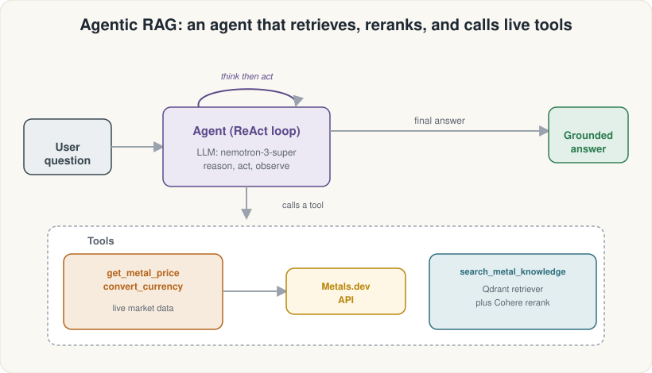
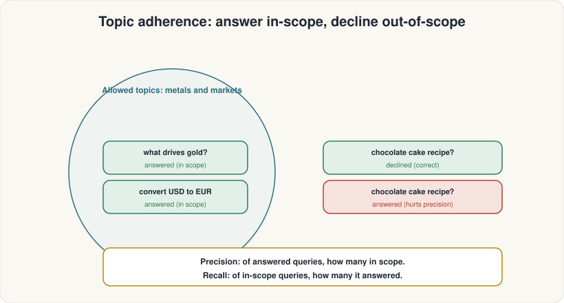
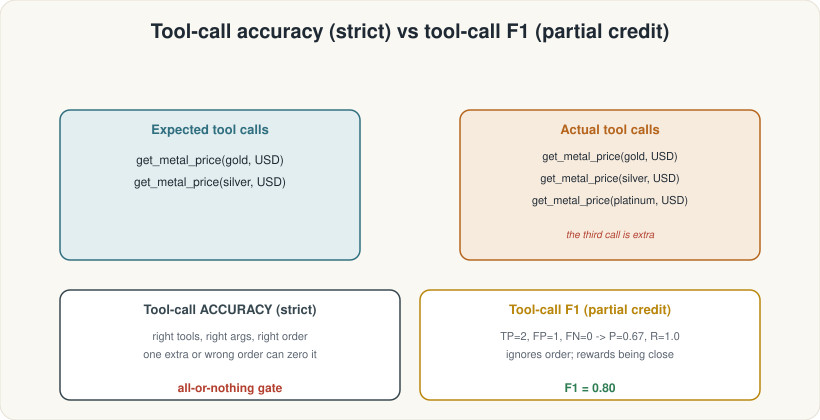
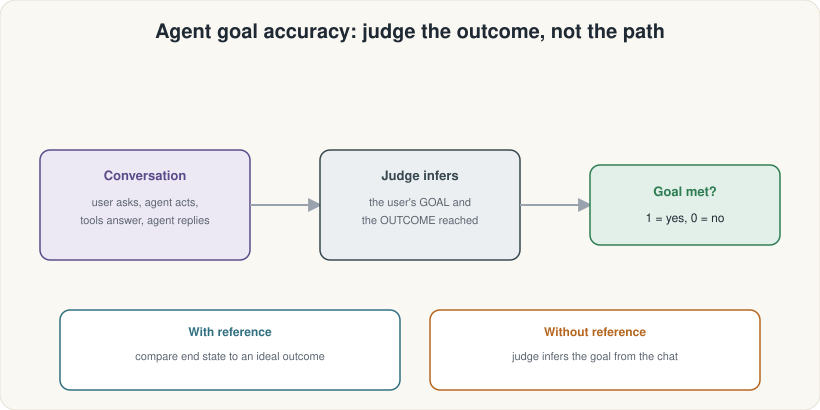

# Module 11 · From RAG to Agent + Agent Metrics — Explanation

> Audience: advanced high-school researchers. Tone: clear, concrete, encouraging, honest about where ideas break.

## Where this module sits

Module 10 left you with a well-tuned RAG pipeline: retrieve ten candidates, rerank to the three best, and generate a grounded answer. The whole flow is a **single-turn, fixed sequence** — always the same tools in the same order. Module 11 breaks that rigidity. You wrap the retriever and two live-data tools inside a **LangGraph ReAct agent** that *decides at runtime* which tool to call, in what order, and how many times. Then you add the five RAGAS metrics designed specifically for agent traces: `TopicAdherenceScore`, `ToolCallAccuracy`, `ToolCallF1`, `AgentGoalAccuracyWithReference`, and `AgentGoalAccuracyWithoutReference`. Module 12 (the capstone) assembles every metric from the entire track into a single MDD dashboard.

## The big idea

### From pipeline to agent

A RAG pipeline is a script: retrieve → rerank → generate, every time, for every question. An **agent** is a loop: **reason → act → observe**, repeated until the agent decides the task is done. The loop is called the **ReAct pattern** (Reasoning + Acting). At each iteration the model reads all the messages so far, decides whether to call a tool (and which one, and with what arguments), receives the tool's output, then reasons again. It can call multiple tools, call the same tool twice with different arguments, or skip tools entirely if the context already has the answer.

LangGraph's `create_react_agent` builds this loop for you. You hand it a chat model, a list of `@tool` functions, and a system prompt. The agent handles the loop machinery; you focus on the tools and the prompt.



### The three MetalDesk tools

- **`get_metal_price(metal, currency)`** — calls the Metals.dev REST API for a live spot price.
- **`convert_currency(amount, from_currency, to_currency)`** — calls Metals.dev's currency rates endpoint for a live conversion.
- **`search_metal_knowledge(query)`** — runs the vector-search + Cohere rerank pipeline from Module 10. This is the RAG half of the agent.

Together they let the agent answer questions like "What is the current gold price in EUR?" (needs both live price and currency conversion) without you writing a hardcoded if/else for every combination.

### Agent-tier evaluation metrics

When the agent decides its own path, single-turn metrics (faithfulness, context recall, …) no longer cover everything you care about. You also need to know:

- **Did the agent stay in its domain?** → `TopicAdherenceScore` (precision, recall, F1 over a `reference_topics` list).
- **Did it call the right tools with the right arguments in the right order?** → `ToolCallAccuracy` (strict, order-sensitive, largely all-or-nothing).
- **How close did it get, even if not perfect?** → `ToolCallF1` (order-insensitive, partial credit through precision/recall over calls).
- **Did the user actually get what they wanted, regardless of which path the agent took?** → `AgentGoalAccuracyWithReference` and `AgentGoalAccuracyWithoutReference` (binary 1/0 outcome judgment).

All five metrics operate on a `MultiTurnSample` built from a RAGAS message trace. The trace is produced by `convert_to_ragas_messages(result["messages"])`, which translates a LangGraph run's message list into the typed RAGAS format (`HumanMessage`, `AIMessage`, `ToolMessage`, `ToolCall`).





## Code preview

### Building the agent

```python
from langgraph.prebuilt import create_react_agent

agent = create_react_agent(model=chat_llm, tools=tools, prompt=SYSTEM_PROMPT)
result = agent.invoke({"messages": [{"role": "user", "content": question}]})
```

`create_react_agent` requires no API call at build time; it only calls the model when `.invoke` runs.

### Converting a trace to RAGAS

```python
from ragas.integrations.langgraph import convert_to_ragas_messages
from ragas.dataset_schema import MultiTurnSample

ragas_trace = convert_to_ragas_messages(result["messages"])
sample = MultiTurnSample(user_input=ragas_trace, reference_tool_calls=expected_calls)
```

### Scoring topic adherence

```python
from ragas.metrics import TopicAdherenceScore

scorer = TopicAdherenceScore(llm=judge_llm, mode="precision")
score = await scorer.multi_turn_ascore(
    MultiTurnSample(user_input=convo, reference_topics=allowed_topics)
)
```

### Scoring tool-call accuracy and F1

```python
from ragas.metrics import ToolCallAccuracy, ToolCallF1

acc = await ToolCallAccuracy().multi_turn_ascore(tool_sample)
f1  = await ToolCallF1().multi_turn_ascore(tool_sample)
```

### Scoring goal accuracy

```python
from ragas.metrics import AgentGoalAccuracyWithReference, AgentGoalAccuracyWithoutReference

score = await AgentGoalAccuracyWithReference(llm=judge_llm).multi_turn_ascore(
    MultiTurnSample(
        user_input=ragas_trace,
        reference="Report the current prices of gold and silver in USD.",
    )
)
```

## Notebook preview

| Step | What you do |
| ---: | --- |
| 0 | Set up the environment; load three API keys from `tutorials/.env` |
| 1 | RAGAS import stub + `nest_asyncio`; cost/safety note |
| 2 | Connect cloud Ollama (chat LLM, RAGAS judge, embeddings) |
| 3 | Load corpus and build vector store (carry-over from Module 10) |
| 4 | Build the Cohere reranker (carry-over from Module 10) |
| 5 | Define the three `@tool` functions; smoke-test each in isolation |
| 6 | Assemble the ReAct agent with `create_react_agent` |
| 7 | Run the agent on a multi-tool question; pretty-print the trace |
| 8 | Convert the trace with `convert_to_ragas_messages`; inspect RAGAS types |
| 9 | Score `TopicAdherenceScore` (precision, recall, F1) |
| 10 | Score `ToolCallAccuracy` |
| 11 | Score `ToolCallF1`; compare a clean vs. noisy trace |
| 12 | Score `AgentGoalAccuracyWithReference` and `AgentGoalAccuracyWithoutReference` |
| Recap | Summary table of all five agent metrics; pointer to Module 12 |

## Cautions

⚠ **Agents are nondeterministic.** The same question can trigger a different tool-call sequence on each run — a different order, an extra call, an unexpected tool. This means a frozen reference trajectory (`reference_tool_calls`) that was correct on the day you wrote it may mismatch a perfectly reasonable agent run tomorrow. Write reference trajectories for deterministic arguments (fixed strings, not live prices), and prefer `ToolCallF1` over `ToolCallAccuracy` during development so you get partial-credit signal rather than a binary 0.

⚠ **Tool-call metrics match arguments exactly.** An agent that calls `get_metal_price(metal="Gold")` when the reference says `"gold"` (lowercase) scores 0. Write reference calls defensively, matching the exact argument shape the agent will produce.

⚠ **Agent goal accuracy is binary and blunt.** A score of 1 hides how well the goal was met; a 0 hides how close the agent came. Never use goal accuracy in isolation — pair it with topic and tool-call metrics.

⚠ **Three paid APIs + live network.** This module calls cloud Ollama (LLM + embeddings + judge), Cohere Rerank, and Metals.dev. Every agent invocation and every metric evaluation that calls the judge LLM incurs real cost and real latency. If all three keys are absent the notebook falls back to `frozen/` data so you can follow along without spending money, but live-data tools (`get_metal_price`, `convert_currency`) will return illustrative strings rather than real prices.

⚠ **`search_metal_knowledge` requires an active Cohere key** because it calls `rerank()` internally. If `COHERE_API_KEY` is missing the tool will error; the frozen fallback bypasses the tool entirely.

## References

- **Capstone theory doc**: `topics/06_rag_eval/agentic_rag_evaluation_theory.md` — §12 (Topic Adherence), §13 (Tool-call accuracy and F1), §14 (Agent goal accuracy).
- **Capstone notebook**: `topics/06_rag_eval/agentic_rag_evaluation_tutorial.ipynb` — Sections 6, 7, 14–18 contain the exact code this module is built from.
- LangGraph `create_react_agent` docs: <https://langchain-ai.github.io/langgraph/reference/prebuilt/#create_react_agent>
- RAGAS multi-turn metrics: <https://docs.ragas.io/en/latest/concepts/metrics/available_metrics/agents/>
- Metals.dev API reference: <https://metals.dev/docs>
- Cohere Rerank docs: <https://docs.cohere.com/reference/rerank>
- ReAct paper: Yao et al. (2022), "ReAct: Synergizing Reasoning and Acting in Language Models" — <https://arxiv.org/abs/2210.03629>

**Next module**: Module 12 (Capstone) assembles the entire track — all 12 metrics, the MDD baseline-vs-reranked loop, and the two multi-hop golden questions — into one complete evaluation system.
