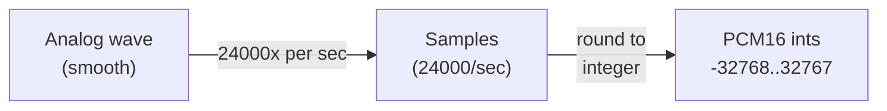
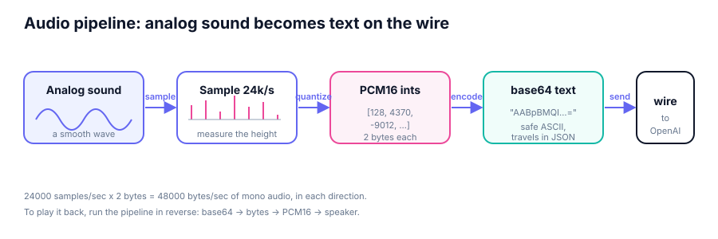
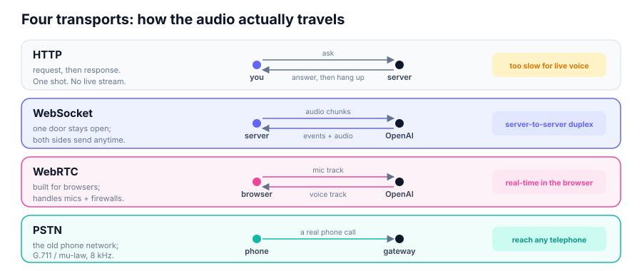
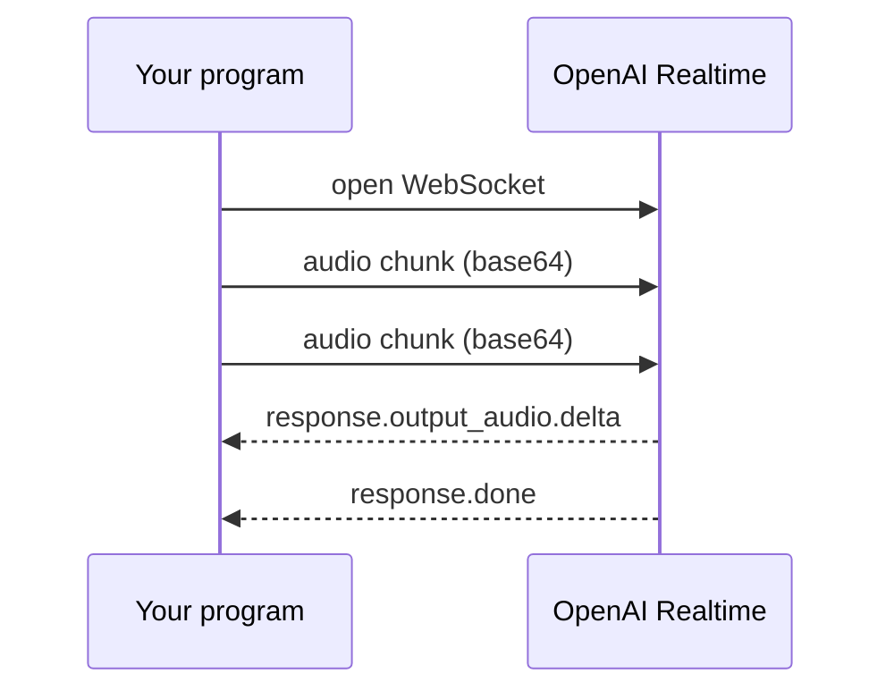
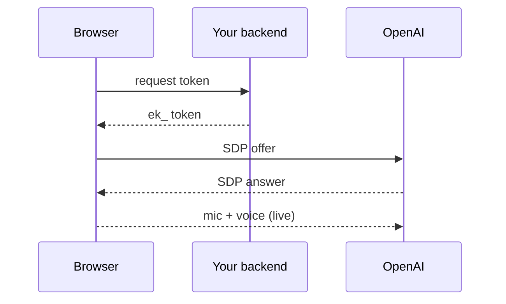
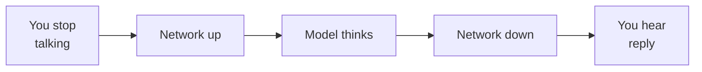

# Module 01 · Voice Foundations

> **The one idea:** Voice is just a long list of numbers. Before we can talk to
> an AI in real time, we have to understand how a sound in the air becomes those
> numbers, how the numbers become text that can travel over the internet, and
> which kind of internet connection is fast enough to carry them both ways at
> once. This whole course is built on that one idea.

There are no OpenAI API calls in this module. We stay on your own machine: we
record a few seconds of audio, look at the raw numbers, count the bytes, turn
one chunk into the exact text that later modules will send to OpenAI, and play
it back. Once you can *see* what audio is, the Realtime API stops being magic
and becomes "put these bytes on a socket".

## Concept map

| Concept | What it is | When it matters |
|---|---|---|
| **Analog sound** | The smooth pressure wave your voice makes in the air | It is what the microphone actually senses |
| **Sampling** | Measuring that wave's height many times per second | Turns a smooth wave into a list of numbers a computer can store |
| **Sample rate (24 kHz)** | How many measurements per second (24000) | OpenAI's Realtime API expects exactly this rate |
| **PCM16** | Each measurement stored as a 16-bit integer (-32768..32767) | It is the exact number format the API reads and writes |
| **Mono** | One audio channel, not stereo | Realtime audio is mono, so we use one channel everywhere |
| **base64** | Rewriting raw bytes as safe ASCII text | JSON and web protocols move text, not raw binary |
| **Transport** | The kind of connection: HTTP, WebSocket, WebRTC, PSTN | Decides whether audio can flow both ways, live |
| **Latency budget** | The delay you can afford before speech feels laggy | Under ~300 ms feels natural; the whole design chases this |

Each concept below has its own section. Slide numbers in parentheses point at
the matching slide in `slides/index.html`.

---

## 1. What is voice audio? Analog sound (slide 3)

When you speak, your vocal cords push the air, and that push spreads outward as
a **sound wave**: the air pressure rises and falls very quickly. A microphone is
a tiny membrane that the pressure wave pushes back and forth. As it moves, the
microphone produces a smoothly changing voltage that traces the same up-and-down
shape as the wave. This smooth, continuous signal is called **analog**: at every
instant it has some exact value, and between any two instants there are
infinitely many more.

Computers cannot store "infinitely many" values. They store lists of numbers.
So the first job is to turn that smooth analog wave into a list of numbers. That
step is called sampling.

## 2. Sampling and the sample rate (slides 4-5)

**Sampling** means measuring the wave's height at regular moments in time and
writing down each measurement. Imagine taking 24000 snapshots of the wave every
second and recording how high it was in each snapshot. Each snapshot is one
**sample**. The number of snapshots per second is the **sample rate**, measured
in hertz (Hz). This course uses **24000 Hz**, written 24 kHz, because that is
what OpenAI's Realtime API expects.

More snapshots per second means a more faithful copy of the original wave. Too
few, and you lose detail (fast, high sounds vanish because you never caught the
wave at its peak). 24 kHz is plenty for clear speech.



> **Caution.** The sample rate is not something you can change casually later.
> If you record at the wrong rate and send it to a 24 kHz model, the audio plays
> back too fast or too slow (like a chipmunk or a slow-motion voice). Record at
> **24000 Hz** from the start. `src/audio_config.py` defines `SAMPLE_RATE = 24000`
> in exactly one place so this number can never drift between modules.

## 3. PCM16: each sample is a 16-bit integer (slide 5)

A raw measurement could be any real number, but we need to store it as a whole
number so it fits in memory exactly. **PCM16** ("pulse-code modulation, 16-bit")
means each sample is rounded to a signed **16-bit integer**: a whole number from
**-32768 to +32767**. Zero means "no pressure change" (silence). Large positive
or negative numbers mean the wave swung far from the middle (loud sound). This
rounding-to-an-integer step is called **quantization**.

Because each sample is 16 bits, and 8 bits make 1 byte, **every sample costs
exactly 2 bytes**. That single fact drives all the data-rate math later.

Here is what that looks like when we actually run the code:

```text
shape : (72000,)   (samples, )
dtype : int16   (int16 == PCM16, range -32768..32767)
first 10 raw samples: [0, 1129, 2244, 3329, 4370, 5353, 6265, 7094, 7829, 8461]
```

That `int16` is NumPy's name for a PCM16 sample. The `shape (72000,)` means one
flat line of 72000 numbers: 3 seconds times 24000 samples per second. Audio
really is nothing more mysterious than that list of integers.

## 4. Mono vs stereo (slide 5)

**Mono** means one audio channel: a single stream of samples, as if one
microphone were listening. **Stereo** means two channels (left and right) so
sound can seem to come from different sides. Realtime audio in this course is
**mono**, so we always record one channel (`CHANNELS = 1`). One microphone, one
list of numbers, half the bytes of stereo. Simple.

## 5. base64: turning bytes into text for the wire (slides 6-7)

We now have raw bytes. But the internet protocols we will use (JSON messages
over a WebSocket, for example) are built to carry **text**, not arbitrary
binary. Some byte values would be interpreted as control characters or would not
survive being put inside a JSON string.

**base64** solves this. It rewrites any run of bytes using only 64 always-safe
characters: `A-Z`, `a-z`, `0-9`, `+`, and `/`. Three raw bytes become four
base64 characters, so the text is about **33% larger** than the raw bytes, but
it is guaranteed to travel safely inside text-based protocols. When it arrives,
the other side decodes it back into the exact original bytes.

```python
import base64
import numpy as np

# One ~50 ms chunk of PCM16 samples (1200 samples at 24 kHz).
chunk = samples[:1200]

raw = chunk.tobytes()                       # 1200 samples x 2 bytes = 2400 bytes
b64 = base64.b64encode(raw).decode("ascii") # bytes -> safe ASCII text
print(b64[:80])                             # e.g. "AABpBMQIAQ0SEek..."

# Proof it is loss-free: decode back and compare.
decoded = np.frombuffer(base64.b64decode(b64), dtype=np.int16)
print(np.array_equal(decoded, chunk))       # True
```

That base64 string is *literally* what later modules drop into a JSON event's
`audio` field. Seeing it now means it will not surprise you in module 03.

> **Caution.** base64 changes the *encoding*, never the audio. Decoding it gives
> back the identical bytes. Also, do not confuse base64 (safe text framing) with
> *compression*: base64 makes the data slightly **bigger**, not smaller. Codecs
> like Opus or G.711 are what actually shrink audio; base64 just makes bytes
> printable.

## 6. The full audio pipeline (slide 7)

Putting sections 1-5 together, capturing your voice for the API is a five-step
pipeline, and playback is the same pipeline run in reverse.



Read it left to right: an analog wave is **sampled** 24000 times a second,
each sample is **quantized** to a PCM16 integer, the integers are **base64**
encoded into safe text, and the text is **sent** on the wire to OpenAI. To hear
a reply, you reverse every arrow: base64 text becomes bytes, bytes become PCM16
integers, and the sound card turns those integers back into a wave your speakers
push into the air.

## 7. Data rate: why "one big request" will not work (slide 8)

Now the money question. If each second of audio is 24000 samples and each sample
is 2 bytes, then one second of mono PCM16 audio is:

```text
24000 samples/sec  x  2 bytes/sample  =  48000 bytes/sec  (about 46.9 KB/s)
```

That is 48 KB **every second**, forever, and for a real conversation it flows in
**both directions at once** (you speak, the assistant speaks). A normal web
request ("send everything, wait, get everything back") cannot do this: you would
have to finish speaking, upload the whole clip, wait, and only then hear a reply.
That is fine for uploading a file, but a conversation where you wait for the
other person to fully stop before anything happens feels broken.

This is exactly why the rest of the course needs a **persistent, two-way
connection** that streams small chunks continuously. Which brings us to
transports.

## 8. Transports: HTTP vs WebSocket vs WebRTC vs PSTN (slides 9-11)

A **transport** is the kind of connection that carries your bytes. Four of them
matter for voice, and they differ mainly in whether both sides can talk at the
same time and how well they cope with browsers and phone lines.



| Transport | Shape of the conversation | Both ways at once? | Built for | We use it for |
|---|---|---|---|---|
| **HTTP** | Ask, then get one answer, then hang up | No | Web pages, file downloads | Nothing live (too slow for voice) |
| **WebSocket** | One connection stays open; either side sends anytime | Yes (full duplex) | Server-to-server streaming | Modules 02-05 (Python CLIs) |
| **WebRTC** | A live media call between browser and server | Yes | Real-time audio/video in browsers | Modules 07-08 (the web app) |
| **PSTN** | An actual telephone call | Yes | The global phone network | Context only (why telephony differs) |

### HTTP: request then response

**HTTP** is how normal web pages load. Your program sends one request, the server
sends back one response, and the connection closes. It is a great fit for "give
me this page" or "here is a file, process it and return the result". It is a poor
fit for live voice because nothing streams: you cannot hear a reply *while* you
are still speaking, and opening a fresh connection for every 50 ms chunk would be
wildly wasteful.

### WebSocket: one door that stays open

A **WebSocket** starts as a normal HTTP request but then "upgrades" into a
connection that **stays open**. After that, **either side can send a message at
any time**, without asking first. That two-way, always-open behavior is called
**full duplex**, and it is exactly what streaming audio needs. Our server-side
Python modules (transcription, translation, the CLI assistant) will open a
WebSocket to `wss://api.openai.com/v1/realtime?model=gpt-realtime-2.1`, push mic
chunks up, and read audio and text events coming down, all on the one connection.

This is a good place to preview what that exchange looks like as a back-and-forth
conversation between the two sides:



> **Caution.** The event that carries the assistant's spoken audio is
> **`response.output_audio.delta`**, and the base64 audio bytes live in that
> event's **`delta`** field. A very common wrong guess is `response.audio.delta`
> (or looking for the bytes in an `audio` field on the way *down*). We will use
> the correct names in module 02 onward; memorize the right one now:
> `response.output_audio.delta`, bytes in `delta`.

### WebRTC: real time, in the browser

**WebRTC** ("web real-time communication") is the technology built into browsers
for live audio and video calls. It does two hard things for you. First, it grabs
the microphone and plays remote audio through the standard browser APIs. Second,
it performs **NAT traversal**: most computers sit behind a home router that hides
them from the public internet (that hiding is called NAT, network address
translation), and WebRTC negotiates a path through it so two machines can
exchange media directly. Because our voice **web app** runs in a browser, modules
07 and 08 use WebRTC, not a raw WebSocket.

WebRTC connects with a one-time handshake: the browser first asks *your* backend
for a short-lived token, then exchanges a small text blob (called an **SDP**,
session description protocol, which lists "here is the audio I can send and
receive") with OpenAI to open the media path.



> **Caution.** The browser must **never** hold your real OpenAI API key. Your
> backend (module 06) trades the real key for a short-lived **ephemeral token**
> that starts with `ek_`, and only that token goes to the browser. We build this
> safe handshake in modules 06-07; for now just note *why* WebRTC needs a backend
> step that a server-side WebSocket does not.

### PSTN: the old phone network (context)

**PSTN** stands for "public switched telephone network": the century-old system
behind ordinary phone calls. It matters because voice AI is often reached *by
phone* (think of calling a support line that is answered by an AI). Phone audio
is not 24 kHz PCM16; it is typically **G.711**, an 8 kHz format also called
**mu-law** (`audio/pcmu` in the API), which sounds narrower ("telephone quality")
and uses different bytes. You will not build a phone bridge in this course, but
knowing that telephony uses 8 kHz mu-law explains why the API even offers a
non-PCM audio format, and why "make my agent answerable by phone" is a real,
separate integration.

## 9. What "real time" means: the latency budget (slide 12)

"**Real time**" does not mean *zero* delay; it means the delay is small enough
that a conversation feels natural. The delay between you finishing a word and
hearing a response is called **latency**. Research on conversation says humans
start to notice awkwardness past roughly a **quarter to a third of a second**.

A rough latency budget for a spoken reply:



Every stage in that chain adds milliseconds, and they add up. This is why the
whole design pushes for **streaming small chunks** over a **persistent
connection**, for **turn detection** so the model knows the instant you stop
talking, and (later) for choosing lower-latency model settings. The 48 KB/s data
rate from section 7 and the transport choices from section 8 are all in service
of staying inside this budget. Keep it in mind: nearly every decision in the
coming modules is a latency decision in disguise.

## 10. Run it yourself

The code lives in `src/`. Two small files:

- **`src/audio_config.py`** defines the audio format once: `SAMPLE_RATE = 24000`,
  `CHANNELS = 1`, `SAMPLE_DTYPE = "int16"`, and a 50 ms chunk size (1200 samples).
  Every later module imports these so the numbers never drift.
- **`src/main.py`** records, describes the array, shows the base64 wire form, and
  plays it back.

```bash
uv sync                              # install sounddevice, numpy, python-dotenv
uv run python src/main.py            # record ~3s from the mic, then play back
uv run python src/main.py --seconds 5
uv run python src/main.py --tone     # no microphone? synthesize a 440 Hz beep
```

Expected output (abridged), which is every concept above made concrete:

```text
--- What did we actually capture? ---
shape : (72000,)   (samples, )
dtype : int16   (int16 == PCM16, range -32768..32767)
first 10 raw samples: [0, 1129, 2244, 3329, 4370, 5353, 6265, 7094, 7829, 8461]
bytes : 144,000  (= 72,000 samples x 2 bytes = 144,000)
data rate: 48,000 bytes/sec of raw audio

--- What goes 'on the wire'? ---
one chunk = 50 ms = 1200 samples = 2,400 raw bytes
base64 length: 3200 characters (base64 grows bytes by ~33%)
decoded back to int16 and matches the original chunk? True
```

> **Caution.** On macOS the first run may ask for microphone permission; grant it
> and re-run. On Linux you may need the PortAudio system library
> (`sudo apt-get install libportaudio2`). If you have no microphone at all, use
> `--tone`: it builds audio in the exact same PCM16 / 24 kHz / mono shape, so
> every printed number still teaches the same lesson.

## What you learned

- Voice audio is a list of PCM16 integers, 24000 of them per second, mono.
- Raw bytes are wrapped in base64 to travel safely as text (about 33% bigger,
  loss-free, and *not* compression).
- One second of that audio is about 48 KB, in each direction, which is why live
  voice needs a **persistent, two-way** connection, not one big HTTP request.
- The four transports differ by duplex and environment: HTTP (one-shot),
  **WebSocket** (server duplex, modules 02-05), **WebRTC** (browser real time,
  modules 07-08), **PSTN** (the phone network, context only).
- "Real time" means staying inside a latency budget of roughly 250-300 ms, and
  every later design choice serves that budget.

Next up, **module 02**: we open a real WebSocket to the Realtime API and watch
its event stream, still without sending any audio yet.
