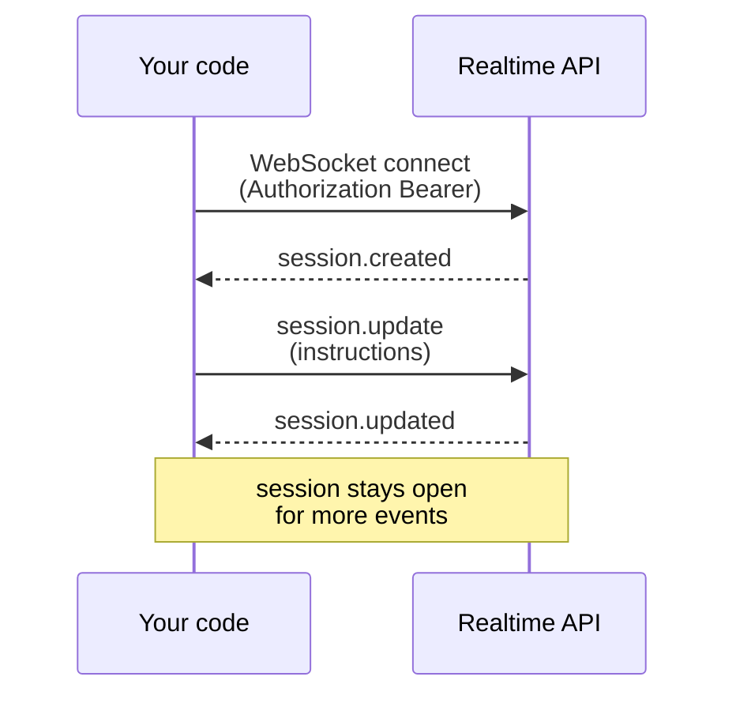

# Module 02 - The Realtime Handshake

**The one idea:** talking to OpenAI's Realtime API is a *conversation between two computers*. You open one long-lived connection (a **session**), then the two sides trade small JSON messages (**events**) back and forth in an **event loop**. In this module there is no audio yet. We connect, send one configuration message, and learn to *read the event stream*, because reading events is how you will debug everything for the rest of the course.

## Concept map

| Concept | What it does | When it matters |
|---|---|---|
| **Session** | One WebSocket connection that stays open | The moment you connect; it holds all your settings and history |
| **WebSocket (`wss://`)** | A two-way pipe both sides can push messages through any time | Whenever you need low-latency, back-and-forth data (voice, chat) |
| **Event** | A single JSON message with a `"type"` field | Every single interaction; events are the only thing on the wire |
| **Client event** | A message *you* send (e.g. `session.update`) | When you configure or drive the session |
| **Server event** | A message the API sends *you* (e.g. `session.created`) | Always; this is your window into what the API is doing |
| **Event loop** | Send-any-time, receive-any-time message flow | The core runtime model; there is no fixed request/response order |
| **`session.update`** | Configures the session (instructions, modalities, later audio) | Right after connecting, and any time you change settings |

---

## 1. What is a session? (the mental model)

When you visit a normal web page, your browser makes an **HTTP request** and gets one **response**, then the connection is done. That is like mailing a letter and getting one letter back. It is fine for loading a page, but it is clumsy for a live conversation, because every new thing you want to say needs a brand-new letter.

The Realtime API instead uses a **WebSocket**. A WebSocket is a single connection that *stays open*, and **either side can send a message at any time**. That is like a phone call instead of mailing letters: once the line is open, you both just talk. We call one open connection a **session**.

Two facts about a session to hold onto:

1. It is **long-lived**. You open it once and keep it. (OpenAI ends idle sessions after about 60 minutes; we reconnect before then in later modules.)
2. It **remembers context**. Your configuration and the running conversation live inside that one session. Close it and that state is gone.

> **Caution - `wss://`, not `ws://`.** The URL scheme is `wss://api.openai.com/v1/realtime`. The extra **s** means the connection is encrypted with TLS, exactly like `https` is the secure form of `http`. Your API key travels over this connection, so it must be the secure `wss://` form. Never use plain `ws://` here.

---

## 2. What is an event?

Everything that travels on the socket is an **event**: a small JSON object. The first field you always read is `"type"`, a short string that names the event. For example, the very first thing the server sends you is:

```jsonc
{ "type": "session.created", "session": { "id": "sess_...", "...": "..." } }
```

Events come in two directions:

- **Client events** are messages *you* send. Example: `session.update` (configure the session).
- **Server events** are messages the API sends *you*. Examples: `session.created`, `session.updated`, `error`.

There is no strict "one request, one response" rule. This is an **event loop**: you may send several client events, and the server may send you many server events, in whatever order things happen. Your job as a programmer is to (a) send the right client events and (b) *listen* for server events and react. Because the entire protocol is just typed JSON messages, **if you print every event you receive, you can see and debug everything.**

> **Caution - the model id is `gpt-realtime-2.1`.** We choose the model right in the URL with a query parameter: `?model=gpt-realtime-2.1`. An older DataCamp tutorial calls it `gpt-realtime-2`; the current GA name is `gpt-realtime-2.1`. Use `-2.1`.

---

## 3. The handshake, step by step

Here is the exact exchange our script performs. It is a **sequence diagram**, which reads top to bottom like a transcript of the conversation between the two computers.



Read it as four beats:

1. **Connect.** Your code opens the WebSocket to `wss://api.openai.com/v1/realtime?model=gpt-realtime-2.1`, sending an `Authorization: Bearer <key>` header.
2. **`session.created`.** The server confirms the session is open and tells you the defaults it picked (a session id, the model, default audio settings we are ignoring for now).
3. **`session.update`.** *You* send your configuration: the assistant's `instructions` and which output `modalities` you want. A "modality" is just a *kind* of output; here we ask for `"text"` only, since there is no speaker in this demo.
4. **`session.updated`.** The server echoes back the session, now reflecting your settings. The handshake is complete. In a real app the session would stay open and keep exchanging events; our teaching script stops here.

> **Caution - there is NO `OpenAI-Beta` header at GA.** During the older beta you had to send `OpenAI-Beta: realtime=v1`. At general availability that header is **gone**. Do not add it. The only header you must send is `Authorization: Bearer <your key>`. (Optionally you may add `OpenAI-Safety-Identifier` with a hashed user id for abuse tracking in production.)

---

## 4. Loading the key safely

Your OpenAI key is a secret. We never write it in code. Instead the whole course shares **one** `.env` file at `topics/voice_agents/.env`, and every Python module finds it the same way:

```python
from dotenv import find_dotenv, load_dotenv

# find_dotenv() walks UP the folders from this file until it finds a ".env".
# load_dotenv() then reads that file's KEY=VALUE lines into the environment.
load_dotenv(find_dotenv())

import os
OPENAI_API_KEY = os.environ.get("OPENAI_API_KEY")  # None if it is missing
```

`find_dotenv()` climbing *upward* is what lets a module deep in `02_realtime_handshake/src/` still find the shared `.env` two folders up. You paste your key once and every module uses it.

> **Caution - server-side only.** This raw `Authorization: Bearer <key>` pattern is safe **only in Python you run yourself** (your own machine or your server). You must **never** ship your real key to a browser. Modules 06 and 07 show the browser-safe path: your backend mints a short-lived `ek_...` token and the browser uses that instead. For now we are 100% server-side, so the Bearer key is fine.

---

## 5. Meet `websocket-client` and `WebSocketApp`

There are two popular ways to speak WebSocket from Python. This course standardizes on the **`websocket-client`** library (imported as `websocket`) and its **`WebSocketApp`** class, because modules 02 through 05 all reuse it. (An async library called `websockets` also exists; we mention it so you recognize the name, but we stay with `websocket-client` for consistency.)

`WebSocketApp` is **callback-based**: you hand it four functions, and it calls the right one when something happens. This is the whole shape of a Realtime program:

```python
import websocket  # the "websocket-client" package

def on_open(ws):          # runs ONCE, right after connecting
    ...                    #   -> here we send our session.update

def on_message(ws, msg):  # runs for EVERY server event: the event loop
    ...                    #   -> here we parse and print each event

def on_error(ws, err):    # runs on a transport error (bad key, no network)
    ...

def on_close(ws, code, reason):  # runs ONCE, when the socket ends
    ...

ws_app = websocket.WebSocketApp(
    "wss://api.openai.com/v1/realtime?model=gpt-realtime-2.1",
    header=[f"Authorization: Bearer {OPENAI_API_KEY}"],  # note: "header", singular
    on_open=on_open,
    on_message=on_message,
    on_error=on_error,
    on_close=on_close,
)
ws_app.run_forever()  # connects, then loops, dispatching messages to on_message
```

Two names catch beginners:

- The constructor argument is **`header`** (singular), and it takes a **list of `"Name: value"` strings**, not a dict.
- **`run_forever()`** is what actually connects. It then *blocks* (keeps running), pumping the event loop and calling `on_message` for each server event, until the socket closes.

### Sending a client event

Inside `on_open`, we send our one configuration event. Every event on the wire is a JSON *string*, so we build a Python dict and serialize it with `json.dumps`:

```python
import json

SESSION_UPDATE = {
    "type": "session.update",           # the client event type
    "session": {
        "type": "realtime",             # a normal realtime session
        "instructions": "You are a friendly coding-class assistant.",
        "output_modalities": ["text"],  # text only: no audio in this module
    },
}

def on_open(ws):
    ws.send(json.dumps(SESSION_UPDATE))  # dict -> JSON text -> onto the socket
```

> **Caution - the session has a `type`.** At GA the `session` object itself carries a `"type"`. For an ordinary speech/text session it is `"realtime"`. (Transcription sessions use `"type": "transcription"`, which you will meet in Module 03.) Leaving it out or guessing a different value is a common cause of an `error` event.

### Receiving server events (the part you will lean on forever)

`on_message` receives each event as a JSON *string*. We parse it, read its `"type"`, print a short summary, and watch for the two events we care about here:

```python
def on_message(ws, message):
    event = json.loads(message)              # JSON text -> Python dict
    event_type = event.get("type", "<none>") # ALWAYS read "type" first
    print(event_type)                         # your window into the API

    if event_type == "error":                 # the API rejected something
        print(event["error"])                 # message/code tell you what

    if event_type == "session.updated":       # our config was accepted
        ws.close()                            # demo goal reached; stop
```

This tiny listener is the debugging superpower of the entire course. When audio, transcription, or tool calls misbehave later, the *first* thing you do is print the event stream and read what the server actually said.

---

## 6. Run it

From this module's folder:

```bash
uv sync                                # create .venv, install the 2 deps
uv run python src/handshake_ws.py      # connect and print the event stream
```

You should see something like this (status lines go to the error stream; the event log is the two lines at the bottom):

```text
[connect] wss://api.openai.com/v1/realtime?model=gpt-realtime-2.1
[open] WebSocket connected. Sending session.update ...
session.created                        server opened session id=sess_...
session.updated                        server accepted our session.update
[done] Handshake complete. Closing.
[close] code=None reason=None
```

That is the whole handshake: **connect -> `session.created` -> `session.update` -> `session.updated`**. You just held a two-computer conversation with the Realtime API, and you can read every word of it.

> **Caution - if you see an `error` event instead.** Read its `message`. A `401` almost always means the key in `topics/voice_agents/.env` is missing, wrong, or on the free tier (Realtime needs a paid tier). An error naming `session.type` or an unknown field usually means a typo in your `session.update`. The event stream tells you exactly what went wrong, which is the point of this module.

---

## What you learned

- A **session** is one long-lived `wss://` WebSocket; a **WebSocket** is a two-way pipe either side can push to at any time.
- The protocol is nothing but **events**: typed JSON messages, split into **client events** (you send) and **server events** (you receive), traded in an **event loop**.
- The handshake is four beats: **connect -> `session.created` -> `session.update` -> `session.updated`**.
- Use **`websocket-client`**'s **`WebSocketApp`** with `on_open` (send config) and `on_message` (read the stream). `run_forever()` drives the loop.
- Two GA gotchas: the model is **`gpt-realtime-2.1`**, and there is **no `OpenAI-Beta` header**.
- **Reading the server event stream is how you debug everything** in the modules to come. Next up, Module 03 adds a microphone and turns this stream into a live transcript.
