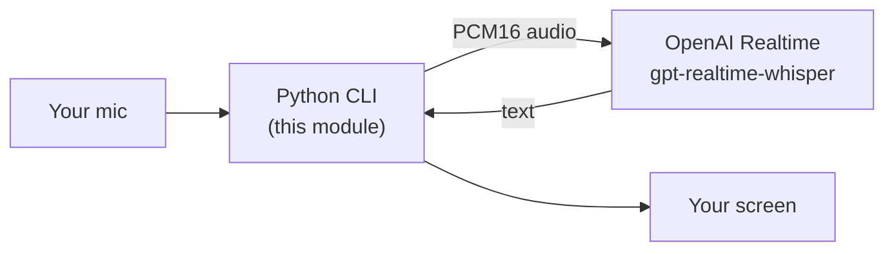
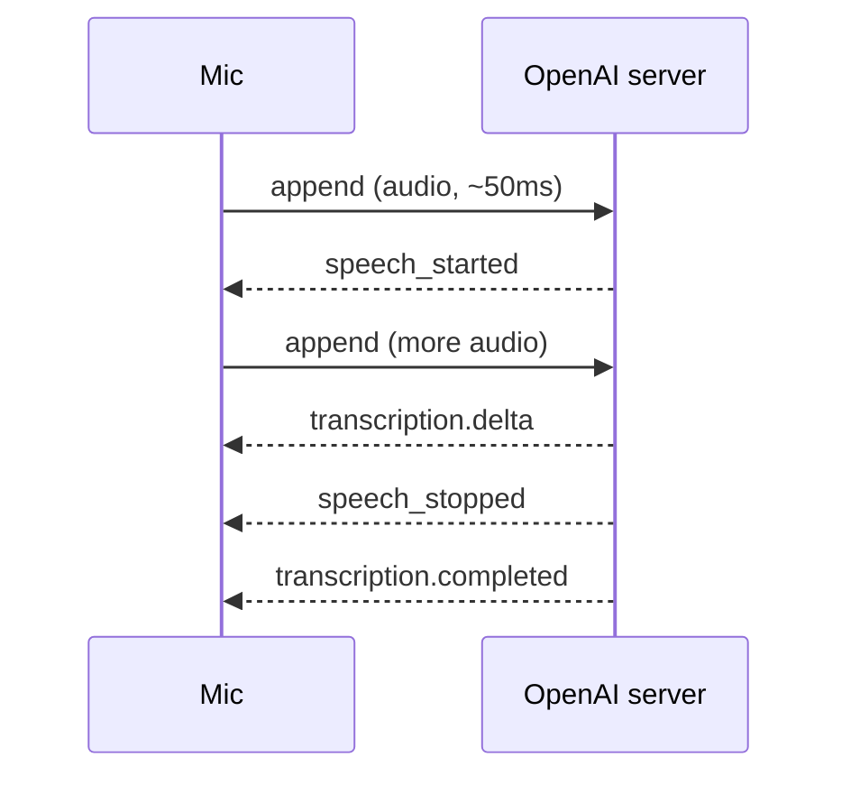

# Module 03: Live Transcription with `gpt-realtime-whisper`

## The one idea

**Stream your microphone to OpenAI in tiny chunks over a WebSocket, and text comes back
as you speak.** That is live transcription. You are not uploading a finished recording and
waiting; you are keeping an open line, pushing audio the whole time, and reading words the
moment the server recognizes them.

By the end you will have a command-line program that prints your speech as text in real time,
and you will understand every line of it. (Slides: see `slides/index.html`.)

## Concept map

| Concept | What it does | When it matters |
|---|---|---|
| Transcription session | A Realtime connection with `session.type: "transcription"` that only listens and returns text | Whenever you want speech to text and no spoken reply (Slide 3) |
| `gpt-realtime-whisper` | The realtime transcription model, billed by the audio minute | Choosing the right model; not the file based `whisper-1` (Slide 4) |
| PCM16 @ 24 kHz mono | The exact audio format the API expects | Recording the mic and setting `audio.input.format` (Slide 5) |
| `input_audio_buffer.append` | The event that carries mic bytes to the server | Every ~50 ms while you talk; bytes go in the **`audio`** field (Slide 6) |
| Turn detection (VAD) | How the server decides a phrase ended | Choosing `server_vad`, `semantic_vad`, or manual `commit` (Slide 7) |
| `...transcription.completed` | The event carrying the final text of your turn | Printing the finished transcript; `.delta` streams partials (Slide 8) |

---

## 1. What a transcription session is

The OpenAI Realtime API is one API with several "modes". You pick a mode by setting
`session.type`. For speech to speech you would use `"realtime"`; for this module you use
`"transcription"`. A transcription session is a one way street: you send audio, it sends
back text, and it never tries to talk to you. There is no `response.create`, no synthesized
voice, no assistant turn. That makes it the simplest capability to learn first.

You open a Realtime WebSocket with `?intent=transcription` (the canonical way to declare a
transcription connection) and then send one `session.update` event to configure it. The model
is named inside that config, not in the URL:

```python
WS_URL = "wss://api.openai.com/v1/realtime?intent=transcription"

SESSION_CONFIG = {
    "type": "session.update",
    "session": {
        "type": "transcription",          # this connection transcribes; it will not talk back
        "audio": {
            "input": {
                "format": {"type": "audio/pcm", "rate": 24000},
                "transcription": {"model": "gpt-realtime-whisper"},
                "turn_detection": {"type": "server_vad"},
            }
        },
    },
}
```

> **Caution: no beta header at GA.** Earlier previews required an
> `OpenAI-Beta: realtime=v1` header. At general availability that header is **gone**. Sending
> it can cause errors. The only header you need is `Authorization: Bearer <your key>`.

## 2. Why a WebSocket, and why server side

A plain HTTP request is one round trip: ask once, get one answer, done. Speech is a stream:
audio keeps flowing in and text keeps flowing back for as long as you talk. A **WebSocket** is
a single connection that stays open so both sides can send messages at any time. That two way,
always open shape is exactly a live conversation, which is why the Realtime API uses it.

We run this program **server side** (your laptop counts as a server here) because it holds your
real API key in the `Authorization` header. Browsers must never see that key; in later modules
the browser uses a short lived `ek_` token instead. For a CLI on your own machine, a direct
WebSocket with your key is perfect.



## 3. What "voice audio" actually is (PCM16 @ 24 kHz mono)

Sound is a wave: air pressure wobbling up and down. A microphone measures that wobble many
times per second. Each measurement is a **sample**, and turning a continuous wave into a list
of samples is called **sampling**.

- **24 kHz (24000 Hz):** we take 24000 samples every second. More samples per second capture
  higher pitched detail. 24 kHz is the rate the Realtime API expects.
- **PCM16:** each sample is stored as a 16 bit signed integer, a whole number from -32768 to
  32767. "PCM" just means the raw, uncompressed samples. In numpy this is the dtype `int16`.
- **mono:** one channel (one microphone stream), not stereo. Simpler and all we need for speech.

So "PCM16 @ 24 kHz mono" is simply: a stream of int16 numbers, 24000 of them per second, one
channel. That is what your microphone hands us and exactly what we send.

One more step: the numbers are raw **bytes**, and JSON (the text format the API speaks) cannot
hold arbitrary bytes. So we **base64**-encode them, which repackages any bytes as safe ASCII
text. Think of base64 as putting the bytes in a text safe envelope for the JSON trip.

```python
import numpy as np
# Pretend this is 3 audio samples the mic gave us (real chunks are 1200 samples):
samples = np.array([0, 15000, -15000], dtype="int16")   # int16 == PCM16
raw_bytes = samples.tobytes()                            # the actual bytes on the wire
import base64
text = base64.b64encode(raw_bytes).decode("ascii")       # JSON-safe ASCII to put in "audio"
```

> **Caution: the format you declare must match the bytes you send.** We tell the server
> `{"type": "audio/pcm", "rate": 24000}` and we also open the mic at 24000 Hz `int16`. If those
> disagree (say the mic is 48000 Hz), the audio is garbled and the transcript is nonsense.

## 4. Choosing the model: `gpt-realtime-whisper` (not `whisper-1`)

There are two very different "whisper" ideas at OpenAI, and mixing them up is a classic mistake.

- **`whisper-1`** is a **file based** endpoint. You record a whole clip, upload the finished
  `.wav` or `.mp3`, and get one transcript back. It is not live.
- **`gpt-realtime-whisper`** is the **realtime** transcription model used here. You stream audio
  as you talk and text comes back continuously. It is billed by the **audio minute**, not by
  tokens or per file.

This module is entirely about the realtime one.

> **Caution: realtime transcription is billed by audio minute.** Every minute of audio you
> stream costs money, even during silence if the mic is open. Close the stream (Ctrl-C) when you
> are done, and remember that leaving it running is like leaving a taxi meter on.

## 5. Capturing the microphone in ~50 ms chunks

We use the `sounddevice` library to read the mic. It runs its own high priority audio thread
and calls a function of ours, the **callback**, every time it has a fresh block of samples. The
callback must return quickly, so it does the least possible work: copy the samples into a
thread safe **queue**. A separate thread later pulls from that queue and does the slower work
(base64 plus send). This hand off keeps the audio smooth and glitch free.

Why ~50 ms per chunk? OpenAI recommends about 50 ms: small enough that text feels live, large
enough that we are not sending thousands of tiny messages per second. At 24 kHz:

```
24000 samples/second  ×  0.050 seconds  =  1200 samples per chunk
```

```python
import queue, sys
import numpy as np
import sounddevice as sd

SAMPLE_RATE = 24000
FRAMES_PER_CHUNK = 1200          # ~50 ms of 24 kHz mono audio
audio_q = queue.Queue()          # the mic thread drops chunks here; another thread sends them

def mic_callback(indata, frames, time_info, status):
    # indata is an int16 numpy array of shape (frames, 1). .tobytes() -> raw PCM16 bytes.
    # .copy() detaches from the buffer sounddevice reuses, so our bytes stay valid.
    audio_q.put(indata.copy().tobytes())

mic = sd.InputStream(
    samplerate=SAMPLE_RATE,
    channels=1,
    dtype="int16",               # capture as PCM16, the format the API wants
    blocksize=FRAMES_PER_CHUNK,  # deliver ~50 ms per callback
    callback=mic_callback,
)
```

## 6. Sending audio: `input_audio_buffer.append`

The server keeps an **input audio buffer**, a growing bucket of the audio you have sent so far.
Each mic chunk becomes one `input_audio_buffer.append` event that adds bytes to that bucket. The
base64 audio goes in a field named **`audio`**:

```python
import base64, json

def sender_loop(ws, stop):
    while not stop.is_set():
        chunk = audio_q.get()                          # raw PCM16 bytes from the mic thread
        event = {
            "type": "input_audio_buffer.append",
            "audio": base64.b64encode(chunk).decode("ascii"),   # field is "audio" on the way IN
        }
        ws.send(json.dumps(event))                     # dict -> JSON text -> across the socket
```

> **Caution: the field is `audio`, not `delta`.** When you SEND audio, the base64 goes in the
> **`audio`** field. `delta` is the field the server uses when it STREAMS things back to you
> (partial transcripts, and in later modules the assistant's audio arrives in
> `response.output_audio.delta`). New learners often try to send `"delta"`; that is wrong for
> `input_audio_buffer.append`.

## 7. Turn detection: `server_vad` vs `semantic_vad` vs manual commit

A **turn** is one chunk of speech, roughly one thing you say before pausing. The server needs to
know when a turn ends so it can finalize a transcript. That decision is **turn detection**, and
you pick the strategy in `audio.input.turn_detection`. There are three options; use exactly one.

| Mode | Value in config | How it ends a turn | Good for |
|---|---|---|---|
| Server VAD | `{"type": "server_vad"}` | Watches audio energy, cuts after a short silence (~200 ms) | Simple, predictable first CLI |
| Semantic VAD | `{"type": "semantic_vad", "eagerness": "medium"}` | A model decides when your **sentence** sounds finished, not just when you pause | Natural conversation, fewer mid sentence cuts |
| Manual | `None` (JSON `null`) | Never auto ends; **you** send `input_audio_buffer.commit` | Push to talk; exact control of boundaries |

"VAD" stands for **Voice Activity Detection**: deciding when speech is versus is not present.
Semantic VAD's `eagerness` knob controls how quickly it is willing to cut in
(`"low"`, `"medium"`, `"high"`). In manual mode you finalize a phrase yourself:

```python
# Manual mode only (turn_detection = None): tell the server "that phrase is done, transcribe it".
ws.send(json.dumps({"type": "input_audio_buffer.commit"}))
```

> **Caution: only commit in manual mode.** `input_audio_buffer.commit` is for when
> `turn_detection` is `null`. If server or semantic VAD is on, the server ends turns for you and
> sending manual commits fights the automatic detector. See `src/manual_commit.py` for a
> complete manual example.

## 8. Reading the transcript: `completed` and the streaming `delta`

The server sends events back as JSON. Two carry your transcript, and both refer to the **user's**
speech (that is you):

- `conversation.item.input_audio_transcription.delta` streams **partial** text as words are
  recognized. The new piece of text is in the `delta` field. Print these without a newline so a
  phrase grows in place.
- `conversation.item.input_audio_transcription.completed` is the **final** text for a turn. The
  full string is in the `transcript` field.

You also get `input_audio_buffer.speech_started` and `..._stopped` from VAD, which mark when the
server thinks you began and finished talking. They are handy for a "listening..." cue.

```python
def handle_server_event(raw):
    event = json.loads(raw)
    etype = event.get("type", "")

    if etype == "conversation.item.input_audio_transcription.delta":
        sys.stdout.write(event.get("delta", ""))   # partial words, printed in place
        sys.stdout.flush()

    elif etype == "conversation.item.input_audio_transcription.completed":
        print(f"\nYOU SAID: {event.get('transcript', '').strip()}\n")   # final text of the turn

    elif etype == "error":
        print("[server error]", event.get("error"))
```

> **Caution: these are the `input_audio_transcription` events (the user).** Do not confuse them
> with `response.output_audio_transcript.*`, which is what the **assistant** is saying in the
> speech to speech modules. In a transcription session there is no assistant, so you only ever
> see the `input_audio_transcription` events.

## 9. The whole exchange as a sequence

Reading a live client to server exchange as a conversation makes it click. This is what happens
from the moment you start talking until your text appears:



You append repeatedly; the server signals when it hears speech start, streams partial deltas,
signals speech stop, and finally sends the completed transcript. In manual mode you would add one
step: your `commit` is what triggers the `completed` event instead of the automatic
`speech_stopped`.

## 10. Run it

```bash
cp ../.env.example ../.env      # once: paste your OpenAI key into the shared ../.env
uv sync                        # create the .venv and install websocket-client, sounddevice, numpy, python-dotenv
uv run python src/live_transcribe.py
```

Speak, and your words appear live. Press Ctrl-C to stop (that closes the socket and stops the
audio meter). To feel the difference, open `src/live_transcribe.py`, change the
`turn_detection` line to `{"type": "semantic_vad", "eagerness": "medium"}`, and notice how it
waits for a finished thought instead of cutting on any pause. Then try `src/manual_commit.py`
to control every boundary yourself.

## Recap

- A **transcription session** (`session.type: "transcription"`) listens and returns text, and
  never talks back.
- The model is **`gpt-realtime-whisper`**, realtime and billed by the audio minute, and it is
  **not** the file based `whisper-1`.
- Audio is **PCM16 @ 24 kHz mono**, base64-encoded, sent in ~50 ms chunks as
  `input_audio_buffer.append` with the bytes in the **`audio`** field.
- **Turn detection** is `server_vad`, `semantic_vad`, or manual `commit`; pick one.
- You read your words from **`...input_audio_transcription.completed`** (final) and the streaming
  **`.delta`** (partial).

Next module: **04 Translation**, where a different session type turns your speech into another
language, both as text and as spoken audio.
