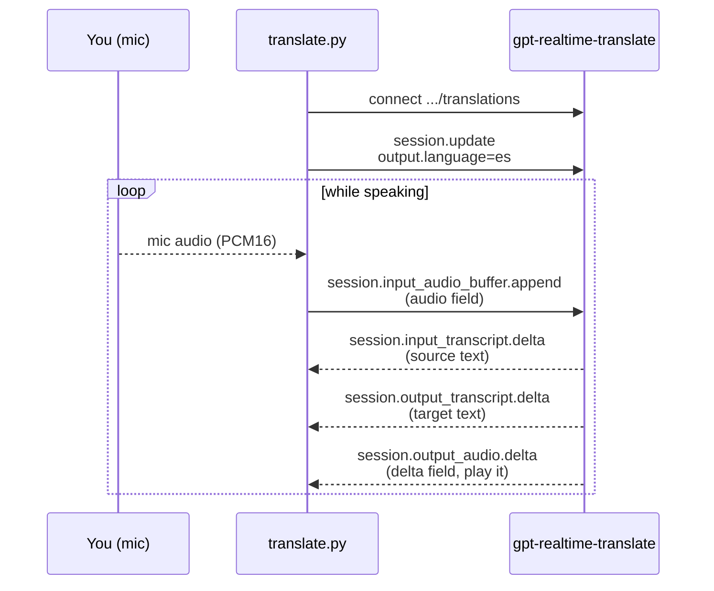

# Module 04: Live Translation with `gpt-realtime-translate`

**The one idea:** OpenAI has a *dedicated translation session*. You connect to a
special translation endpoint, tell it **one** thing (the language to translate
*into*), then just stream your microphone. It auto-detects what language you are
speaking and streams back both the translated **text** and the translated
**speech**. There is no "ask the model to reply" step, and every message uses a
`session.`-prefixed name. That last detail is the whole reason this module is
separate from the transcription module.

By the end you will have a terminal program you can talk to in English and hear
answer back in Spanish (or any of 13 target languages), while it prints the
source and target text like live subtitles.

> This tutorial explains **every concept and every line**. It assumes only basic
> Python (variables, functions, `if`, `import`). No prior audio, networking, or
> WebSocket experience is needed. The runnable code lives in
> [`src/translate.py`](./src/translate.py).

---

## Concept map

| Concept | What it does | When it matters |
|---|---|---|
| Translation endpoint | A special URL, `.../realtime/translations`, that runs the `gpt-realtime-translate` model | The very first line: you connect *here*, not to the normal realtime URL (slide 3) |
| `session.audio.output.language` | The **only** setting you choose: the target language | Right after connecting, in your `session.update` (slide 5) |
| Auto source detection | The model figures out what language you are speaking | You never set an input language; just talk (slide 5) |
| `session.`-prefixed events | On a translation session, event names start with `session.` | Every message you send and receive (slides 4, 6) |
| `delta` field carries audio | Translated audio bytes arrive in `event["delta"]` | When you decode and play the reply (slide 7) |
| No `response.create` loop | Translation streams automatically; you never request a turn | Contrast with the assistant in module 05 (slide 8) |

Keep this table open. Each row is a place the API can bite if you assume it
works like the transcription module. The **Caution** boxes below mark every one.

---

## Recap: what "voice audio" is (30 seconds)

You met this in Module 01, but every audio program depends on it, so here is the
short version. A microphone measures air pressure many times per second. Each
measurement is a **sample**, stored as a 16-bit signed integer (a whole number
from -32768 to 32767). That format is called **PCM16**. We take **24000**
samples every second (written **24000 Hz**), using **1** channel (**mono**).
Those three numbers, `PCM16 / 24000 Hz / mono`, must match what the API expects,
or you get static.

Computers move text more easily than raw bytes, so each little burst of audio is
**base64-encoded**: raw bytes are rewritten using 64 safe letters and digits so
they can ride inside a JSON message as plain text. We `base64.b64encode(...)`
before sending and `base64.b64decode(...)` after receiving. That is all the
audio theory this module needs.

---

## Concept 1: A dedicated translation endpoint

Most of this course connects to the general realtime address. Translation is
different: it has its **own** URL, and the model is chosen right in the query
string.

```python
TRANSLATE_URL = "wss://api.openai.com/v1/realtime/translations?model=gpt-realtime-translate"
```

Reading it piece by piece:

- `wss://` is a **secure WebSocket**. A WebSocket is a phone call between your
  program and OpenAI: once connected, either side can speak at any time, which
  is exactly what live audio needs. `wss` is the encrypted version (like `https`
  for web pages).
- `api.openai.com/v1/realtime/translations` is the **translation** endpoint.
  The trailing `/translations` is what makes this a translation session.
- `?model=gpt-realtime-translate` picks the model. This model supports **70+
  input languages** and **13 output languages**.

We connect using the `websocket-client` package (imported, confusingly, as
`websocket`). Its `WebSocketApp` lets us attach callback functions that fire on
connect, on each message, and on close:

```python
import websocket   # this is the "websocket-client" package

headers = [f"Authorization: Bearer {self.api_key}"]

ws = websocket.WebSocketApp(
    TRANSLATE_URL,
    header=headers,
    on_open=self._on_open,        # runs once, when connected
    on_message=self._on_message,  # runs for every message the server sends
    on_error=self._on_error,
    on_close=self._on_close,
)
ws.run_forever()   # blocks here, delivering messages to the callbacks above
```

`run_forever()` keeps the call open and hands each incoming message to
`on_message`. It blocks the current line until the socket closes, which is why
we run the microphone on a **separate thread** (Concept 4).

> **Caution: connect to the right URL.** The transcription module (03) connects
> to `.../realtime?...` and then sets `session.type: "transcription"`.
> Translation is a *different endpoint*: `.../realtime/translations`. If you
> reuse the transcription URL, the `session.`-prefixed translation events below
> will never arrive.

> **Caution: no `OpenAI-Beta` header.** During the old beta you had to send
> `OpenAI-Beta: realtime=v1`. At GA that header is **gone**. We send only
> `Authorization: Bearer <key>`. Adding the old header can cause errors.

The key itself comes from the one shared `.env` file, found by walking up the
folders from this module:

```python
from dotenv import find_dotenv, load_dotenv
load_dotenv(find_dotenv())          # finds topics/voice_agents/.env
api_key = os.getenv("OPENAI_API_KEY")
```

`find_dotenv()` searches parent directories until it sees a `.env`, so every
module in the course shares one key without copying it around.

---

## Concept 2: Configure the session, set only the target language

The instant the socket opens, we send **one** setup message called
`session.update`. It tells the server two things: the audio format, and the
language to translate **into**. We deliberately do **not** set an input
language, because the model auto-detects the language you speak.

```python
session_update = {
    "type": "session.update",
    "session": {
        "audio": {
            "input": {
                # What WE send: PCM16 @ 24 kHz, matching the mic.
                "format": {"type": "audio/pcm", "rate": 24000},
            },
            "output": {
                "format": {"type": "audio/pcm", "rate": 24000},
                # The ONE knob of this module: the target language.
                "language": self.target_language_code,   # e.g. "es"
            },
        },
    },
}
ws.send(json.dumps(session_update))
```

Line by line:

- `"type": "session.update"` names the message. (Notice this configuration
  message is *not* `session.`-prefixed twice; it is the standard update type.
  The `session.` prefix appears on the audio *events* below.)
- `session.audio.input.format` and `session.audio.output.format` both say
  `audio/pcm` at `24000` Hz. At GA the format lives **nested** under
  `audio.input` / `audio.output`. The old flat `"input_audio_format": "pcm16"`
  is legacy; do not use it.
- `session.audio.output.language` is the target. `self.target_language_code`
  is `"es"`, `"fr"`, `"ja"`, and so on. **This single field is the entire
  configuration difference** that turns a stream of your voice into a stream of
  translated voice.

Where does the code come from? The CLI accepts a friendly name and maps it:

```python
LANGUAGE_CODES = {"spanish": "es", "french": "fr", "japanese": "ja", ...}

def to_language_code(name: str) -> str:
    cleaned = name.strip().lower()
    # Known name -> code; anything else passes through (so "es" also works).
    return LANGUAGE_CODES.get(cleaned, cleaned)
```

So `--to Spanish`, `--to spanish`, and `--to es` all end up as `"es"`.

> **Caution: set the *output* language, source is automatic.** A natural guess
> is to set an input language too. Do not. `gpt-realtime-translate`
> auto-detects the source from your audio. You configure **only**
> `session.audio.output.language`.

> **Caution: 13 output languages.** The model auto-detects the input from 70+
> languages but translates *into* only 13. Common targets include Spanish,
> French, Japanese, and Arabic; the `LANGUAGE_CODES` map above lists the names
> we wire up for convenience. If you ask for a target the model does not
> support, the server replies with an `error` event (we print it), so trust the
> server, not a memorized list.

---

## Concept 3: Stream the microphone with `session.input_audio_buffer.append`

Now we feed the model. We capture the mic in ~50 ms chunks, base64-encode each
chunk, and send it as an **append** event. On a translation session that event
is prefixed with `session.`:

```python
b64_audio = base64.b64encode(chunk).decode("ascii")

event = {
    "type": "session.input_audio_buffer.append",   # note the "session." prefix
    "audio": b64_audio,                             # OUTGOING audio goes in "audio"
}
ws.send(json.dumps(event))
```

- `base64.b64encode(chunk)` turns the raw PCM16 bytes into base64 **bytes**;
  `.decode("ascii")` turns those into a normal Python **string** so `json.dumps`
  can put them in the message.
- `"type": "session.input_audio_buffer.append"` is the translation-session name
  for "here is more microphone audio."
- The audio rides in the **`audio`** field of this *outgoing* event. (Watch the
  asymmetry in Concept 5: the *incoming* audio arrives in `delta`, not `audio`.)

Why 50 ms chunks? Small chunks keep latency low (the model starts translating
almost immediately) without flooding the socket. At 24000 Hz, 50 ms is
`24000 * 0.05 = 1200` samples per chunk.

> **Caution: the `session.` prefix is easy to miss.** In a normal realtime
> session (module 05) the event is `input_audio_buffer.append`. On a
> **translation** session it is `session.input_audio_buffer.append`. Send the
> unprefixed name here and the server ignores your audio: no error, just
> silence. When "nothing happens," check the prefix first.

---

## Concept 4: Why two threads (mic and socket at the same time)

`ws.run_forever()` blocks: it sits on the main thread receiving messages. But we
also need to *send* microphone audio continuously. If we did both on one thread,
sending would freeze receiving and vice versa.

The fix is a classic **producer/consumer** pattern with a thread-safe
`queue.Queue`:

```python
# sounddevice calls this on ITS OWN thread for each fresh block of mic audio.
def _on_mic_block(self, indata, frames, time_info, status):
    if self.running:
        self.mic_queue.put(bytes(indata))   # produce: drop audio in the mailbox

# A background thread we start ourselves: drain the mailbox to the socket.
def _sender_loop(self, ws):
    while self.running:
        try:
            chunk = self.mic_queue.get(timeout=0.1)   # consume
        except queue.Empty:
            continue
        ws.send(json.dumps({"type": "session.input_audio_buffer.append",
                             "audio": base64.b64encode(chunk).decode("ascii")}))
```

- The **microphone thread** (owned by `sounddevice`) only copies audio into the
  queue and returns immediately. Audio callbacks must be fast, so we do no
  network work there.
- The **sender thread** (we start it with `threading.Thread(...).start()`) pulls
  from the queue and does the base64 + `ws.send`.
- The **main thread** stays in `run_forever()`, receiving and playing replies.
- A shared boolean `self.running` lets every thread stop cleanly on `Ctrl+C`.

A `Queue` is safe to share across threads without locks, which is exactly why we
use it as the hand-off. This is the same event-loop shape you will reuse in the
voice-assistant module.

---

## Concept 5: Read the replies, `delta` carries text *and* audio

Every message from the server arrives in `on_message` as a JSON string. We parse
it and branch on its `type`. Three `session.`-prefixed events matter:

```python
def _on_message(self, ws, message):
    event = json.loads(message)
    etype = event.get("type", "")

    if etype == "session.input_transcript.delta":
        # Live text of what YOU said (detected source language).
        self._print_delta("source", "YOU (source):", event.get("delta", ""))

    elif etype == "session.output_transcript.delta":
        # Live text of the TRANSLATION (target language).
        self._print_delta("target", "TRANSLATION:", event.get("delta", ""))

    elif etype == "session.output_audio.delta":
        # The translated SPEECH. Bytes are in event["delta"], NOT event["audio"].
        audio_bytes = base64.b64decode(event["delta"])
        self.speaker_stream.write(audio_bytes)   # play it right away
```

- `session.input_transcript.delta` streams the **source** text (a running
  transcript of your speech). `delta` is the newest slice of text.
- `session.output_transcript.delta` streams the **target** text (the
  translation), the same way.
- `session.output_audio.delta` is the **translated audio**. We
  `base64.b64decode(event["delta"])` back into raw PCM16 bytes and immediately
  `write` them to the open speaker stream, so you hear the translation as it
  arrives.

Both transcript streams arrive as `delta` pieces with no newline, so if we
printed them raw they would run together on one line. A tiny helper,
`_print_delta`, prints a labeled header (`YOU (source):` or `TRANSLATION:`)
**only when the stream changes**, so live text stays readable without a header on
every fragment:

```python
def _print_delta(self, stream, label, text):
    if not text:
        return
    if stream != self._last_stream:      # the stream just flipped
        print(f"\n{label} ", end="", flush=True)   # new line + label
        self._last_stream = stream
    print(text, end="", flush=True)      # then the words, in place
```

> **Caution: audio is in `delta`, not `audio`.** This is the single most common
> mistake in this module, and the asymmetry is genuinely confusing:
> - When you **send** mic audio, the bytes go in `event["audio"]`.
> - When you **receive** translated audio, the bytes are in `event["delta"]`.
>
> Reach for `event["audio"]` on the incoming event and you get a `KeyError` (or
> silence if you use `.get`). Always decode `event["delta"]` on
> `session.output_audio.delta`.

> **Caution: it is `output_audio`, not `audio`.** The event is
> `session.output_audio.delta`. A frequent wrong guess is
> `response.audio.delta` (which does not exist) or `session.audio.delta`. If you
> hear nothing, print `etype` for every message and confirm the exact string.

We also handle two housekeeping events:

```python
    elif etype == "session.output_transcript.done":
        print()   # one segment finished -> start the next on a fresh line

    elif etype == "error":
        err = event.get("error", {})
        print(f"\n[server error] {err.get('message', event)}", file=sys.stderr)
```

`...output_transcript.done` tells us a translated segment is complete, so we
print a newline to keep the console tidy. The `error` branch surfaces anything
the server rejects (a bad language code, a wrong audio format) instead of
failing silently.

---

## Concept 6: Playing audio back

We open the speakers once, in `_on_open`, as a **raw output stream** and then
just `write` decoded bytes into it:

```python
self.speaker_stream = sd.RawOutputStream(
    samplerate=24000, channels=1, dtype="int16"
)
self.speaker_stream.start()
# ...later, per audio delta:
self.speaker_stream.write(audio_bytes)
```

- `RawOutputStream` accepts raw PCM16 bytes directly, which is convenient
  because that is exactly what `base64.b64decode` gives us.
- `samplerate=24000, channels=1, dtype="int16"` mirror the API's format. If any
  of these disagreed with the incoming audio, playback would sound wrong.
- `.write(audio_bytes)` queues the bytes for the speakers. Because deltas arrive
  in order, writing them as they come plays the translation smoothly.

The microphone is the mirror image, a `RawInputStream` with a `callback`:

```python
self.mic_stream = sd.RawInputStream(
    samplerate=24000, channels=1, dtype="int16",
    blocksize=1200,                 # ~50 ms at 24 kHz
    callback=self._on_mic_block,    # called with each fresh block
)
self.mic_stream.start()
```

On `Ctrl+C` we stop and close both streams in a `finally:` block so the audio
hardware is always released, even after an error.

---

## Concept 7: No `response.create`, translation just streams

In the voice-assistant module (05) you will ask the model to reply by sending a
`response.create` event (or letting voice-activity detection fire it for you),
and answers arrive as `response.output_audio.delta`. **Translation has none of
that.** Once configured, the translation session continuously turns your input
into output on its own. You send audio; you receive `session.output_*` deltas.
That is the entire loop.

> **Caution: do not send `response.create` here.** It belongs to the general
> realtime/assistant session, not the translation session. There is no
> request/response turn to trigger: translation is a continuous stream. Sending
> assistant-style events on a translation socket just produces errors.

---

## The whole exchange, as a sequence diagram



Read it top to bottom like a conversation: connect, set the target language
once, then a repeating loop where your audio goes up as an `append` and three
kinds of `delta` come back down. Note the field names on the arrows: **audio
goes up in `audio`, and comes back down in `delta`.** That asymmetry is the
detail to memorize.

---

## Run it

```bash
cd topics/voice_agents/04_translation
uv sync                                       # build the .venv from pyproject.toml
uv run python src/translate.py --to Spanish   # speak English; hear Spanish
```

- Leave off `--to` and the program asks which language to translate into.
- Names (`Japanese`) and codes (`ja`) both work.
- Wrong microphone or speakers? `uv run python src/translate.py --list-devices`
  prints every device so you can see what your system exposes.
- `Ctrl+C` stops cleanly and releases the audio hardware.

You should see your words appear as you speak (source), the translation appear
right after (target), and hear the translated speech through your speakers, all
within a fraction of a second.

---

## What you learned

- Translation uses a **dedicated endpoint**,
  `.../realtime/translations?model=gpt-realtime-translate`, not the general
  realtime URL.
- You configure **only** `session.audio.output.language`; the source language is
  **auto-detected**.
- On a translation session, event names are **`session.`-prefixed**:
  `session.input_audio_buffer.append` (send), and
  `session.input_transcript.delta` / `session.output_transcript.delta` /
  `session.output_audio.delta` (receive).
- **Audio is asymmetric:** you send it in `event["audio"]` and receive it in
  `event["delta"]`.
- There is **no `response.create` loop**; translation streams continuously.
- The same **two-thread** shape (mic thread produces, sender thread consumes,
  main thread receives) powers every realtime audio program in this course, and
  you will reuse it in Module 05.

Next up, Module 05 turns this into a full **speech-to-speech voice assistant**
with `gpt-realtime-2.1`, where `response.create`, voice-activity detection, and
barge-in finally enter the picture.
