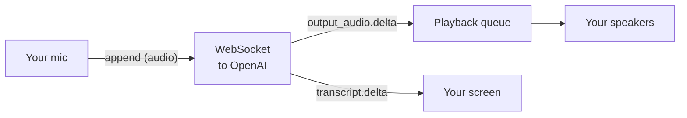
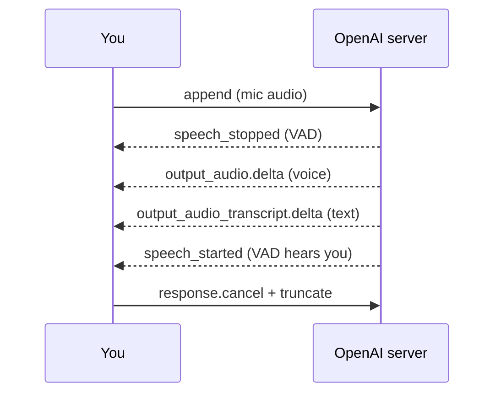

# Module 05: A Terminal Voice Assistant with `gpt-realtime-2.1`

## The one idea

**Keep your microphone streaming up to OpenAI and the assistant's voice streaming down to your
speakers at the same time, and you have a spoken conversation you can interrupt.** That two way,
always open flow is called *full duplex*, and being able to cut the assistant off mid sentence is
called *barge-in*. This module builds that, end to end, as a command-line program you can read
line by line.

Modules 03 and 04 were one way streets (audio in, text or translation out). This is the first
module where audio flows **both ways at once** and the assistant actually talks back. (Slides: see
`slides/index.html`.)

## Concept map

| Concept | What it does | When it matters |
|---|---|---|
| Speech-to-speech (`gpt-realtime-2.1`) | Send raw audio, get raw audio back, no separate STT or TTS step | Choosing the model and the session type (Slide 3) |
| Full duplex | Mic streams up while voice streams down, simultaneously | Running mic + speaker streams together (Slide 4) |
| Semantic VAD | The server decides when your sentence is finished and auto-replies | Setting `turn_detection`; auto vs manual response (Slide 6) |
| `response.output_audio.delta` | The event carrying the assistant's spoken audio, base64 in `delta` | Playing the reply; the #1 naming gotcha (Slide 7) |
| `response.output_audio_transcript.delta` | The text of what the assistant is saying, streamed | Printing live captions (Slide 7) |
| Barge-in | Stop playback the instant the user starts talking again | Natural interruption; `truncate` keeps memory honest (Slide 8) |
| `conversation.item.truncate` | Tells the server to forget the audio you never heard | So the assistant does not "remember" saying words you cut off (Slide 8) |

---

## 1. What we are building, and the four moving parts

A real conversation has no "over to you now" button. You talk, the other person starts answering,
and if they go on too long you jump back in. To get that feel, four things must run **at the same
time**, each on its own *thread* (a helper worker that runs alongside the main program so nothing
waits in line):



1. **The WebSocket** is the always open two way pipe to OpenAI. We SEND mic-audio events up it and
   RECEIVE audio and transcript events down it.
2. **The microphone stream** hands us about 50 ms of audio at a time; we base64-encode it and push
   it up the WebSocket.
3. **The speaker stream** repeatedly asks us "give me more audio to play"; we hand it bytes from a
   playback queue.
4. **The message loop** reads events coming down and reacts: queue audio to play, print the
   transcript, and handle barge-in.

We run this **server side** (your laptop is the "server" here) because it holds your real API key.
Browsers must never see that key, and modules 06 and 07 fix that with short lived `ek_` tokens.
For a CLI on your own machine, a direct WebSocket with your key is perfect.

## 2. Speech-to-speech: one model, no pipeline

There are two ways to build a talking assistant:

- **Chained pipeline:** speech-to-text, then a text model, then text-to-speech. Three steps, three
  sources of delay. This is what you would build with `gpt-realtime-whisper` plus a chat model plus
  a voice model.
- **Speech-to-speech:** one model takes your **audio** and returns its **audio** directly. That is
  `gpt-realtime-2.1`. Fewer steps means lower latency, which is what makes it feel like a real
  conversation.

This module uses speech-to-speech. We open a Realtime WebSocket with the model in the URL:

```python
MODEL = "gpt-realtime-2.1"
WS_URL = f"wss://api.openai.com/v1/realtime?model={MODEL}"
```

> **Caution: the model id is `gpt-realtime-2.1`.** OpenAI's GA docs and official SDK use `-2.1`.
> An earlier DataCamp tutorial called it `gpt-realtime-2`; treat `-2.1` as canonical and `-2` as
> the older name. Do not invent `gpt-realtime-mini` or `gpt-4o-realtime-preview`; they are not part
> of this course.

## 3. Configuring the session (audio nested, voice once, low effort)

Right after the socket opens we send exactly one `session.update` event that describes how the
assistant should listen and speak. This is the heart of the setup:

```python
session_update = {
    "type": "session.update",
    "session": {
        "type": "realtime",                       # speech-to-speech (not "transcription")
        "instructions": INSTRUCTIONS,             # the system prompt (who the assistant is)
        "reasoning": {"effort": "low"},           # low latency, recommended for voice
        "audio": {
            "input": {
                "format": {"type": "audio/pcm", "rate": 24000},   # what WE send up
                "transcription": {"model": "gpt-realtime-whisper"}, # transcribe YOUR speech too
                "turn_detection": {"type": "semantic_vad"},       # server decides turn end
            },
            "output": {
                "format": {"type": "audio/pcm", "rate": 24000},   # what we RECEIVE
                "voice": "marin",                                 # chosen ONCE
            },
        },
    },
}
```

A few things to notice:

- **Audio format is PCM16 @ 24 kHz mono.** "PCM" is the raw, uncompressed audio numbers; "16" means
  each sample is a 16-bit integer; "24 kHz" means 24000 samples per second; "mono" is one channel.
  Both directions use this exact format.
- **`reasoning.effort: "low"`** trades a little depth for a lot of speed. For a snappy back and
  forth chat, low is the recommended setting.
- **`transcription: {"model": "gpt-realtime-whisper"}`** turns on a transcript of *your* speech,
  exactly like Module 03. In a speech-to-speech session this is off by default, so without this line
  the server never emits `conversation.item.input_audio_transcription.completed` and the `[you said]`
  line in section 7 would never print. Opt in and it fires.

> **Caution: audio format and turn detection are NESTED at GA.** They live under
> `session.audio.input` and `session.audio.output`. The old flat fields (like
> `input_audio_format: "pcm16"`) are legacy and will silently fail to configure a GA session.

> **Caution: the voice is chosen once.** You set `voice: "marin"` here, before the assistant ever
> speaks, and you cannot switch it mid-session. Pick it up front.

## 4. Full duplex: mic in and speakers out, together

*Full duplex* means both directions are open at the same instant. A walkie-talkie is *half* duplex
(one side talks at a time); a phone call is full duplex. We are building a phone call with an AI.

In code, "both at once" is just two audio streams opened together and left open for the whole
program. We use *raw* streams because they deal in plain bytes, which is exactly what we base64-
encode (mic) and decode into (speaker):

```python
with sd.RawInputStream(                  # the microphone
    samplerate=24000, blocksize=1200,    # 1200 samples = ~50 ms at 24 kHz
    dtype="int16", channels=1,           # PCM16, mono
    callback=mic_callback,               # sounddevice calls this with fresh mic audio
), sd.RawOutputStream(                    # the speakers
    samplerate=24000, blocksize=1200,
    dtype="int16", channels=1,
    callback=speaker_callback,           # sounddevice calls this asking for audio to play
):
    ws_app.run_forever()                 # pump the WebSocket until Ctrl+C
```

`sounddevice` runs each stream on its own high-priority thread and calls our small callback
functions. We never block those callbacks; they do the least work possible and hand off the rest.

> **Caution: use headphones.** Without them your speakers leak into your mic, the assistant hears
> its own voice, VAD thinks you are talking, and it interrupts itself in a loop. Headphones give
> clean barge-in.

## 5. Sending the mic up: `input_audio_buffer.append`

The server keeps an *input audio buffer*, a growing bucket of the audio you have sent. Each ~50 ms
mic chunk becomes one `input_audio_buffer.append` event. The base64 audio goes in a field named
**`audio`**:

```python
def mic_callback(indata, frames, time_info, status):
    if ws_app is None or not session_ready:
        return                                   # do not send before the session is configured
    b64_audio = base64.b64encode(bytes(indata)).decode("ascii")   # raw bytes -> ASCII text
    send_event({"type": "input_audio_buffer.append", "audio": b64_audio})
```

Notice we keep sending the mic **even while the assistant is talking**. That is on purpose: it is
how the server can hear you start to interrupt (barge-in, section 8).

> **Caution: on the way IN the field is `audio`, not `delta`.** When you SEND audio it goes in the
> `audio` field. `delta` is the field the server uses when it STREAMS things back DOWN to you. New
> learners often try to send `"delta"`; that is wrong for `input_audio_buffer.append`.

The `session_ready` gate is a small but real detail: audio that arrives before our `session.update`
is processed can be rejected. We flip `session_ready = True` only at the end of `on_open`, right
after sending the config, so the mic thread never races ahead of the session.

## 6. Turn detection: semantic VAD (auto response) vs manual

A *turn* is one thing you say before the assistant replies. Someone has to decide when your turn is
over. "VAD" stands for **Voice Activity Detection**: deciding when speech is versus is not present.
You choose the strategy in `audio.input.turn_detection`:

| Mode | Value | Who ends the turn | Who asks for a reply |
|---|---|---|---|
| Semantic VAD | `{"type": "semantic_vad"}` | Server, when your **sentence** sounds finished | Server, **automatically** |
| Server VAD | `{"type": "server_vad"}` | Server, after a short **silence** | Server, automatically |
| Manual | `None` (JSON `null`) | **You**, via `input_audio_buffer.commit` | **You**, via `response.create` |

Our main assistant uses **semantic VAD**: it judges meaning, not just silence, so it does not cut
you off during a thoughtful pause. Crucially, when semantic or server VAD decides your turn ended,
**the server automatically creates a response**. That is why `voice_assistant.py` never sends
`response.create`: VAD does it for us.

The bonus file `push_to_talk.py` turns VAD off (`turn_detection: None`) so you can see what it was
doing. There, pressing ENTER sends the two events VAD used to send for you:

```python
# Manual mode ONLY (turn_detection = None): you end the turn and you ask for the reply.
send_event({"type": "input_audio_buffer.commit"})   # "that phrase is complete"
send_event({"type": "response.create"})             # "now answer me"
```

> **Caution: only commit and create in manual mode.** `input_audio_buffer.commit` and a manual
> `response.create` are for `turn_detection: null`. With VAD on, the server already ends turns and
> creates responses, and sending your own fights the automatic detector (you get double replies or
> errors). Pick one model: VAD **or** manual.

## 7. Hearing and reading the reply

Two events carry the assistant's answer, and they stream in as it speaks:

- **`response.output_audio.delta`** carries the spoken **audio**, base64-encoded in the `delta`
  field. We decode it back to PCM16 bytes and drop it in the playback queue.
- **`response.output_audio_transcript.delta`** carries the **text** of what it is saying. We print
  it with no newline so it reads like live captions.

```python
if etype == "response.output_audio.delta":
    pcm = base64.b64decode(event["delta"])   # bytes are in "delta", NOT "audio"
    enqueue_audio(pcm)                        # the speaker callback will play it

elif etype == "response.output_audio_transcript.delta":
    sys.stdout.write(event.get("delta", ""))  # live captions, printed in place
    sys.stdout.flush()
```

> **Caution: it is `response.output_audio.delta`, NOT `response.audio.delta`.** Guessing
> `response.audio.delta` is the single most common mistake with this API. It looks right, it is
> wrong, and the only symptom is silence (the event never fires, so you never queue any audio).

Why a queue? Audio arrives from OpenAI in a fast burst of little pieces, faster than real time. The
speaker can only play 24000 samples per second. So the message loop drops each piece into a
thread-safe queue, and the speaker callback pulls from the front of that line at exactly the right
speed, padding with silence (zeros) whenever the queue is momentarily empty.

## 8. Barge-in: interrupting the assistant

Barge-in is the difference between a demo and something you actually want to use. When you start
talking while the assistant is speaking, semantic VAD fires an
`input_audio_buffer.speech_started` event. If the assistant is mid-answer, we do three things:

```python
if etype == "input_audio_buffer.speech_started":
    if assistant_speaking:
        send_event({"type": "response.cancel"})   # (a) stop OpenAI generating more
        clear_playback()                          # (b) silence our speakers immediately
        if current_item_id is not None:           # (c) tell the server what you actually heard
            send_event({
                "type": "conversation.item.truncate",
                "item_id": current_item_id,        # which assistant message
                "content_index": 0,
                "audio_end_ms": played_ms,         # ms of it we QUEUED (upper bound on heard)
            })
```

Each step matters:

- **(a) `response.cancel`** stops the model from generating the rest of that answer, so you are not
  billed for audio you will never hear.
- **(b) `clear_playback()`** empties our local queue so the speakers go quiet *now*, not after the
  buffered tail finishes.
- **(c) `conversation.item.truncate`** is the subtle one. The server thinks it "said" the whole
  answer. But you cut it off after, say, 1.2 seconds. `truncate` tells the server: the audio really
  ended around `audio_end_ms`, so forget the rest. Without it, the assistant's memory of the
  conversation includes words you never heard, and its next reply can reference them, which is
  confusing.

We track `played_ms` by counting the samples we have *queued* for the current answer
(`samples = len(pcm) // 2`, then `ms = samples * 1000 / 24000`), and we reset it when a new turn
starts or `response.done` arrives. Note this is the audio we *queued*, which is an upper bound on
what actually left the speaker (the playback queue usually holds a little more than has been heard),
so `audio_end_ms` may be slightly generous. That is fine: the server clamps an out-of-range value,
and this keeps the code simple while getting the assistant's memory close to what you heard.

> **Caution: WebSocket truncates, WebRTC clears.** Over a WebSocket (this module) you drop
> unplayed assistant audio with `conversation.item.truncate`. In the browser over WebRTC (module
> 07) the equivalent is `output_audio_buffer.clear`. Same idea, different transport, different
> event name.

## 9. A full turn, with a barge-in, as a sequence

Reading the client to server exchange as a conversation makes it click. This is one clean turn
followed by the user interrupting the next one:



You append audio; VAD marks the end of your turn and the server auto-creates a response; audio and
transcript stream down; then you start talking again, the server reports `speech_started`, and we
cancel plus truncate. In **manual** mode the two auto steps become explicit: your `commit` replaces
`speech_stopped` and your `response.create` is what triggers the reply.

## 10. Run it

```bash
cp ../.env.example ../.env      # once: paste your OpenAI key into the shared ../.env
uv sync                        # create the .venv and install websocket-client, sounddevice, numpy, python-dotenv
uv run python src/voice_assistant.py
```

Put on headphones, then just talk. The assistant answers out loud and prints what it is saying.
Start talking again while it speaks and it stops to listen. Press Ctrl+C to quit.

To feel the auto-vs-manual difference from section 6, run the bonus:

```bash
uv run python src/push_to_talk.py    # talk, then press ENTER to send each phrase
```

Want to see that "audio is just numbers"? Open `src/voice_assistant.py` and set
`SHOW_MIC_METER = True` to draw a live volume bar from your microphone.

## Recap

- **`gpt-realtime-2.1`** is a **speech-to-speech** model: raw audio in, raw audio out, no separate
  STT or TTS step, which is what keeps latency low.
- The session is configured once with `session.update`; audio format and turn detection are
  **nested** under `session.audio.input` / `session.audio.output`, and the **voice is chosen once**.
- **Semantic VAD** ends your turn by meaning and **auto-fires** the response; you only send
  `response.create` yourself in **manual** mode (`push_to_talk.py`).
- The assistant's audio arrives in **`response.output_audio.delta`** (bytes in `delta`), **not**
  `response.audio.delta`, and its words arrive in `response.output_audio_transcript.delta`.
- **Barge-in** = `response.cancel` + clear the local queue + **`conversation.item.truncate`** so
  the server's memory matches what you actually heard.

Next module: **06 Python Backend**, where a FastAPI server mints short lived `ek_` tokens so a
browser can use this same model safely, without ever seeing your real key.
