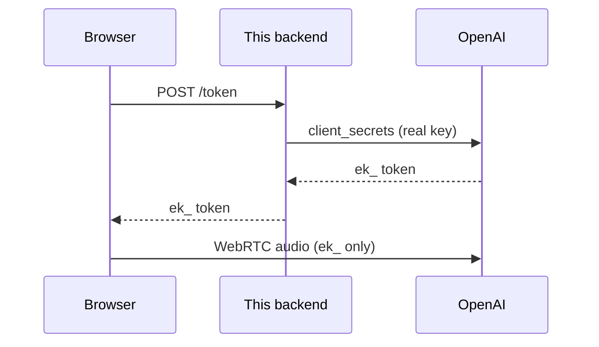

# Module 06: The Python Backend (token minter)

A tiny **FastAPI** server that hands the browser a **short-lived, scoped
ephemeral key** (`ek_...`) so your real `OPENAI_API_KEY` never leaves the server.
This is the bridge module 07 (the Next.js frontend) fetches from.

Two routes:

| Route | Method | Does |
|---|---|---|
| `/health` | GET | says `{"status":"ok", ...}` so you can confirm it started + `.env` loaded |
| `/token` | POST (GET alias too) | calls OpenAI's `client_secrets` and returns an `ek_...` token |

## Quickstart

```bash
cd topics/voice_agents/06_python_backend
uv sync                                              # 1) create .venv + install deps
# (make sure ../.env exists: cp ../.env.example ../.env and paste your key)
uv run uvicorn src.main:app --reload --port 8000     # 2) start the server on :8000
```

Then open <http://localhost:8000/docs> for interactive docs, or test from another
terminal (below).

## Test it with curl

```bash
# 1) Liveness + config check. has_api_key must be true (your ../.env loaded).
curl -s http://localhost:8000/health
# -> {"status":"ok","model":"gpt-realtime-2.1","has_api_key":true}

# 2) Mint an ephemeral token (the real call). value starts with "ek_".
curl -s -X POST http://localhost:8000/token
# -> {"value":"ek_XXXXXXXX...","model":"gpt-realtime-2.1","expires_at":1753...}

# Pull out just the token (needs jq installed):
curl -s -X POST http://localhost:8000/token | jq -r .value
```

If `has_api_key` is `false`, your key was not found: copy `../.env.example` to
`../.env` and paste a **paid-tier** OpenAI key (the free tier cannot use Realtime).

## What the browser will do with the `ek_` token (preview of module 07)

The frontend fetches `/token`, then opens a WebRTC voice session with OpenAI
using **only** the `ek_` key. The real key stays here on the server.



See `python_backend_tutorial.md` for a full, line-by-line explanation and
`slides/index.html` for the deck. API details: `../docs/API_FACTS.md`.

---

Built by **mui-group** for advanced high-school students.
