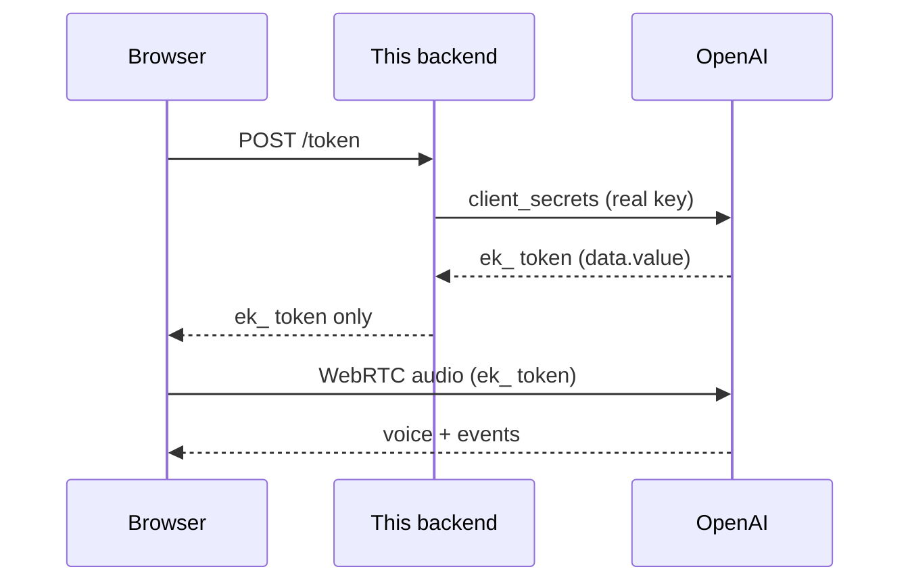

# Module 06: The Python Backend: minting safe browser tokens

**The one idea:** your real OpenAI key is a long-lived master secret. The browser
can never be trusted with it, because anyone who opens your page can read it. So
we build a small server whose only job is to trade the real key for a **short-lived,
scoped ephemeral key** (an `ek_...` token) and hand *that* to the browser. The
browser talks to OpenAI with the disposable token; the real key stays on the server.

Everything up to now (modules 01 to 05) ran on your own machine, so it could use
the real key directly. Module 07 moves into the browser, and the browser is a
public place. This module is the safety bridge that makes that move possible.

## Concept map

| Concept | What it does | When it matters |
|---|---|---|
| Real key (`sk-...`) | Long-lived master credential that spends your money | Keep it on the server, **never** ship it to a browser |
| Ephemeral key (`ek_...`) | Short-lived (about a minute), single-purpose token | The only secret the browser is ever allowed to hold |
| FastAPI | Python web framework: URLs to functions, JSON, auto docs | Whenever you need an HTTP server or API |
| Route / endpoint | A URL + method (`GET /health`) mapped to a function | Each thing your server can do is one route |
| CORS | Server tells browsers which origins may call it | The frontend (`:3000`) calls this backend (`:8000`) |
| `httpx` (async) | HTTP client that calls OpenAI from our server | Any server-to-server web request |
| `client_secrets` | OpenAI endpoint that returns an `ek_` token | The one call that mints the browser's token |

Slide references below point at `slides/index.html` (Slide N).

---

## 1. Why the browser must never see the real key (Slide 2, 3)

Code that runs in a browser is **fully visible to the user**. Open the developer
tools, look at the Sources tab or the Network tab, and every string the page
downloaded is right there, including any API key baked into the JavaScript. There
is no "hide this from the user" in a browser. If your `sk-...` key reaches the
page, treat it as leaked.

A leaked `sk-...` key is serious because it is:

- **Long-lived**: it works for months until you manually rotate it.
- **Powerful**: it can call every model on your account and spend your money.
- **Account-wide**: it is not limited to voice or to one session.

So the rule is simple and absolute: **the real key stays on a server the user
cannot read.** That server is what we build here.

> **Caution:** "environment variable in the frontend" is NOT safe.
> A common mistake is to put the key in a frontend `.env` (for example a Next.js
> `NEXT_PUBLIC_...` variable) and assume it is hidden. It is not. Anything the
> browser needs at runtime gets shipped to the browser and is readable. The only
> safe place for `sk-...` is server-side, which is exactly why this module exists.

---

## 2. What an ephemeral token is (Slide 4)

An **ephemeral token** is a temporary credential minted for one narrow purpose.
OpenAI's ephemeral realtime tokens start with `ek_` (think "ephemeral key") and
have two properties that make them safe to hand out:

- **Short-lived**: they expire in about a minute. Even if someone copies one, it
  stops working almost immediately.
- **Scoped**: the token is created from a session template (see section 5), so it
  can only do the one thing you configured, such as "start a realtime voice
  session on `gpt-realtime-2.1` with the `marin` voice." It cannot go rummage
  through the rest of your account.

Analogy: the real key is your **credit card**. The ephemeral key is a **$5 gift
card that self-destructs in a minute**. You hand out gift cards freely. You never
hand out your credit card.

> **Caution:** the browser still needs a fresh one each time.
> Because `ek_` tokens expire fast, the frontend fetches a new one right before it
> connects. Do not cache an `ek_` token for later; it will be dead. (Module 07
> handles this: fetch, then immediately connect.)

---

## 3. FastAPI in 60 seconds (Slide 5)

**FastAPI** is a Python library for building web servers. You create an `app`
object and attach **routes**. A route is a URL plus an HTTP method, mapped to a
Python function. When a request matches, FastAPI runs your function and turns what
you return into JSON automatically.

```python
from fastapi import FastAPI

app = FastAPI()                      # the application object

@app.get("/health")                  # GET /health -> run health()
async def health():
    return {"status": "ok"}          # a dict becomes a JSON response automatically
```

`@app.get("/health")` is a **decorator**: it registers the function below it as the
handler for `GET /health`. FastAPI also gives you free interactive documentation at
`/docs`, where you can click a button to try each route in the browser.

The server that actually listens on a port and calls into `app` is **uvicorn**. You
start it with:

```bash
uv run uvicorn src.main:app --reload --port 8000
```

Read that as: run uvicorn, load the `app` object from `src/main.py`, listen on port
8000, and `--reload` (restart automatically whenever you edit the code).

---

## 4. CORS: letting the frontend call the backend (Slide 6)

Browsers enforce the **same-origin policy**. An "origin" is the scheme + host +
port, for example `http://localhost:3000`. By default, JavaScript on one origin may
**not** make requests to a different origin. Our frontend runs on
`http://localhost:3000` and our backend on `http://localhost:8000`. Different port
means different origin, so the browser would block the call.

**CORS** (Cross-Origin Resource Sharing) is how the server says "these specific
origins are allowed to call me." We enable it with FastAPI's `CORSMiddleware`:

```python
from fastapi.middleware.cors import CORSMiddleware

app.add_middleware(
    CORSMiddleware,
    allow_origins=["http://localhost:3000", "http://127.0.0.1:3000"],  # who may call us
    allow_credentials=True,
    allow_methods=["*"],   # GET, POST, and the preflight OPTIONS
    allow_headers=["*"],   # e.g. Content-Type
)
```

Before a POST, the browser quietly sends a **preflight** `OPTIONS` request asking
"am I allowed?". `allow_methods=["*"]` makes sure that preflight succeeds.

> **Caution:** `allow_origins` is for LOCAL DEV only here.
> Listing localhost origins is fine while developing. In production you would set
> `allow_origins` to your real site's exact URL (for example
> `https://myvoiceapp.com`). Do **not** use `allow_origins=["*"]` together with
> `allow_credentials=True`: browsers reject that combination, and a wildcard would
> let any website on the internet call your token minter.

---

## 5. The core call: minting an `ek_` token (Slide 7, 8)

Here is the whole point of the server. When the browser asks for a token, we call
OpenAI's `client_secrets` endpoint **with the real key**, ask for the session we
want, and return only the `ek_` token from the reply.

The endpoint and body come straight from `../docs/API_FACTS.md`:

```python
CLIENT_SECRETS_URL = "https://api.openai.com/v1/realtime/client_secrets"

headers = {
    "Authorization": f"Bearer {OPENAI_API_KEY}",  # the REAL key, server-side only
    "Content-Type": "application/json",
}

payload = {
    "session": {
        "type": "realtime",           # a speech-to-speech voice session
        "model": "gpt-realtime-2.1",  # canonical GA model id
        "audio": {
            "output": {"voice": "marin"}  # the assistant voice, locked for the session
        },
    }
}
```

That `session` block is the **scope** of the ephemeral token: it inherits exactly
this configuration and nothing more.

We send it with **`httpx`**, an HTTP client that supports `async`/`await`. "Async"
means the handler can pause while waiting on the network without freezing the whole
server, so it can serve other requests in the meantime.

```python
import httpx

async with httpx.AsyncClient(timeout=10.0) as client:
    openai_response = await client.post(CLIENT_SECRETS_URL, headers=headers, json=payload)
```

`async with` guarantees the connection is cleaned up even if an error happens.
`json=payload` serializes our dict to JSON and sets the request body.

Then we read the token. Per API_FACTS.md, the ephemeral key is at **`data["value"]`**
and starts with `ek_`:

```python
data = openai_response.json()   # parse OpenAI's JSON reply into a dict
ephemeral_key = data.get("value")  # -> "ek_..."   (None if missing, so we can check)
```

Finally we return **only** that token (plus the model to connect with). The real
`OPENAI_API_KEY` is never part of the response, so the browser cannot learn it.

> **Caution:** the token field is `value`, not `client_secret` or `key`.
> OpenAI returns the ephemeral key at `data.value`. If you read the wrong field you
> will hand the browser `None` and the WebRTC connection in module 07 will fail with
> a confusing auth error. Also note: at GA there is **no** `OpenAI-Beta: realtime=v1`
> header. Do not send it.

---

## 6. Handling failure cleanly (Slide 9)

Networks fail and keys expire, so we guard each step and return a clear error
instead of a stack trace. FastAPI's `HTTPException` produces a tidy JSON error with
the status code you choose.

```python
from fastapi import HTTPException

# Missing key? Fail early with a helpful message (500 = our server is misconfigured).
if not OPENAI_API_KEY:
    raise HTTPException(status_code=500, detail="OPENAI_API_KEY is not set. ...")

# Could not even reach OpenAI (DNS, timeout, refused)? 502 = the upstream failed.
except httpx.RequestError as exc:
    raise HTTPException(status_code=502, detail=f"Could not reach OpenAI: {exc}")

# OpenAI answered with an error status (401 bad key, 429 rate-limited, ...)? Forward it.
if openai_response.status_code != 200:
    raise HTTPException(status_code=502, detail=f"OpenAI returned {openai_response.status_code}: ...")
```

Status codes in plain words: **500** means "this server is broken" (our config),
**502** ("bad gateway") means "a server I depend on failed" (OpenAI). Using the right
code helps the frontend decide whether to retry or show you a setup hint.

> **Caution:** never echo the real key into an error.
> When you build error messages, include OpenAI's *reply*, not your *request*. If
> you accidentally interpolate the `Authorization` header into a returned string,
> you have leaked the key into the browser's Network tab. Our code only ever returns
> OpenAI's response body.

---

## 7. The end-to-end flow (Slide 10)

This is the handshake this module enables. The frontend (module 07) will fetch a
token from us, then use it to open a WebRTC voice session with OpenAI directly.



Notice what never happens: the real key never travels to the browser, and the
browser never talks to *us* about audio. We only mint the token. The audio path
(module 07) goes browser to OpenAI directly, authenticated by the disposable `ek_`.

---

## 8. Run and test it yourself

```bash
cd topics/voice_agents/06_python_backend
uv sync
uv run uvicorn src.main:app --reload --port 8000
```

In another terminal:

```bash
curl -s http://localhost:8000/health
# {"status":"ok","model":"gpt-realtime-2.1","has_api_key":true}

curl -s -X POST http://localhost:8000/token
# {"value":"ek_...","model":"gpt-realtime-2.1","expires_at":...}
```

If `has_api_key` is `false`, copy `../.env.example` to `../.env` and paste a
paid-tier OpenAI key (the free tier cannot use Realtime). If `/token` returns a
502 mentioning a 401, the key itself is wrong or unpaid.

---

## Recap

- The real `sk-...` key is a long-lived master secret and must stay on the server.
- The browser only ever holds a short-lived, scoped `ek_...` token.
- We built a FastAPI server with `GET /health` and `POST /token`.
- `/token` calls OpenAI's `client_secrets` with the real key and returns the token
  from `data.value`.
- CORS lets the `:3000` frontend call the `:8000` backend during development.
- Next stop, module 07: the browser fetches this token and starts talking.

---

Built by **mui-group** for advanced high-school students.
