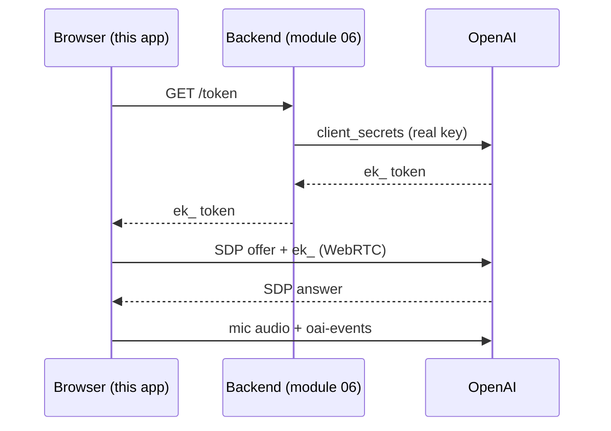

# Module 07: The Next.js Frontend (talk in the browser)

A minimal **Next.js + React** app that talks to `gpt-realtime-2.1` **in the
browser over WebRTC**. One screen: a big **Talk** button, a **Mute** button, a
live **transcript** panel, and a **status pill**. A toggle switches the engine
between the **official SDK** (`@openai/agents/realtime`, recommended) and a
**hand-written raw WebRTC** handshake so you can see what the SDK does for you.

> This is a **Node** project, so there is **no `pyproject.toml`** here. Use
> `npm`, not `uv`. Everything else (README + `.gitignore` + tutorial + slides)
> matches the other modules.

## You need module 06 running first

The browser must **never** hold your real OpenAI key. Instead it asks the
module-06 FastAPI backend for a short-lived **ephemeral `ek_` token**. So start
that backend before this app:

```bash
cd ../06_python_backend
uv sync
uv run uvicorn src.main:app --reload --port 8000   # serves POST /token on :8000
```

Confirm it is up: <http://localhost:8000/health> should say `has_api_key: true`.

## Quickstart (this app)

```bash
cd topics/voice_agents/07_nextjs_frontend/app
cp .env.local.example .env.local     # 1) sets NEXT_PUBLIC_TOKEN_ENDPOINT
npm install                          # 2) install next, react, @openai/agents
npm run dev                          # 3) open http://localhost:3000
```

Then open <http://localhost:3000>, click **Talk**, allow the microphone, and
speak. You should hear the assistant reply and see the transcript fill in.

## How it connects (the whole handshake)



## What each file does

| File | Role |
|---|---|
| `app/app/page.tsx` | The one screen: Talk / Mute / status pill / transcript + engine toggle |
| `app/app/layout.tsx` | Root layout: loads the Inter font and global CSS |
| `app/app/globals.css` | Minimalist pastel styling (matches the slides) |
| `app/lib/token.ts` | Fetches the `ek_` token from the module-06 backend |
| `app/lib/useRealtime.ts` | **Primary path**: `RealtimeAgent` + `RealtimeSession` (the SDK) |
| `app/lib/rawWebrtc.ts` | **Second path**: raw `RTCPeerConnection` + SDP + `oai-events` |

## Reproducibility

`npm install` writes `app/package-lock.json`, which pins the exact dependency
versions it resolved (the Node equivalent of a `uv.lock`). Commit it so a
classmate gets an identical install. The versions in `package.json` are lower
bounds pinned to the **Next.js 15** line; bump deliberately later with
`npm install next@latest` and re-test.

## Troubleshooting

- **"Could not reach the token backend"** → module 06 is not running on
  `:8000`, or CORS is blocking you (module 06 allows `localhost:3000`).
- **No sound** → most browsers require a click before audio; the **Talk** click
  covers that. Check the tab is not muted and your output device is right.
- **Mic denied** → click the address-bar site permissions and allow the
  microphone, then reload.

See `nextjs_frontend_tutorial.md` for a line-by-line explanation and
`slides/index.html` for the deck. API details: `../_shared/API_FACTS.md`.

---

Built by **mui-group** for advanced high-school students.
