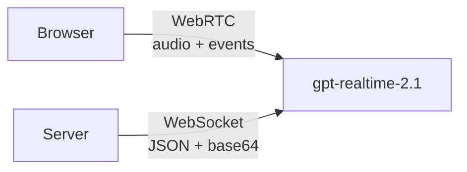
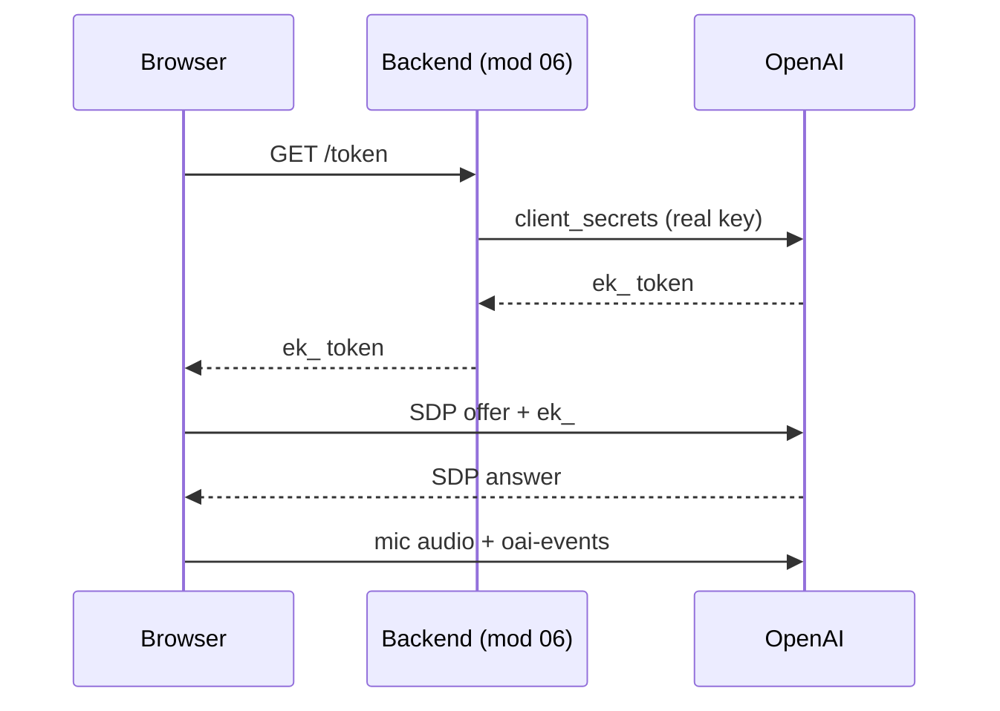

# Module 07: The Next.js Frontend: Talk to a Voice Agent in the Browser

**The one idea:** the browser can hold a real, two-way voice conversation with
`gpt-realtime-2.1`, but it must do it over **WebRTC** (not WebSocket) and it must
**never** hold your real API key. It uses a short-lived **`ek_` token** that the
module-06 backend hands it. We build this twice: first with the official
`@openai/agents` **SDK** (three objects and one `connect` call), then by hand
with a **raw `RTCPeerConnection`** so you can see exactly what the SDK automates.

## Concept map

| Concept | What it does | When it matters |
|---|---|---|
| Ephemeral `ek_` token | A one-minute key the browser is allowed to hold | Every browser connection starts here |
| WebRTC | Live media transport (audio over UDP) + echo cancel + NAT | Any voice in a browser (not WebSocket) |
| `RealtimeAgent` | Describes WHO the agent is: name, instructions, voice | Setting personality and the fixed voice |
| `RealtimeSession` | The live connection: mic up, audio down, transcript | The whole conversation lifecycle |
| `oai-events` data channel | The JSON side-channel for events + transcripts | Reading what was said; sending config |
| SDP offer / answer | The two-message "menu swap" that starts WebRTC | The raw handshake (SDK hides this) |
| `history_updated` | SDK event carrying the running transcript | Rendering the live transcript panel |

Everything here obeys `../_shared/API_FACTS.md`. Where the API has a sharp edge,
you will see a **Caution** box.

---

## 1. Why WebRTC in the browser (and not WebSocket)?

In modules 02 to 05 the Python programs talked to OpenAI over a **WebSocket**.
That was right for a **server**. In a **browser** we switch to **WebRTC**. Here
is the plain-English reason, which is a required teaching point of this course.

Think about what a phone call needs versus what a chat app needs.

- **A chat app** wants every message to arrive, in order, perfectly. If one is
  slow, you wait for it. That is **TCP**, and a **WebSocket** rides on TCP.
- **A phone call** wants to stay *live*. If one tiny slice of audio is lost, you
  do not want the whole call to freeze while it is resent; you want to skip that
  20 milliseconds and keep going. That is **UDP**, and **WebRTC** rides on UDP.

WebRTC is built for live media, and it gives us three things for free that a raw
WebSocket does not:

1. **Low latency**: audio travels over UDP, so a lost packet is skipped, not
   re-sent. The conversation stays real-time.
2. **Echo cancellation and noise suppression**: the browser cleans the
   microphone so the assistant does not hear its own voice through your speakers
   and talk to itself in a loop.
3. **NAT traversal**: WebRTC knows how to punch through home routers, so it
   works from a laptop on normal Wi-Fi without you configuring anything.

A server has none of these problems (no speakers, no mic, a public address), so
it happily uses a WebSocket. The rule to remember:

> **WebRTC for browsers, WebSocket for servers.**



---

## 2. The safety rule: the browser never sees the real key

Your real key (the `sk-...` one) can spend your money and lasts for months.
Anyone who opens a web page can read the JavaScript and the network traffic, so
**a real key in the browser is a leaked key**. Module 06 solved this: it keeps
the real key on the server and mints a **short-lived ephemeral `ek_` token** that
only works for one realtime session and expires in about a minute. Losing an
`ek_` is cheap.

So the browser's first job is always: **ask our backend for a fresh `ek_`.**

Here is the whole browser handshake as a sequence. Read it top to bottom like a
conversation.



The code that does the first three arrows lives in `app/lib/token.ts`:

```ts
// Read the backend URL from the environment. NEXT_PUBLIC_* values are visible
// in the browser, which is fine: a URL is not a secret.
const TOKEN_ENDPOINT =
  process.env.NEXT_PUBLIC_TOKEN_ENDPOINT ?? "http://localhost:8000/token";

export async function fetchEphemeralToken(): Promise<string> {
  const res = await fetch(TOKEN_ENDPOINT, { method: "GET" });
  if (!res.ok) throw new Error(`Token backend returned HTTP ${res.status}.`);
  const json = await res.json();
  const token = json.value; // module 06 returns { value: "ek_...", ... }
  if (typeof token !== "string" || !token.startsWith("ek_")) {
    throw new Error("No ek_ token in the backend response.");
  }
  return token;
}
```

Line by line:

- `process.env.NEXT_PUBLIC_TOKEN_ENDPOINT` reads the backend URL you set in
  `app/.env.local`. The `NEXT_PUBLIC_` prefix is a Next.js rule that means "safe
  to expose to the browser." We only ever put non-secrets there.
- `fetch(TOKEN_ENDPOINT, { method: "GET" })` calls **our own** backend. Module 06
  offers both `POST /token` and a `GET /token` alias; we use GET for simplicity.
- `res.ok` is `false` for error statuses (like 500). We stop with a clear message.
- `json.value` is where module 06 puts the token. We check it starts with `ek_`
  before trusting it.

> **Caution.** The ephemeral key is at **`data.value`** in module 06's response,
> which unwrapped OpenAI's `client_secrets` reply for us. If you ever call OpenAI
> directly, the raw shape nests it differently. Always read `value`, and never
> log the token to a shared console.

> **Caution.** `NEXT_PUBLIC_...` variables are **baked into the browser bundle**.
> That is exactly why they must never hold a secret. The real `OPENAI_API_KEY`
> lives only in module 06's server-side `.env`, never in this app.

---

## 3. The primary path: the `@openai/agents` SDK

The recommended way to build a browser voice agent is the official SDK. It does
the microphone capture, the WebRTC handshake, the audio playback, and the
transcript bookkeeping for you. You only teach it two things it cannot guess:
**who the agent is** and **how to authenticate**.

Three imports, three steps. This is the heart of `app/lib/useRealtime.ts`:

```ts
import { RealtimeAgent, RealtimeSession } from "@openai/agents/realtime";
import { fetchEphemeralToken } from "@/lib/token";

// 1) Ask our backend for a short-lived ek_ token.
const ephemeralKey = await fetchEphemeralToken();

// 2) Describe the agent: name, personality, and its (fixed) voice.
const agent = new RealtimeAgent({
  name: "Voice Tutor",
  instructions: "You are a friendly voice tutor. Keep answers short and spoken.",
  voice: "marin",
});

// 3) Create the session on gpt-realtime-2.1 and connect over WebRTC.
const session = new RealtimeSession(agent, {
  model: "gpt-realtime-2.1",
  transport: "webrtc",
});
await session.connect({ apiKey: ephemeralKey }); // ek_ only, never the real key
```

What each piece is:

- **`RealtimeAgent`** describes *who the agent is*. `name` is a label,
  `instructions` is the system prompt (its personality and rules), and `voice`
  is which OpenAI voice speaks. We use `"marin"` across this course.
- **`RealtimeSession`** is the *live connection*. It takes the agent plus a
  `model` (`"gpt-realtime-2.1"`, the GA name) and a `transport`. In the browser
  the SDK defaults to `"webrtc"`, but we name it so the choice is visible.
- **`session.connect({ apiKey })`** is where the microphone prompt appears and
  the WebRTC handshake happens. We pass the **`ek_`** key as `apiKey`.

> **Caution.** The model id is **`gpt-realtime-2.1`**. The older DataCamp
> tutorials say `gpt-realtime-2`; that is an earlier name. Use `-2.1`.

> **Caution.** The **`voice` is chosen once** and cannot change mid-session
> (API_FACTS.md). Set it on the agent before you connect. Trying to switch it
> after the assistant has spoken will not work.

### Reading the transcript

As the conversation changes, the session emits a **`history_updated`** event
carrying the full conversation so far. We listen for it and flatten it into
simple lines for the UI. Wire your listeners **before** `connect()` so you never
miss the first update:

```ts
session.on("history_updated", (history) => {
  setTranscript(historyToTranscript(history)); // flatten to {role, text, done}
});

session.on("error", (event) => {
  setStatus("error");
  console.error(event.error);
});
```

Each history item can carry text, audio, or a tool call. For a spoken turn, the
words arrive in a `transcript` field that fills in as speech recognition catches
up, so early frames may be partial. Our `historyToTranscript` helper simply
concatenates whatever text or transcript it finds per message. See the full,
commented version in `app/lib/useRealtime.ts`.

> **Caution.** The transcript field is `null` until recognition catches up, so a
> line can render empty for a beat and then fill in. Treat a turn as still
> streaming until its `status` is no longer `"in_progress"`. This is why the UI
> shows a blinking caret on unfinished lines.

### Mute and barge-in (two small niceties)

```ts
session.mute(true);   // stop sending mic audio (session.mute(false) to resume)

session.on("audio_interrupted", () => {
  // Fired when you talk over the assistant. The SDK stops its own playback
  // and trims its audio to what you actually heard. This is "barge-in".
});
```

- `session.mute(true | false)` toggles the microphone without tearing down the
  connection. (Muting is a WebRTC feature; it does not apply on a WebSocket.)
- **Barge-in** is the natural human ability to interrupt. When you start talking,
  the SDK fires `audio_interrupted` and stops the assistant mid-sentence, just
  like a real conversation.

---

## 4. The React glue: one hook, one screen

We keep all the SDK logic inside a small React hook, `useRealtime()`, so the UI
component stays tiny. The hook returns exactly what the screen needs:

```ts
const {
  status,      // "idle" | "connecting" | "connected" | "error"  -> the pill
  transcript,  // TranscriptLine[]                               -> the panel
  errorMessage,
  muted,
  connect, disconnect, toggleMute, // -> the buttons
} = useRealtime();
```

Two React ideas worth naming for beginners:

- **`"use client"`** at the top of a file tells Next.js this code runs in the
  browser (it uses the microphone and WebRTC, which do not exist on the server).
  Files without it render on the server by default in the App Router.
- We store the live `session` in a **`ref`** (`useRef`), not in state, because it
  is a long-lived object, not display data. Changing a ref does not trigger a
  re-render, which is what we want for a connection handle.

The screen in `app/app/page.tsx` then wires those values to three widgets: the
**Talk/Stop** button (calls `connect`/`disconnect`), the **Mute** button (calls
`toggleMute`), and the **status pill** plus **transcript** (read `status` and
`transcript`). That is the entire app on the SDK path.

> **Caution.** Always close the session when the user navigates away
> (`useEffect` cleanup calling `session.close()`), or the microphone light stays
> on. Our hook does this for you.

---

## 5. How it really works: the raw WebRTC handshake (no SDK)

The SDK is what you should ship. But you should also *see* what it does, because
under the hood it is just the browser's built-in `RTCPeerConnection` plus one
`fetch`. This is `app/lib/rawWebrtc.ts`, and it imports **nothing** from OpenAI.
Here is the whole thing, condensed to seven steps.

```ts
// STEP 1: the peer connection: the browser object that "speaks" WebRTC.
const pc = new RTCPeerConnection();

// STEP 2: play whatever the far end sends. When OpenAI adds its audio track,
// point an <audio> element at that stream so you HEAR the assistant.
pc.ontrack = (event) => { audioEl.srcObject = event.streams[0]; };

// STEP 3: capture the microphone (this pops the permission prompt) and send it.
const micStream = await navigator.mediaDevices.getUserMedia({ audio: true });
for (const track of micStream.getTracks()) pc.addTrack(track, micStream);

// STEP 4: open the JSON events channel. It MUST be named "oai-events".
const dc = pc.createDataChannel("oai-events");
dc.addEventListener("message", (e) => handleEvent(JSON.parse(e.data)));

// STEP 5: make an SDP OFFER (our "menu" of media) and set it locally.
const offer = await pc.createOffer();
await pc.setLocalDescription(offer);

// STEP 6: POST the offer TEXT to OpenAI with the ek_ key. Body is raw SDP.
const sdpRes = await fetch(`https://api.openai.com/v1/realtime/calls?model=gpt-realtime-2.1`, {
  method: "POST",
  body: offer.sdp,
  headers: {
    Authorization: `Bearer ${ephemeralKey}`,   // ek_..., never the real key
    "Content-Type": "application/sdp",          // raw SDP, NOT JSON
  },
});

// STEP 7: apply the server's SDP ANSWER. The handshake completes; media flows.
await pc.setRemoteDescription({ type: "answer", sdp: await sdpRes.text() });
```

Walking through the new vocabulary:

- **`RTCPeerConnection`** is the browser's WebRTC engine. It will negotiate audio
  and a data channel with the far end (OpenAI).
- **`getUserMedia({ audio: true })`** asks the user for microphone permission and
  returns the mic as a `MediaStream`. `pc.addTrack(...)` sends it up.
- **SDP** ("Session Description Protocol") is a plain-text description of the
  media each side wants: which codecs, which direction. The two sides swap an
  **offer** and an **answer** to agree. `createOffer()` writes ours;
  `setLocalDescription` also starts gathering network paths.
- The **`fetch` to `/v1/realtime/calls`** is the only network call you make by
  hand. The body is the **raw SDP text**, so the `Content-Type` is
  **`application/sdp`**, not `application/json`. You authenticate with the
  **`ek_`** token.
- **`setRemoteDescription`** with the returned answer finishes the handshake.
  Now `ontrack` fires, audio plays, and the `oai-events` channel is live.

> **Caution.** The data channel name must be **exactly `"oai-events"`**. A
> different name silently gives you no events.

> **Caution.** The offer body is **raw SDP** with
> **`Content-Type: application/sdp`**. Do not `JSON.stringify` it and do not send
> `application/json`. The endpoint expects the SDP text as-is.

> **Caution.** Send **`Authorization: Bearer ek_...`**, the ephemeral token, to
> `/v1/realtime/calls`. Never send your real `sk-...` key from the browser.

### Reading events on the raw path

On the raw path *you* parse the events. Note the exact event names, which are a
classic source of bugs:

```ts
switch (msg.type) {
  case "response.output_audio_transcript.delta": // assistant words, streaming
    show({ role: "assistant", text: msg.delta, done: false }); break;
  case "response.output_audio_transcript.done":  // assistant words, final
    show({ role: "assistant", text: msg.transcript, done: true }); break;
  case "conversation.item.input_audio_transcription.completed": // YOUR words
    show({ role: "user", text: msg.transcript, done: true }); break;
}
```

> **Caution.** The **assistant audio bytes** event is
> **`response.output_audio.delta`** (base64 in the `delta` field), *not*
> `response.audio.delta`. With WebRTC you rarely touch raw audio bytes because
> `ontrack` plays the audio for you, but the naming trips people up constantly.
> The **transcript** deltas above are a different pair of events.

---

## 6. SDK versus raw: same result, different effort

The app has a toggle so you can run the same UI on either engine and watch them
behave identically. Here is what the SDK did for you that you wrote by hand:

| Job | SDK path | Raw path |
|---|---|---|
| Get `ek_` token | `fetchEphemeralToken()` | `fetchEphemeralToken()` (shared) |
| Mic capture | automatic in `connect()` | `getUserMedia` + `addTrack` |
| WebRTC handshake | automatic in `connect()` | `createOffer` + POST SDP + answer |
| Play assistant audio | automatic | `pc.ontrack` into an `<audio>` element |
| Events channel | automatic | `createDataChannel("oai-events")` |
| Transcript | `history_updated` event | parse each event `type` yourself |
| Barge-in | `audio_interrupted` event | you would implement it |

The lesson: the raw path is not magic, but it is a lot of careful plumbing. Ship
the SDK; keep the raw file as your mental model of what is really happening.

---

## 7. Run it

```bash
# Terminal 1: the backend that mints ek_ tokens (module 06):
cd ../06_python_backend && uv run uvicorn src.main:app --reload --port 8000

# Terminal 2: this app:
cd app && cp .env.local.example .env.local && npm install && npm run dev
# open http://localhost:3000, click Talk, allow the mic, and speak.
```

Flip the **engine toggle** at the bottom between "SDK" and "Raw WebRTC" and
confirm the transcript and audio work the same on both. That side-by-side is the
whole point of this module.

> **Caution.** If Talk fails with "Could not reach the token backend," module 06
> is not running on `:8000`, or CORS is blocking the browser. Module 06 already
> allows `http://localhost:3000`; make sure you are on that exact origin.

---

## Recap

- Browsers talk to `gpt-realtime-2.1` over **WebRTC**, because live media wants
  UDP, echo cancellation, and NAT traversal. Servers use WebSocket.
- The browser **never** holds the real key. It fetches a one-minute **`ek_`**
  token from the module-06 backend and connects with that.
- The **SDK** is three objects (`RealtimeAgent`, `RealtimeSession`, `connect`)
  plus a `history_updated` listener. Set the **voice once**; use model
  **`gpt-realtime-2.1`**.
- The **raw** path is `RTCPeerConnection` + `getUserMedia` +
  `createDataChannel("oai-events")` + an **SDP** offer POSTed as
  **`application/sdp`** with a **`Bearer ek_`** header, then the answer applied.
- Watch the event names: transcript deltas are
  `response.output_audio_transcript.delta`; the audio-bytes event is
  `response.output_audio.delta`, not `response.audio.delta`.

Next up (module 08): unify **Transcribe / Translate / Assist** into one app and
give the `RealtimeAgent` a tool to call.
