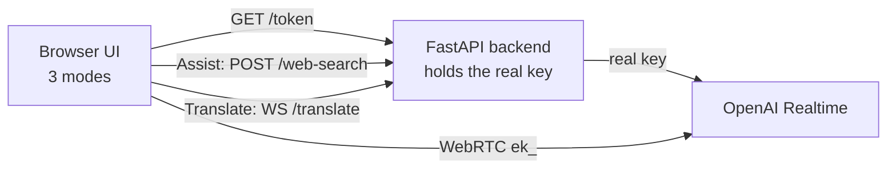

# Module 08: Capstone: One App, Three Modes, One Tool-Using Agent

The finale. **One web app** (a Next.js UI plus one FastAPI backend) that unifies
everything from the course behind a single **mode switch**. All three modes run in
the browser:

| Mode | What it does | How it connects | Builds on |
|---|---|---|---|
| **Transcribe** | Live speech &rarr; text (never talks back) | Browser **WebRTC**, `session.type:"transcription"`, `gpt-realtime-whisper` | Module 03 + 07 |
| **Translate** | Speak one language, hear another | Browser mic streamed to the backend **`WS /translate`** proxy, `gpt-realtime-translate` | Module 04 |
| **Assist** | Talk to a **tool-calling** voice agent | Browser **WebRTC** via `@openai/agents/realtime`, `gpt-realtime-2.1` | Module 05 + 07 |

The headline is **Assist mode**: the agent has `get_time` and `web_search` tools and does a
**ReAct loop** you can watch on screen: reason &rarr; act (call the tool) &rarr;
observe (read the result) &rarr; respond (speak it).

One **FastAPI backend** keeps your real key secret. It does three jobs: it mints
short-lived `ek_` tokens (for Transcribe and Assist, which open WebRTC to OpenAI
directly), runs Assist web searches through the Responses API, and proxies the
translation WebSocket (for Translate, which a browser cannot authenticate to on
its own). The key is loaded from the shared `topics/voice_agents/.env` via
**python-dotenv**.

## Quickstart (two terminals)

The app is two processes: the **FastAPI backend** (`backend/`) and the **Next.js
UI** (`app/`).

**0) Set the one shared key** (once for the whole course):

```bash
cd topics/voice_agents
cp .env.example .env          # then paste your paid-tier OPENAI_API_KEY into .env
```

**1) Terminal one, the backend** (Python, reads `.env` via python-dotenv):

```bash
cd topics/voice_agents/08_capstone_multimode/backend
uv sync                                              # install deps, write uv.lock
uv run uvicorn src.main:app --reload --port 8000     # http://localhost:8000
```

Check it: open `http://localhost:8000/health` and confirm `"has_api_key": true`.

**2) Terminal two, the UI** (Node):

```bash
cd topics/voice_agents/08_capstone_multimode/app
cp .env.local.example .env.local     # defaults the backend URL to http://localhost:8000
npm install                          # install next, react, @openai/agents, zod
npm run dev                          # open http://localhost:3000
```

Click **Assist**, allow the microphone, and say: *"What time is it in Tokyo?"*
Watch the **ReAct loop** panel show the `get_time` call and its result, then hear
the answer spoken back. Then say: *"Search the web for today's top AI story"* to
trigger `web_search`. Finally, try **Translate**: pick a language, press Start,
and speak.

> The **free tier cannot use Realtime** (use a paid-tier key). Sessions end after
> about **60 minutes** (OpenAI); reconnect if you hit that.

## The three modes, briefly

- **Transcribe** reuses Module 07's browser WebRTC handshake but flips the session
  to transcription, so you get text and no voice reply.
- **Translate** streams your mic (converted to PCM16 @ 24 kHz in the browser) to
  the backend's `WS /translate` route. The backend sends the same audio to OpenAI's
  translation session and a `gpt-realtime-whisper` source-caption session. It
  relays what the speaker said in the detected source language, plus translated
  text and audio. Both authenticated sockets keep the real key out of the browser.
- **Assist** is the tool-calling agent. `get_time` executes locally in the
  browser. `web_search` calls `POST /web-search`; the backend securely invokes
  the Responses API hosted search tool and returns its answer as the observation.

## Deploy notes

- **Set `OPENAI_API_KEY`** in the backend's environment (the shared
  `topics/voice_agents/.env` locally, or the host's settings). Only the backend
  reads it; it is never shipped to the browser.
- **The backend must be reachable** at `NEXT_PUBLIC_BACKEND_URL` (default
  `http://localhost:8000`), and its CORS `allow_origins` must include your UI's
  origin. In production set that to your real site URL, not `localhost`.
- **HTTPS + microphone**: browsers only grant the mic on `https://` (or
  `localhost`). A real deploy must be HTTPS, which also makes the translation
  socket `wss://` (it is derived from `NEXT_PUBLIC_BACKEND_URL`).
- **Session length**: ~60 min per Realtime session (API_FACTS §7); plan to
  reconnect for longer use.
- **UI-only deploy?** The app also ships a built-in Next.js token route
  (`app/src/app/api/token/route.ts`). Set `NEXT_PUBLIC_TOKEN_ENDPOINT=/api/token`
  and `OPENAI_API_KEY` in `.env.local` to mint tokens without the Python backend.
  Translate still needs the FastAPI backend's `WS /translate`, so run it too.



See `capstone_multimode_tutorial.md` for the full, line-by-line walkthrough,
`backend/README.md` for the server, and `slides/index.html` for the deck. API
details live in `../_shared/API_FACTS.md`.

---

Built by **mui-group** for advanced high-school students.
