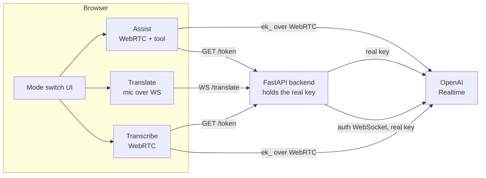
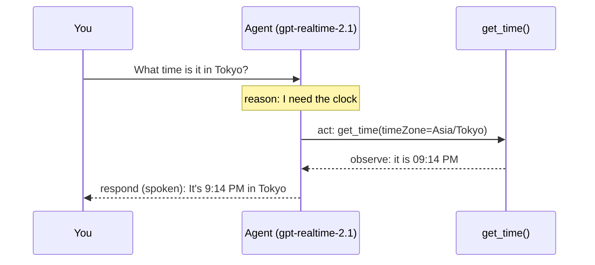

# Module 08: Capstone: One App, Three Modes, One Tool-Using Agent

**The one idea:** every capability you built in Modules 01 through 07 shares the
same backbone (a Realtime session made of events), so you can wrap all three in
**one web app** behind a mode switch, and then teach the assistant a **tool** so
it can act, not just talk. This module composes the course into a single app and
adds the last new concept: **tool calling** and the **ReAct loop**.

By the end you will have a two-process app, a **Next.js UI** plus one **FastAPI
backend**, with a `Transcribe | Translate | Assist` switch. All three modes run
in the browser. Assist mode is a voice agent that calls `get_time` and
`web_search` tools, and you can watch its reason &rarr; act &rarr; observe
&rarr; respond loop on screen.

> The runnable app lives in [`app/`](./app) (the UI) and [`backend/`](./backend)
> (the FastAPI server). API facts come from [`../_shared/API_FACTS.md`](../_shared/API_FACTS.md),
> the single source of truth.

---

## Concept map

| Concept | What it does | When it matters |
|---|---|---|
| Mode switch | One UI, one live session at a time, three behaviors | The whole app shape (slide 3) |
| One FastAPI backend | Mints `ek_` tokens AND proxies translation | Every mode; keeps your key secret (slide 4) |
| Transcribe mode | Browser WebRTC + `session.type:"transcription"` | Reusing Module 03/07 in the browser (slide 6) |
| Translate mode | Browser mic streamed to the backend translation proxy | Why some things need a server relay (slide 7) |
| RealtimeAgent + tool | Give the agent a function it may call | Assist mode, the headline (slides 8, 9) |
| ReAct loop | reason &rarr; act &rarr; observe &rarr; respond | How a tool call actually flows (slide 10) |
| Deploy notes | Env vars, HTTPS mic, session limits | Shipping it (slide 12) |

Keep this table open. Each row maps to a section below and a slide.

---

## The architecture in one picture

Three modes, one UI, one backend that hides your key. Assist and Transcribe run
in the browser over **WebRTC** (Modules 05 and 07), each using an `ek_` token the
backend mints. Translate runs in the browser too, but its audio is streamed to
the backend, which relays it to OpenAI's translation **WebSocket** with the real
key. All three talk to the same OpenAI Realtime service.



Notice the browser boxes never touch the real key: Assist and Transcribe hold
only a short-lived `ek_` token, and Translate holds nothing secret at all (the
key stays on the backend when it opens the translation socket). That is the
security rule from Module 06, extended to cover translation too.

---

## Concept 1: One app, one mode at a time

The home page (`app/src/app/page.tsx`) is a Client Component. It holds one piece
of state, the current mode, and renders exactly one panel.

```tsx
type Mode = "transcribe" | "translate" | "assist";

const [mode, setMode] = useState<Mode>("assist"); // start on the headline demo

// ...render the switch, then exactly one panel:
{mode === "transcribe" && <TranscribePanel key="transcribe" />}
{mode === "translate" && <TranslatePanel  key="translate" />}
{mode === "assist"    && <AssistPanel     key="assist" />}
```

Two beginner-friendly details do real work here:

- `type Mode = ...` is a **string union**. If you typo `"assit"`, TypeScript
  refuses to compile. Cheap safety.
- The `key` prop (`key="assist"`) tells React these are *different* components.
  When you switch modes, React **unmounts** the old panel and **mounts** the new
  one. Unmounting runs each panel's cleanup, which stops the microphone and
  closes the session. So switching modes can never leave two live mics running.

> **Caution.** A Realtime session ties up your microphone and counts against
> rate limits. Keeping exactly one alive is not just tidy, it avoids the browser
> error you get when two `getUserMedia` grabs fight over the mic. The `key`-based
> remount gives us that for free.

Back-link: slide 3.

---

## Concept 2: One FastAPI backend for the whole app

Every mode needs the server. Transcribe and Assist need a short-lived `ek_` token;
Translate needs a live relay (Concept 5). The capstone uses **one** FastAPI server
(`backend/src/main.py`) for all of it. It is the Module 06 token server, grown a
`WS /translate` route. It loads the real key from the shared `.env` with
**python-dotenv** (`load_dotenv(find_dotenv())`), exactly like every other Python
module in the course, so you set your key once.

The token route (`POST /token`, with a `GET /token` alias for browser testing):

```python
@app.post("/token")
async def mint_token() -> TokenResponse:
    if not OPENAI_API_KEY:                                  # loaded from the shared .env
        raise HTTPException(500, "OPENAI_API_KEY is not set...")
    headers = {"Authorization": f"Bearer {OPENAI_API_KEY}", "Content-Type": "application/json"}
    payload = {"session": {"type": "realtime", "model": "gpt-realtime-2.1",
                           "audio": {"output": {"voice": "marin"}}}}
    async with httpx.AsyncClient(timeout=10.0) as client:
        resp = await client.post("https://api.openai.com/v1/realtime/client_secrets",
                                 headers=headers, json=payload)
    data = resp.json()
    return TokenResponse(value=data["value"], model="gpt-realtime-2.1",   # the "ek_..." key
                         expires_at=data.get("expires_at"))
```

The browser calls this through one helper, `getEphemeralToken()`
(`app/src/lib/token.ts`), which points at the backend via `NEXT_PUBLIC_BACKEND_URL`:

```ts
import { BACKEND_URL } from "@/lib/backend"; // e.g. http://localhost:8000
const endpoint = process.env.NEXT_PUBLIC_TOKEN_ENDPOINT || `${BACKEND_URL}/token`;
const res = await fetch(endpoint, { method: "GET" });
const data = await res.json();
return data.value as string; // the "ek_..." string
```

> **Fallback.** The app also ships a built-in Next.js token route at
> `app/src/app/api/token/route.ts` (identical logic in TypeScript). Set
> `NEXT_PUBLIC_TOKEN_ENDPOINT=/api/token` and `OPENAI_API_KEY` in `.env.local` to
> use it, for example when deploying the UI without the Python backend. Translate
> mode still needs the FastAPI backend's `WS /translate`, so run the backend
> regardless.

> **Caution (secrets).** The key is read only on the server (the FastAPI process,
> or the Next.js Route Handler). The moment you read a secret inside a
> `"use client"` file, it would be bundled into the browser and leak. Keep secrets
> in server code only. `NEXT_PUBLIC_BACKEND_URL` is just an address, not a secret.

> **Caution (GA header).** Do **not** add an `OpenAI-Beta: realtime=v1` header.
> At GA it is gone (API_FACTS §2). Old tutorials still show it.

Back-link: slide 4. See also `backend/README.md`.

---

## Concept 3: What "voice audio" is (30-second recap)

Every mode moves audio, so here is the one paragraph the whole course rests on.
A microphone measures air pressure thousands of times per second. Each
measurement is a **sample**, stored as a 16-bit signed integer (a whole number
from -32768 to 32767). That is **PCM16**. We take **24000** samples per second
(**24000 Hz**) on **1** channel (**mono**). To send those raw bytes inside JSON
text, we **base64-encode** them. Those numbers, `PCM16 / 24000 Hz / mono`, must
match what the API expects or you get static (API_FACTS §3). WebRTC hides the
encoding for us in Transcribe and Assist; Translate mode does it by hand in the
browser with the Web Audio API, which is the most instructive path of the three.

---

## Concept 4: Transcribe mode (browser WebRTC, text only)

Transcribe mode reuses the exact WebRTC handshake from Module 07, with two
changes: the session type is `"transcription"`, and we listen for the user's
transcript instead of playing a voice. The logic is a small class,
`TranscribeClient` (`app/src/lib/transcribeClient.ts`).

The handshake (identical shape to Module 07, verified in API_FACTS §5):

```ts
const pc = new RTCPeerConnection();                       // the WebRTC pipe
const mic = await navigator.mediaDevices.getUserMedia({ audio: true });
pc.addTrack(mic.getTracks()[0], mic);                     // send the mic up
const dc = pc.createDataChannel("oai-events");            // JSON events channel
const offer = await pc.createOffer();
await pc.setLocalDescription(offer);
const sdpRes = await fetch(
  "https://api.openai.com/v1/realtime/calls?model=gpt-realtime-2.1",
  { method: "POST", body: offer.sdp,
    headers: { Authorization: `Bearer ${token}`, "Content-Type": "application/sdp" } },
);
await pc.setRemoteDescription({ type: "answer", sdp: await sdpRes.text() });
```

The one configuration message, sent when the data channel opens. Note the GA
nesting under `session.audio.input` (API_FACTS §3) and the transcription model:

```ts
dc.send(JSON.stringify({
  type: "session.update",
  session: {
    type: "transcription",                                // text only, no voice back
    audio: {
      input: {
        format: { type: "audio/pcm", rate: 24000 },       // PCM16 @ 24 kHz
        turn_detection: { type: "server_vad" },           // server finds speech edges
        transcription: { model: "gpt-realtime-whisper" }, // API_FACTS §1
      },
    },
  },
}));
```

Then we react to two server events (exact strings from API_FACTS §4):

```ts
case "conversation.item.input_audio_transcription.delta":   // partial words
  onPartial(event.delta); break;
case "conversation.item.input_audio_transcription.completed": // finished segment
  onFinal(event.transcript); break;
```

> **Caution.** These are the **user's** transcript events. Do not confuse them
> with `response.output_audio_transcript.*`, which is what the *assistant* says
> in Assist mode. In transcription mode there is no assistant, so those never
> fire.

Back-link: slide 6.

---

## Concept 5: Translate mode (browser mic, backend proxy)

Translate is the one mode the browser cannot do alone, and the reason is a
genuine, teachable constraint. Translation lives on a dedicated **WebSocket**
endpoint that authenticates with a header:

```
wss://api.openai.com/v1/realtime/translations?model=gpt-realtime-translate
Authorization: Bearer <key>
```

Three facts collide to make this browser-hostile:

1. It is a **WebSocket**, not WebRTC (API_FACTS §2).
2. It needs an `Authorization: Bearer` **header**. The browser `WebSocket`
   constructor has **no way to set request headers**. So a browser cannot present
   the credential the normal way.
3. The `ek_` token our route mints is scoped to a `{"type":"realtime"}` session
   (a voice assistant), not a translation session.

The correct fix is a **backend proxy**. The browser opens a plain WebSocket to our
own server (no header needed on that leg), and the server, which holds the real
key, opens the authenticated OpenAI socket and relays messages both ways:

```
[ browser ] --plain WS /translate--> [ FastAPI backend ] --auth WS + real key--> [ OpenAI ]
```

The backend side (`backend/src/main.py`, route `WS /translate`) opens two upstream
sockets. The translation session produces target text and translated audio. A
`gpt-realtime-whisper` transcription sidecar receives the same mic chunks and
produces reliable **You said (source)** captions in the speaker's language. The
sidecar is necessary because the live translation service does not currently emit
its documented `session.input_transcript.delta` event reliably.

```python
@app.websocket("/translate")
async def translate(ws: WebSocket):
    await ws.accept()
    first = await ws.receive_json()                       # {"type":"start","language":"es"}
    headers = {"Authorization": f"Bearer {OPENAI_API_KEY}"}
    async with (
        websockets.connect(TRANSLATE_URL, additional_headers=headers) as translator,
        websockets.connect(SOURCE_TRANSCRIBE_URL, additional_headers=headers) as transcriber,
    ):
        await translator.send(json.dumps({"type": "session.update", "session": {"audio": {
            "output": {"language": first["language"]}}}}))
        await transcriber.send(json.dumps({"type": "session.update", "session": {
            "type": "transcription",
            "audio": {"input": {
                "format": {"type": "audio/pcm", "rate": 24000},
                "transcription": {"model": "gpt-realtime-whisper", "delay": "low"},
            }},
        }}))
        # Wait for session.updated from BOTH sockets before starting the mic.
        await ws.send_json({"type": "ready"})             # now start the browser mic
        # Send every mic chunk to both sockets. Commit source phrases after a pause,
        # because gpt-realtime-whisper does not support server VAD.
        # Then relay source text, target text, and translated audio to the browser.
```

The browser side (`app/src/lib/translateClient.ts`) captures the mic with the Web
Audio API, converts float samples to **PCM16** by hand, and streams them as
base64. This is the one place you see the audio conversion the SDK usually hides:

```ts
// Float32 mic samples in [-1, 1]  ->  little-endian PCM16 bytes  ->  base64
function floatsToBase64Pcm16(floats: Float32Array): string {
  const pcm = new Int16Array(floats.length);
  for (let i = 0; i < floats.length; i++) {
    const s = Math.max(-1, Math.min(1, floats[i]));       // clamp to [-1, 1]
    pcm[i] = s < 0 ? s * 0x8000 : s * 0x7fff;             // scale to 16-bit signed
  }
  return bytesToBase64(new Uint8Array(pcm.buffer));
}
```

The two upstream sessions use different event families. The backend maps both to
the browser's simple `source` / `target` / `audio` messages:

```
conversation.item.input_audio_transcription.delta      # source partial
conversation.item.input_audio_transcription.completed  # source final
session.output_transcript.delta                         # target text
session.output_audio.delta                              # translated audio
                                                        # audio bytes are in event["delta"]
```

> **Caution (do not decode twice).** The backend passes the browser's base64 mic
> audio straight through to OpenAI and OpenAI's base64 translated audio straight
> back; only the browser decodes PCM16 (to send) and re-decodes it (to play). Keep
> base64 as the wire format end to end and you avoid a class of corruption bugs.

> **Caution (the audio math must match).** Capture and playback both run at
> **24000 Hz mono PCM16**. We force the browser `AudioContext` to 24 kHz so the
> mic is resampled for us; if you let it default (often 48 kHz) the translation
> would sound chipmunk-fast. `PCM16 / 24000 / mono` is non-negotiable (API_FACTS §3).

Module 04 taught the translation protocol as a standalone Python CLI. The
capstone moves it behind the browser proxy and adds a parallel transcription
session for reliable source-language captions, so all three modes live in one app.

Back-link: slide 7.

---

## Concept 6: Assist mode: a RealtimeAgent with tools

Now the headline. Assist mode uses the official browser SDK,
`@openai/agents/realtime`, exactly like Module 07, but this time we give the
agent **tools** it can call. A tool is just a normal function the model is
*allowed* to run when it decides it needs to.

Defining the local clock tool (`app/src/lib/assistAgent.ts`):

```ts
import { RealtimeAgent, RealtimeSession, tool } from "@openai/agents/realtime";
import { z } from "zod";

export const getTimeTool = tool({
  name: "get_time",
  description:
    "Get the current wall-clock time, optionally for an IANA time zone like " +
    "'Asia/Tokyo'. Use this whenever the user asks what time it is.",
  parameters: z.object({
    // Realtime tool schemas must be strict (no truly optional fields), so we
    // model "no zone given" as an explicit null and default it below.
    timeZone: z.string().nullable()
      .describe("IANA time zone id, e.g. 'Asia/Tokyo'. Null = user's local time."),
  }),
  execute: async ({ timeZone }) => {
    const zone = timeZone || Intl.DateTimeFormat().resolvedOptions().timeZone;
    const now = new Date().toLocaleTimeString("en-US",
      { timeZone: zone, hour: "2-digit", minute: "2-digit" });
    return `The current time in ${zone} is ${now}.`;   // becomes the observation
  },
});
```

Web search is also exposed as a strict Realtime function tool. Because function
tools execute wherever the `RealtimeSession` runs, this function runs in the
browser. It calls our backend rather than using a permanent OpenAI key:

```ts
export const webSearchTool = tool({
  name: "web_search",
  description:
    "Search the public web for current information, recent events, or changing facts.",
  parameters: z.object({
    query: z.string().describe("A concise, self-contained web search query."),
  }),
  execute: async ({ query }) => {
    const response = await fetch(`${BACKEND_URL}/web-search`, {
      method: "POST",
      headers: { "Content-Type": "application/json" },
      body: JSON.stringify({ query }),
    });
    const data = await response.json();
    return data.answer; // becomes the web_search observation
  },
});
```

The backend route holds the real key and delegates the lookup to the Responses
API hosted search tool. `tool_choice: "required"` guarantees that this dedicated
route actually searches rather than answering from model memory:

```py
payload = {
    "model": "gpt-5.6",
    "reasoning": {"effort": "low"},
    "tools": [{"type": "web_search"}],
    "tool_choice": "required",
    "input": request.query,
}
response = await client.post(
    "https://api.openai.com/v1/responses",
    headers={"Authorization": f"Bearer {OPENAI_API_KEY}"},
    json=payload,
)
```

Line by line, the four fields of `tool(...)`:

- **`name`** is what the model refers to the tool by.
- **`description`** is plain English telling the model *when* to use it. The
  model reads this to decide. Vague descriptions cause missed or spurious calls.
- **`parameters`** is a **zod** schema. zod is a tiny library for describing the
  shape of data; the SDK turns it into the JSON schema OpenAI needs and
  **validates the model's arguments** before your code runs.
- **`execute`** is *your* code. It runs in the browser, and whatever it returns
  becomes the model's **observation** (the value it reads back to you).

Attaching both tools to the agent is identical to a text agent:

```ts
export function makeAssistant(): RealtimeAgent {
  return new RealtimeAgent({
    name: "Capstone Assistant",
    instructions:
      "You are a friendly, concise voice assistant. When the user asks for the " +
      "time, call the get_time tool and then say the result out loud. Do not " +
      "guess the time yourself. Use web_search for current or changing facts.",
    tools: [getTimeTool, webSearchTool],
  });
}
```

And the session (the SDK handles mic, WebRTC, and playback for us):

```ts
export function makeSession(agent: RealtimeAgent): RealtimeSession {
  return new RealtimeSession(agent, {
    model: "gpt-realtime-2.1",                 // API_FACTS §1 (older name: gpt-realtime-2)
    config: {
      outputModalities: ["audio"],             // it speaks; we read text from events
      reasoning: { effort: "low" },            // low effort = snappy voice (API_FACTS §7)
    },
  });
}
```

> **Caution (strict schemas).** Realtime tool parameters must be strict. A plain
> `z.string().optional()` can be rejected. Model an omitted value as
> `z.string().nullable()` and default it in code, as above. The required search
> query remains a plain `z.string()`.

> **Caution (voice locks once).** The voice ("marin") is chosen in the token
> route and cannot change mid-session (API_FACTS §3, §7). Pick it before the
> first audio.

Back-link: slides 8 and 9.

---

## Concept 7: The ReAct loop, made visible

"ReAct" means **Reason + Act**: the model reasons about what it needs, acts by
calling a tool, observes the result, and only then responds. With a voice agent
it looks like this:



The model cannot know the time or today's news on its own; tools are its senses. It **reasons**
that it needs the clock, **acts** by emitting a call to `get_time`, **observes**
the string our `execute` returned, and **responds** by speaking it.

We surface these steps in the UI. The SDK re-emits the whole conversation on
every change via `history_updated`; our hook (`app/src/lib/useAssist.ts`) walks
the history and picks out tool activity:

```ts
session.on("history_updated", (history) => {
  const { lines, tools } = flattenHistory(history);   // split messages vs tool steps
  setTranscript(lines);
  setToolEvents(tools);
});

// inside flattenHistory: ONE "function_call" item carries BOTH steps.
if (item.type === "function_call") {
  // ACT: the model chose the tool + arguments.
  tools.push({ phase: "act", label: `${item.name}(${item.arguments})`, /* ... */ });
  // OBSERVE: `output` is null until the tool runs, then holds the result string.
  if (item.output != null) {
    tools.push({ phase: "observe", label: item.output, /* ... */ });
  }
}
```

The `AssistPanel` renders `toolEvents` as an "ACT / OBSERVE" log next to the
transcript, so a student literally watches the loop happen for either
`get_time` or `web_search`.

> **Caution.** `history_updated` fires **a lot** (every partial word). Keep the
> handler cheap: just transform and set state, as above. Do not do network calls
> or heavy work inside it.

Back-link: slide 10.

---

## Concept 8: Running and deploying it

The app is **two processes**: the FastAPI backend and the Next.js UI. Open two
terminals.

First, set the ONE shared key (once for the whole course):

```bash
cd topics/voice_agents
cp .env.example .env                 # then paste your paid-tier OPENAI_API_KEY into .env
```

Terminal 1, the backend (reads that `.env` via python-dotenv):

```bash
cd topics/voice_agents/08_capstone_multimode/backend
uv sync                                              # install fastapi, uvicorn, httpx, websockets, python-dotenv
uv run uvicorn src.main:app --reload --port 8000     # http://localhost:8000
```

Terminal 2, the UI:

```bash
cd topics/voice_agents/08_capstone_multimode/app
cp .env.local.example .env.local     # defaults NEXT_PUBLIC_BACKEND_URL to http://localhost:8000
npm install
npm run dev                          # http://localhost:3000
```

Open `http://localhost:3000`, and check the backend first at
`http://localhost:8000/health` (it should show `"has_api_key": true`).

Deploy checklist:

- **`OPENAI_API_KEY`** goes in the **backend's** environment (the shared `.env`
  locally, or the host's settings). It is read only by the server, never shipped.
- **The backend must be reachable** from the browser at `NEXT_PUBLIC_BACKEND_URL`,
  and its CORS `allow_origins` must include your UI's origin. In production, set
  that to your real site URL, not `localhost`.
- **HTTPS for the mic.** Browsers grant `getUserMedia` only on `https://` or
  `localhost`. A real deploy must be HTTPS, which also means the backend must be
  `wss://` (use `https://` in `NEXT_PUBLIC_BACKEND_URL` and the WS URL follows).
- **Session length.** Realtime sessions end after about **60 minutes**
  (API_FACTS §7). For long use, reconnect (mint a fresh token and re-`connect`).

Back-link: slide 12.

---

## Recap

You composed the whole course into one app and added the last new idea, tools:

- **One UI, one live session** at a time, via a `key`-remounted mode switch.
- **One FastAPI backend** that mints `ek_` tokens (Transcribe, Assist) and proxies
  translation (Translate), loading the key from the shared `.env` via python-dotenv,
  so the browser never holds the real key.
- **Transcribe** and **Assist** run in the browser over **WebRTC**; **Translate**
  runs in the browser too, streaming mic audio to the backend proxy over a
  **WebSocket**, and we explained exactly why it needs the relay.
- **Assist** gives a `RealtimeAgent` `get_time` and `web_search` **tools** and shows the
  **ReAct loop** (reason &rarr; act &rarr; observe &rarr; respond) on screen.

> **Remember the gotchas.** No `OpenAI-Beta` header at GA. Assistant audio is
> `response.output_audio.delta` (bytes in `delta`), user transcript is
> `conversation.item.input_audio_transcription.completed`; Translate source captions
> use that same transcription event family, while target/audio translation events
> are `session.`-prefixed with audio in `delta`. Tool schemas must be strict
> (`nullable`, not `optional`). Voice locks once per session. Secrets live in
> server code only. All of these are in `../_shared/API_FACTS.md`.

Where to go next: give the agent a real tool (a weather or wiki lookup), add
`handoffs` to route between multiple agents, add `guardrails`, or extend the
translation proxy to broadcast a room of listeners. You now have every piece you
need.

---

Built by **mui-group** for advanced high-school students. Now run the app and
ask it what time it is. 🎙️
