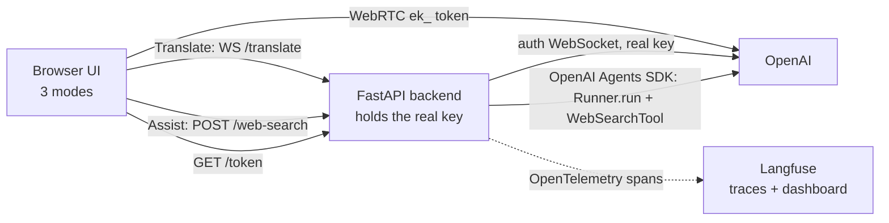

# A Complete Voice App: Transcribe, Translate, and a Tool-Using Voice Agent

A self-contained project that builds **one web app with three voice modes** on top
of the OpenAI Realtime API, with a Python backend that keeps your API key secret
and traces everything to [Langfuse](https://langfuse.com). You can learn it start
to finish here; no other module is required.

| Mode | What it does | How it works |
|---|---|---|
| **Transcribe** | Live speech &rarr; text (it never talks back) | The browser opens a **WebRTC** connection to OpenAI with a short-lived token and streams your mic; OpenAI returns the text of what you said (`gpt-realtime-whisper`). |
| **Translate** | Speak one language, hear another | The browser streams your mic to **our backend** over a plain WebSocket; the backend relays it to OpenAI's translation socket and a caption socket, then sends back the translation as text and audio (`gpt-realtime-translate`). |
| **Assist** | Talk to a voice agent that can **use tools** | The browser opens **WebRTC** to a voice model (`gpt-realtime-2.1`) that can call a local `get_time` tool and a `web_search` tool. `web_search` calls our backend, which runs an **OpenAI Agents SDK** agent with a hosted web-search tool. |

Two ideas run through the whole app:

- **Your real OpenAI key never reaches the browser.** A tiny FastAPI backend holds
  it. For voice modes the backend mints a short-lived `ek_...` token the browser
  uses directly; for web search and translation the backend does the paid call
  itself and returns only the result.
- **Everything is observable.** Each web search and each translation session becomes
  a **Langfuse trace** you can open in a dashboard: which agent ran, what it was
  asked, which tool it called, how many tokens it used, and what it answered.

## What you will build (and learn)

- **What "voice audio" is:** a microphone samples air pressure thousands of times a
  second; each sample is a 16-bit integer (**PCM16**); we take **24000** samples/sec
  (**24 kHz**), **mono**, and **base64**-encode the bytes to put them in JSON.
- **WebRTC vs WebSocket:** Transcribe and Assist use **WebRTC** (a browser-native
  real-time media pipe). Translate uses a **WebSocket** through our backend, because
  OpenAI's translation endpoint needs an `Authorization` header that a browser
  cannot set on a WebSocket.
- **Ephemeral tokens:** why the browser gets a ~1-minute `ek_...` token instead of
  your real `sk-...` key.
- **Tools and the ReAct loop:** how a voice agent **reasons**, **acts** (calls a
  tool), **observes** the result, and **responds** by speaking it.
- **The OpenAI Agents SDK:** an `Agent` owns its tools and a `Runner` executes the
  loop for you (`await Runner.run(agent, query)` &rarr; `result.final_output`).
- **Langfuse tracing to best practice:** framework instrumentation, descriptive
  trace names, explicit input/output, sessions, tags, and flushing.

## Prerequisites

- **A paid-tier OpenAI API key** (`sk-...`). The free tier cannot use the Realtime
  API.
- **Python 3.11 - 3.14** with [`uv`](https://docs.astral.sh/uv/) for the backend.
- **Node.js 18+** with `npm` for the web UI.
- **Optional:** a free [Langfuse](https://cloud.langfuse.com) account for tracing.
  The app runs fine without it (tracing is simply off).

## Quickstart (two terminals)

**0) Put your key in one shared file.** This project reads a `.env` at
`topics/voice_agents/.env` (found automatically by walking up the folder tree):

```bash
cd topics/voice_agents
cp .env.example .env
# Edit .env and paste your paid-tier OPENAI_API_KEY (starts with sk-).
# OPTIONAL: paste LANGFUSE_PUBLIC_KEY / LANGFUSE_SECRET_KEY to turn on tracing.
```

**1) Terminal one, the backend** (Python):

```bash
cd topics/voice_agents/09_capstone_openai/backend
uv sync                                              # create .venv/, install deps
uv run uvicorn src.main:app --reload --port 8000     # http://localhost:8000
```

Check it: open `http://localhost:8000/health`. You should see:

```json
{"status":"ok","model":"gpt-realtime-2.1","translate_model":"gpt-realtime-translate",
 "has_api_key":true,"telemetry":false,"auth":false}
```

- `has_api_key:false` &rarr; your `.env` was not found or the key line is empty.
- `telemetry:true` &rarr; Langfuse tracing is on (you added valid keys).
- `auth:false` &rarr; the backend is open on localhost (no caller token required).

**2) Terminal two, the UI** (Node):

```bash
cd topics/voice_agents/09_capstone_openai/app
cp .env.local.example .env.local     # points the UI at http://localhost:8000
npm install
npm run dev                          # open http://localhost:3000
```

Open `http://localhost:3000`. Click **Assist**, allow the microphone, and say:
*"What time is it in Tokyo?"* Watch the on-screen **ReAct** panel show the
`get_time` call and its result, then hear the answer spoken. Then say: *"Search the
web for today's top AI story"* to trigger `web_search`. Finally try **Translate**:
pick a language, press Start, and speak.

If Langfuse is on, open <https://cloud.langfuse.com> &rarr; **Traces** and watch
`assist-web-search` and `translate-session` traces appear in real time.

> Realtime sessions end after about **60 minutes**; reconnect if you hit that.

## Verifying all three functionalities

| Functionality | How to verify | What to look for |
|---|---|---|
| **Transcription** | Mint a token: `curl "http://localhost:8000/token?mode=transcribe"` | JSON with a `value` starting `ek_`. In the UI, Transcribe mode shows your words as text. |
| **Translation** | In the UI, Translate mode: pick a language, press Start, speak a sentence. | "You said (source)" fills with your words; the translation streams as text and audio. A `translate-session` trace appears in Langfuse. |
| **Agent assist** | In the UI, Assist mode: ask "what time is it in Tokyo?", then "search the web for the latest AI news". | The ReAct panel shows `get_time` / `web_search` act + observe steps; the answer is spoken. An `assist-web-search` trace (with nested model + tool spans) appears in Langfuse. |

You can also verify web search headlessly:

```bash
curl -s -X POST http://localhost:8000/web-search \
  -H "Content-Type: application/json" \
  -d '{"query":"Who is the CEO of OpenAI? One sentence."}'
# {"answer":"Sam Altman is the current CEO of OpenAI ..."}
```

## How the pieces fit together



The backend exposes four routes:

| Route | Used by | What it does |
|---|---|---|
| `GET /health` | you (debugging) | Liveness + whether the key loaded, tracing is on, and a caller token is required. |
| `POST /token` (and `GET /token`) | Transcribe, Assist | Mints a short-lived `ek_...` token so the browser can open WebRTC to OpenAI directly. |
| `POST /web-search` | Assist | Runs an OpenAI Agents SDK agent (hosted web search) and returns a grounded answer. |
| `WS /translate` | Translate | Relays mic audio to OpenAI's translation + caption sockets and streams results back. |

## Turning on Langfuse (optional but recommended)

1. Create a free account and project at <https://cloud.langfuse.com>.
2. Open **Settings &rarr; API Keys** and copy the **Public key** (`pk-lf-...`) and
   **Secret key** (`sk-lf-...`).
3. Paste both into `topics/voice_agents/.env`:
   ```bash
   LANGFUSE_PUBLIC_KEY=pk-lf-...
   LANGFUSE_SECRET_KEY=sk-lf-...
   LANGFUSE_BASE_URL=https://cloud.langfuse.com   # or https://us.cloud.langfuse.com
   ```
4. Restart the backend. `GET /health` now shows `"telemetry":true`.
5. Use Assist or Translate, then open the Langfuse **Traces** view.

## Protecting the paid routes (for a deployed demo)

On your own laptop the backend is open and that is fine. If you deploy it so others
can reach it, its paid routes could be abused. The backend has three guards
(see [`backend/README.md`](./backend/README.md) and `backend/src/security.py`):

- **Per-caller rate limit** (always on): caps paid requests per IP per minute.
- **WebSocket Origin check** (always on): `/translate` only accepts localhost or
  origins you allow.
- **Optional shared caller token**: set `CAPSTONE_API_TOKEN` on the backend and the
  matching `NEXT_PUBLIC_CAPSTONE_API_TOKEN` in the UI, and every paid call must
  carry it. Leave both blank for local work. `GET /health` shows `"auth":true` when
  a token is required.

## Deploy notes

- **`OPENAI_API_KEY`** (and optional `LANGFUSE_*`, `CAPSTONE_*`) live in the
  **backend's** environment only; they are never shipped to the browser.
- **The backend must be reachable** from the browser at `NEXT_PUBLIC_BACKEND_URL`
  (default `http://localhost:8000`).
- **HTTPS for the microphone.** Browsers grant the mic only on `https://` (or
  `localhost`). A real deploy must be HTTPS, which also makes the translation socket
  `wss://`.

## Where the details live

- [`capstone_openai_tutorial.md`](./capstone_openai_tutorial.md) - the full,
  line-by-line walkthrough of every concept and file.
- [`backend/README.md`](./backend/README.md) - the server, the Agents SDK web
  search, the Langfuse wiring, and the access guards.
- [`slides/index.html`](./slides/index.html) - a slide deck of the whole app.
- [`../_shared/API_FACTS.md`](../_shared/API_FACTS.md) - the exact OpenAI Realtime
  model ids, endpoints, and event names this project relies on.

---

Built by **mui-group** for advanced high-school students.
