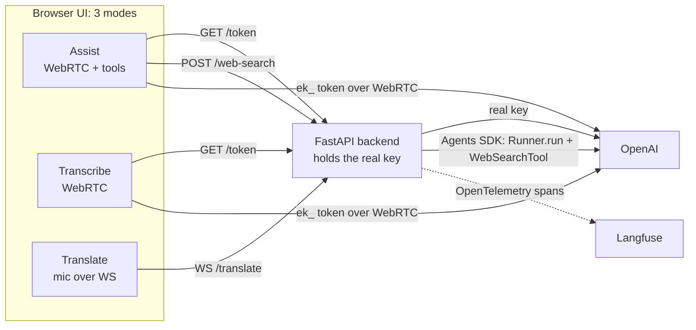

# A Complete Voice App: Transcribe, Translate, and a Tool-Using Agent (with Langfuse)

**The one idea:** every real-time voice feature, live transcription, live
translation, and a talking assistant that can use tools, is built from the same
backbone: a stream of audio and a stream of small JSON events between your app and
a model. Once you see that backbone, you can put all three behind one mode switch,
keep your API key safe on a small server, and watch the whole thing on a tracing
dashboard.

This tutorial is self-contained. It assumes only basic Python and a little
JavaScript/React, and explains every concept and every important line from
scratch. The runnable app lives in [`app/`](./app) (the browser UI) and
[`backend/`](./backend) (the Python server). The exact OpenAI model ids, endpoints,
and event names it relies on are collected in
[`../_shared/API_FACTS.md`](../_shared/API_FACTS.md), the project's API reference.

> Audience note: written for advanced high-school students. No prior project is
> required; if a term is new, it is defined where it first appears.

---

## Concept map

| Concept | What it does | Where it matters |
|---|---|---|
| What "voice audio" is | Sound &rarr; samples &rarr; PCM16 @ 24 kHz &rarr; base64 | Every mode moves audio (§1) |
| WebRTC vs WebSocket | Two ways to stream audio in real time | Transcribe/Assist vs Translate (§2) |
| Ephemeral `ek_` token | A ~1-minute browser credential, not your real key | Keeping the key secret (§3) |
| One backend, four routes | `/health`, `/token`, `/web-search`, `/translate` | The server's whole job (§3) |
| Transcribe mode | Browser WebRTC, transcription session | Speech to text (§4) |
| Translate mode | Browser mic &rarr; backend proxy &rarr; OpenAI | Why a server relay is needed (§5) |
| Assist mode + tools | A voice agent that calls functions | The headline (§6) |
| The ReAct loop | reason &rarr; act &rarr; observe &rarr; respond | How a tool call flows (§6) |
| OpenAI Agents SDK | `Agent` + `Runner` + hosted `WebSearchTool` | The web-search backend (§7) |
| Langfuse tracing | A dashboard timeline of every agent/translation run | Understanding + debugging (§8) |
| Access guards | Rate limit, Origin check, optional token | Protecting a deployed demo (§9) |

Keep this table open. Each row maps to a section below and a slide.

---

## The architecture in one picture

Three modes, one UI, one backend that hides your key.



The browser boxes never hold the real key: Assist and Transcribe hold only a
short-lived `ek_` token, and Translate holds nothing secret at all (the key stays
on the backend when it opens the translation socket). The dotted arrow to Langfuse
is optional: with no Langfuse keys, everything else works unchanged.

---

## Concept 1: What "voice audio" actually is

Every mode moves audio, so here is the one paragraph the whole app rests on. A
microphone measures air pressure thousands of times per second. Each measurement is
a **sample**, stored as a 16-bit signed integer (a whole number from -32768 to
32767). That is **PCM16**. We take **24000** samples per second (**24000 Hz**, or
**24 kHz**) on **1** channel (**mono**). To carry those raw bytes inside JSON text,
we **base64**-encode them. Those numbers, `PCM16 / 24000 Hz / mono`, must match what
the API expects or you get static. In Transcribe and Assist, WebRTC handles the
encoding for you; in Translate, the browser does it by hand with the Web Audio API,
which is the most instructive path of the three.

---

## Concept 2: WebRTC vs WebSocket (two ways to stream)

- **WebRTC** is a browser-native pipe for real-time media. It negotiates a direct
  connection, carries your microphone as an audio track, and opens a small data
  channel for JSON events. Transcribe and Assist use it to talk to OpenAI directly.
- **WebSocket** is a simpler two-way message channel. Translate uses one, but not to
  OpenAI directly: OpenAI's translation endpoint authenticates with an
  `Authorization` header, and a browser **cannot set headers on a WebSocket**. So the
  browser opens a WebSocket to *our* backend, which holds the key and opens the
  authenticated socket to OpenAI on its behalf (§5).

---

## Concept 3: The backend and the ephemeral token

Your real OpenAI key (`sk-...`) can spend money and lasts for months. If it reached
the browser, anyone could read it in DevTools. So a small FastAPI server
(`backend/src/main.py`) holds the key and hands the browser only what is safe. It
loads the key once at startup from a shared `.env` file using **python-dotenv**:

```python
from dotenv import find_dotenv, load_dotenv
load_dotenv(find_dotenv())   # walks UP the folder tree to find topics/voice_agents/.env
OPENAI_API_KEY = os.environ.get("OPENAI_API_KEY", "").strip()
```

The **token route** mints a short-lived `ek_...` credential the browser uses to open
WebRTC. Minting a credential creates something, so it is a `POST` (a `GET` alias
exists for quick browser testing):

```python
@app.post("/token")
async def mint_token(request: Request, mode="assist"):
    guard_http(request)                                    # rate limit + optional token (§9)
    headers = {"Authorization": f"Bearer {OPENAI_API_KEY}"}  # the REAL key, server-side only
    payload = {"session": {"type": "realtime", "model": "gpt-realtime-2.1",
                           "audio": {"output": {"voice": "marin"}}}}
    async with httpx.AsyncClient() as c:
        r = await c.post("https://api.openai.com/v1/realtime/client_secrets",
                         headers=headers, json=payload)
    return {"value": r.json()["value"], ...}               # the ek_ token, nothing else
```

The browser fetches it through one helper (`app/src/lib/token.ts`) and never sees
the real key.

> **Caution.** Read the secret only in server code. The moment you read it inside a
> browser (`"use client"`) file it would be bundled and leak. Also: at the current
> API version there is **no** `OpenAI-Beta` header; do not add one.

The backend has four routes total: `GET /health` (liveness + config), `POST /token`
(Transcribe + Assist), `POST /web-search` (Assist, §7), and `WS /translate`
(Translate, §5).

---

## Concept 4: Transcribe mode (browser WebRTC, text only)

Transcribe opens WebRTC to OpenAI and configures the session as
`"transcription"`, so it returns the **text of what you said** and never speaks. The
logic is a small class, `TranscribeClient` (`app/src/lib/transcribeClient.ts`).

The handshake:

```ts
const pc = new RTCPeerConnection();                       // the WebRTC pipe
const mic = await navigator.mediaDevices.getUserMedia({ audio: true });
pc.addTrack(mic.getTracks()[0], mic);                     // send the mic up
const dc = pc.createDataChannel("oai-events");            // JSON events channel
const offer = await pc.createOffer();
await pc.setLocalDescription(offer);
const sdpRes = await fetch("https://api.openai.com/v1/realtime/calls", {
  method: "POST", body: offer.sdp,
  headers: { Authorization: `Bearer ${token}`, "Content-Type": "application/sdp" },
});
await pc.setRemoteDescription({ type: "answer", sdp: await sdpRes.text() });
```

One configuration message, sent when the data channel opens. The audio format nests
under `session.audio.input`, and the model is the realtime transcription model:

```ts
dc.send(JSON.stringify({
  type: "session.update",
  session: {
    type: "transcription",
    audio: { input: {
      format: { type: "audio/pcm", rate: 24000 },
      transcription: { model: "gpt-realtime-whisper", delay: "low" },
    } },
  },
}));
```

Then we react to two server events:

```ts
case "conversation.item.input_audio_transcription.delta":     // partial words
case "conversation.item.input_audio_transcription.completed": // a finished segment
```

> **Caution (lifecycle).** A live session ties up the microphone. The component
> makes the client **cancellable and idempotent**: every terminal error stops that
> exact client (releasing the mic, not just flipping a state flag), and if the panel
> is closed while a token fetch is still in flight, the pending start is invalidated
> so it never opens an orphaned microphone. Only the latest start owns the mic.

---

## Concept 5: Translate mode (browser mic, backend proxy)

Translate is the one mode the browser cannot do alone, for a genuine, teachable
reason. Translation lives on a dedicated **WebSocket** endpoint that authenticates
with a header:

```
wss://api.openai.com/v1/realtime/translations?model=gpt-realtime-translate
Authorization: Bearer <key>
```

Two facts collide: (1) it is a **WebSocket**, and (2) it needs an **Authorization
header**, which the browser `WebSocket` constructor cannot set. The fix is a
**backend proxy**:

```
[ browser ] --plain WS /translate--> [ FastAPI backend ] --auth WS + real key--> [ OpenAI ]
```

The backend (`WS /translate`) opens two upstream sockets. The translation session
produces the target-language text and audio. A `gpt-realtime-whisper` transcription
**sidecar** receives the same mic chunks and produces reliable **You said (source)**
captions in the speaker's own language (the translation service does not itself emit
a reliable source caption, so the sidecar fills that in):

```python
@app.websocket("/translate")
async def translate(ws: WebSocket):
    await ws.accept()
    first = await ws.receive_json()          # {"type":"start","language":"es", ...}
    # ... access guard (§9) ...
    headers = {"Authorization": f"Bearer {OPENAI_API_KEY}"}
    async with (
        websockets.connect(TRANSLATE_URL, additional_headers=headers) as translator,
        websockets.connect(SOURCE_TRANSCRIBE_URL, additional_headers=headers) as transcriber,
    ):
        await translator.send(json.dumps({"type":"session.update","session":{
            "audio":{"output":{"language": first["language"]}}}}))
        # ... configure the transcription sidecar, then relay both ways ...
        await ws.send_json({"type": "ready"})
```

The browser side (`app/src/lib/translateClient.ts`) captures the mic with the Web
Audio API, converts float samples to **PCM16** by hand, and streams them as base64.
This is the one place you see the conversion the SDK usually hides:

```ts
function floatsToBase64Pcm16(floats: Float32Array): string {
  const pcm = new Int16Array(floats.length);
  for (let i = 0; i < floats.length; i++) {
    const s = Math.max(-1, Math.min(1, floats[i]));       // clamp to [-1, 1]
    pcm[i] = s < 0 ? s * 0x8000 : s * 0x7fff;             // scale to 16-bit signed
  }
  return bytesToBase64(new Uint8Array(pcm.buffer));
}
```

The backend re-shapes OpenAI's events into a tiny browser protocol: `source`
(what you said), `target` (the translation text), and `audio` (the translated
speech, base64 PCM16).

> **Caution (the audio math must match).** Capture and playback both run at
> **24000 Hz mono PCM16**. Force the browser `AudioContext` to 24 kHz; if you let it
> default (often 48 kHz), the translated voice sounds chipmunk-fast.

---

## Concept 6: Assist mode, a voice agent with tools, and the ReAct loop

Assist uses the official browser SDK, `@openai/agents/realtime`. You describe an
**agent** (its persona + the tools it may call), open a **session**, connect with an
`ek_` token, and talk. A **tool** is a normal function the model is *allowed* to run
when it decides it needs to.

A local clock tool (`app/src/lib/assistAgent.ts`):

```ts
export const getTimeTool = tool({
  name: "get_time",
  description: "Get the current time, optionally for an IANA zone like 'Asia/Tokyo'.",
  parameters: z.object({
    timeZone: z.string().nullable()      // strict schema: model "no zone" as null
      .describe("IANA zone id, or null for local time."),
  }),
  execute: async ({ timeZone }) => {
    const zone = timeZone || Intl.DateTimeFormat().resolvedOptions().timeZone;
    const now = new Date().toLocaleTimeString("en-US",
      { timeZone: zone, hour: "2-digit", minute: "2-digit" });
    return `The current time in ${zone} is ${now}.`;   // becomes the observation
  },
});
```

A web-search tool. Its `execute` runs in the browser and calls **our backend**, so
the search itself (which needs the real key) happens server-side. It also sends a
per-conversation `session_id` so all of a conversation's searches group together in
tracing (§8):

```ts
export function makeWebSearchTool(sessionId: string) {
  return tool({
    name: "web_search",
    description: "Search the public web for current or factual information.",
    parameters: z.object({ query: z.string().describe("A concise web search query.") }),
    execute: async ({ query }) => {
      const res = await fetch(`${BACKEND_URL}/web-search`, {
        method: "POST",
        headers: { "Content-Type": "application/json", ...authHeader() },
        body: JSON.stringify({ query, session_id: sessionId }),
      });
      const data = await res.json();
      return data.answer;                 // becomes the web_search observation
    },
  });
}
```

The agent bundles persona + tools, and mints one conversation id per connection:

```ts
export function makeAssistant() {
  const sessionId = newConversationId();  // e.g. "assist-<uuid>", one per connection
  const agent = new RealtimeAgent({
    name: "Capstone Assistant",
    instructions: "Concise voice assistant. Call get_time for the time; use " +
      "web_search for current or changing facts. Never invent results.",
    tools: [getTimeTool, makeWebSearchTool(sessionId)],
  });
  return { agent, sessionId };
}
```

**The ReAct loop** ("Reason + Act") is what happens when you ask *"What time is it in
Tokyo?"*: the model **reasons** it needs the clock, **acts** by calling `get_time`,
**observes** the string your `execute` returned, and **responds** by speaking it. The
model cannot know the time (or today's news) on its own; tools are its senses. The UI
shows these steps as an **ACT / OBSERVE** log by walking the SDK's `history_updated`
events, so you literally watch the loop happen.

> **Caution (strict schemas).** Realtime tool parameters must be strict. Use
> `z.string().nullable()` for an optional value (and default it in code), not
> `.optional()`.

---

## Concept 7: The web-search backend on the OpenAI Agents SDK

When the voice model calls `web_search`, the browser POSTs the query to
`POST /web-search`. The backend answers it with the **OpenAI Agents SDK**
(`openai-agents`): you describe an **Agent** that owns a **hosted** web-search tool,
and a **Runner** executes the whole reason &rarr; search &rarr; answer loop.

Build the agent once (`backend/src/main.py`):

```python
from agents import Agent, Runner, WebSearchTool, set_default_openai_key

# Give the SDK the real key for MODEL calls, but not for its own trace export (§8).
set_default_openai_key(OPENAI_API_KEY, use_for_tracing=False)

agent = Agent(
    name="Web Search Delegate",
    instructions=("Always use the web_search tool to answer with live information; "
                  "never answer from memory. Return a concise, plain-text answer "
                  "suitable for reading aloud. Name sources; no Markdown or long URLs."),
    model="gpt-5.6",                 # the text model behind the search
    tools=[WebSearchTool()],         # OpenAI's HOSTED web search tool
)
```

Run it per request:

```python
@app.post("/web-search")
async def web_search(request: Request, body: WebSearchRequest):
    guard_http(request)                                   # access guard (§9)
    query = body.query.strip()
    # ... validate: non-blank, <= 1000 chars ...
    result = await Runner.run(agent, query)               # reason -> search -> answer
    answer = (result.final_output or "").strip()
    return {"answer": answer}                             # what the browser gets back
```

Line by line: `WebSearchTool()` is a **hosted** tool, so OpenAI runs the actual
internet lookup on its side and hands the results back to the model, no search API to
wire, no HTML to parse. `await Runner.run(agent, query)` returns a `RunResult`; we
read **`result.final_output`**, the finished answer. Failures map to a clean `502`.

> **Caution (empty output).** A run that produced no text yields an empty
> `final_output`. Guard for it and return a clear `502` rather than an empty answer.

---

## Concept 8: Langfuse tracing, done to best practice

A log line ("web search ran") is nearly useless for an agent. A **trace** shows the
timeline: which agent ran, what it was asked, which tool it called, how many tokens
it used, and the final answer. [Langfuse](https://langfuse.com) is a dashboard for
exactly those traces. `backend/src/telemetry.py` wires it up following the official
Langfuse observability skill.

### The three-layer pipeline

1. The OpenAI Agents SDK already **emits structured events** for every run.
2. `OpenAIAgentsInstrumentor().instrument()` (from
   `openinference-instrumentation-openai-agents`, the integration the Langfuse docs
   recommend) turns those events into **OpenTelemetry spans**, automatically
   capturing the model name, token usage, and the tool call.
3. `langfuse.get_client()` is an OpenTelemetry **exporter**: it ships those spans to
   your Langfuse project using the `LANGFUSE_*` env keys.

```python
# telemetry.py, at startup (AFTER load_dotenv so the keys are present):
from openinference.instrumentation.openai_agents import OpenAIAgentsInstrumentor
from langfuse import get_client

client = get_client()
if client.auth_check():                 # verify the keys actually work
    OpenAIAgentsInstrumentor().instrument()
```

### The best-practice choices (each on purpose)

- **Import after env is loaded**, so the Langfuse client sees the credentials.
- **Prefer the framework integration** over hand-written spans: less code, and it
  captures model/tokens/observation-types for you.
- **One trace per request, descriptive and low-cardinality name.** We use
  `assist-web-search` and `translate-session`, never the query text (names are like
  an API; keep them stable so filters and dashboards do not break).
- **Explicit input and output**: the trace input is just the user query, the output
  is the final answer, not a dump of every function argument.
- **`session_id`, tags, environment.** Searches from one conversation share a
  `session_id`; the trace is tagged `["assist","web-search"]`; and it is stamped with
  an environment label so test traces are separable.
- **Flush after each short request**, so the trace appears promptly (forgetting to
  flush is the most common tracing mistake).

The route wraps the run in one trace and sets the output:

```python
with telemetry.trace("assist-web-search", input=query, session_id=body.session_id,
                     tags=["assist","web-search"], as_type="agent") as span:
    result = await Runner.run(agent, query)
    span.set_output((result.final_output or "").strip())
```

The SDK's nested model + tool spans land **inside** this trace, so you see the whole
tree: the agent, its model generation (with tokens), and the web-search step.

### Two gotchas worth internalizing

> **Do NOT call `set_tracing_disabled(True)` while Langfuse is ON.** The instrumentor
> listens to the SDK's own trace pipeline; disabling it leaves Langfuse with only the
> outer wrapper span and drops every nested model/tool observation (the "flat traces"
> anti-pattern). We keep the pipeline enabled when Langfuse is on. We verified this on
> a real trace: with the flag it had **1** observation; without it, **6**
> (`GENERATION` + `AGENT` + `CHAIN`).

> **When Langfuse is OFF, disable tracing so nothing leaks.** We pass
> `use_for_tracing=False` to `set_default_openai_key` (so the real key is never used
> to export traces to OpenAI's dashboard), and when no Langfuse keys are set we call
> `set_tracing_disabled(True)`. Result: "telemetry disabled" truly means no trace
> export anywhere. `GET /health` reports `"telemetry": false` in that case.

### The self-audit loop (how you know it works)

Instrumentation is not done when the code compiles. Run the path, **fetch the trace,
and audit it**: with the Langfuse CLI,
`npx langfuse-cli api traces list --session-id "<your id>" --fields core,io` should
show the right name, input, output, session, tags, and environment; the observations
API should show the nested model/tool spans. Fix any gap, re-run, and confirm.

---

## Concept 9: Protecting the paid routes

`/token`, `/web-search`, and `/translate` spend real money. On your laptop that is
fine, but a reachable deployment could be abused. `backend/src/security.py` adds
three guards, all degrading gracefully (with nothing configured, the app runs open on
localhost):

- **Per-caller rate limit** (always on): a simple in-process counter caps paid
  requests per caller IP per minute (`CAPSTONE_RATE_LIMIT_PER_MIN`, default 60). This
  protects even the no-auth local case from a runaway loop.
- **WebSocket Origin check** (always on): `/translate` only accepts a missing Origin
  (non-browser tools), a localhost Origin, or one you list in
  `CAPSTONE_ALLOWED_ORIGINS`. A browser cannot forge Origin.
- **Optional shared caller token**: set `CAPSTONE_API_TOKEN` on the backend and every
  paid route also requires it (`Authorization: Bearer <token>` for HTTP; a
  `{"token": ...}` field in the `/translate` first message). The UI sends it when you
  set `NEXT_PUBLIC_CAPSTONE_API_TOKEN` to the same value.

`GET /health` reports `"auth": true` when a token is required. Honest caveat: a
`NEXT_PUBLIC_` token is visible in the browser bundle, so it is a light gate to deter
casual abuse of a public URL, not real per-user login.

---

## Running and verifying

Two processes, two terminals (full steps in [`README.md`](./README.md)):

```bash
# 0) one shared key: cd topics/voice_agents && cp .env.example .env
#    paste OPENAI_API_KEY; OPTIONAL: paste LANGFUSE_PUBLIC_KEY / LANGFUSE_SECRET_KEY

# 1) backend
cd topics/voice_agents/09_capstone_openai/backend
uv sync
uv run uvicorn src.main:app --reload --port 8000

# 2) UI
cd topics/voice_agents/09_capstone_openai/app
cp .env.local.example .env.local
npm install
npm run dev
```

Verify all three functionalities:

- **Transcription:** `curl "http://localhost:8000/token?mode=transcribe"` returns a
  `value` starting `ek_`; Transcribe mode in the UI turns your speech into text.
- **Translation:** Translate mode fills "You said (source)" and streams the
  translation as text + audio; a `translate-session` trace appears in Langfuse.
- **Agent assist:** ask the time, then ask it to search the web; the ReAct panel
  shows `get_time` and `web_search` steps, the answer is spoken, and an
  `assist-web-search` trace (with nested model + tool spans) appears in Langfuse.

Run the backend tests:

```bash
cd topics/voice_agents/09_capstone_openai/backend && uv run pytest -q
```

---

## Recap

- **One backbone, three modes.** Transcription, translation, and a tool-using agent
  are all real-time streams of audio and JSON events, unified behind one mode switch.
- **The key never reaches the browser.** A small FastAPI backend mints `ek_` tokens,
  runs web search, and proxies translation.
- **The agent uses tools.** A `RealtimeAgent` with `get_time` and `web_search` runs
  the ReAct loop; `web_search` is answered by an OpenAI Agents SDK agent
  (`Agent` + `Runner` + hosted `WebSearchTool`, read `result.final_output`).
- **Everything is observable.** Langfuse tracing (framework integration, good names,
  explicit input/output, sessions, tags, proper nesting, flush) degrades gracefully
  when keys are absent.
- **Paid routes are guarded** with a rate limit, an Origin check, and an optional
  shared token.

> **Remember the gotchas.** No `OpenAI-Beta` header. Assistant audio is
> `response.output_audio.delta`; user transcript is
> `conversation.item.input_audio_transcription.completed`; translation target/audio
> events are `session.`-prefixed with audio in `delta`. Tool schemas must be strict
> (`nullable`, not `optional`). Import Langfuse after `load_dotenv()`, do not disable
> SDK tracing while Langfuse is on, and flush in short requests.

Where to go next: give the search agent a second tool (weather, a wiki lookup), add a
thumbs-up/down score to each trace, or route between multiple agents with handoffs,
and watch the richer traces light up in Langfuse.

---

Built by **mui-group** for advanced high-school students. Now run the app, ask it to
search the web, and open your Langfuse dashboard to watch the agent think. 🎙️
