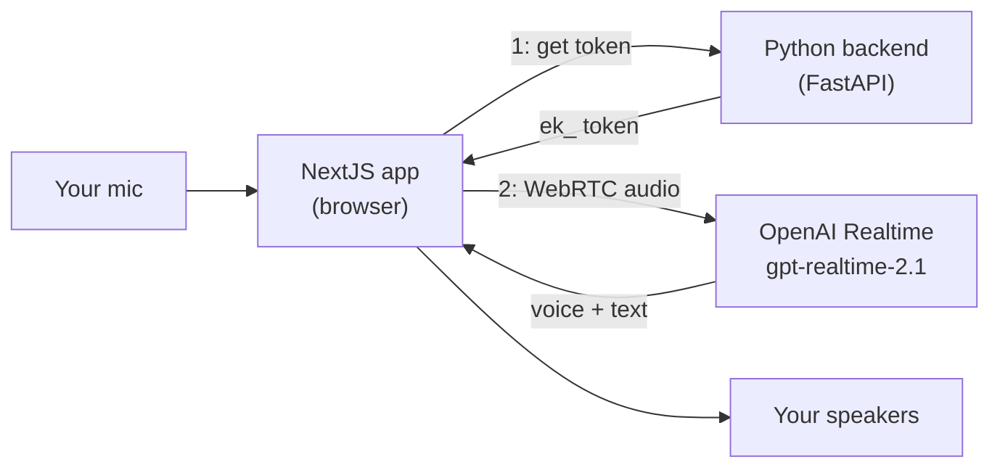

# Voice Agents: a hands-on minicourse

Build a real-time voice web app from the ground up with OpenAI's Realtime API:
a **NextJS + React** frontend and a **Python** backend that demonstrate three
capabilities (**transcription**, **translation**, and a **voice assistant**).

## The three capabilities

| Capability | Model | You will build |
|---|---|---|
| Live transcription | `gpt-realtime-whisper` | a CLI that turns your speech into text as you talk |
| Live translation | `gpt-realtime-translate` | a CLI that translates your voice into another language |
| Voice assistant | `gpt-realtime-2.1` | a browser app you can *talk to* and it talks back |

## The 8 modules (do them in order the first time; each also stands alone)

1. **`01_voice_foundations`**: what voice audio *really* is, and WebSocket vs WebRTC vs PSTN.
2. **`02_realtime_handshake`**: connect to the Realtime API and read its event stream.
3. **`03_transcription`**: capability #1, a live speech-to-text CLI.
4. **`04_translation`**: capability #2, a live voice translator CLI.
5. **`05_voice_assistant_cli`**: capability #3 in the terminal (full duplex, barge-in).
6. **`06_python_backend`**: a FastAPI backend that safely mints browser tokens.
7. **`07_nextjs_frontend`**: the NextJS + React app that talks to the assistant over WebRTC.
8. **`08_capstone_multimode`**: one app, all three modes, plus a tool-calling assistant.

## Setup (once)

```bash
# 1) Put your OpenAI key in the ONE shared secrets file
cd topics/voice_agents
cp .env.example .env         # then edit .env and paste your key

# 2) Each module manages its own environment with uv:
cd 01_voice_foundations
uv sync                      # creates .venv from that module's pyproject.toml
uv run python src/main.py    # (exact run command is in each module's README)
```

Every Python module finds the shared `.env` above it automatically via
`load_dotenv(find_dotenv())`, so you only paste your key once.

## How the pieces fit together



The backend holds the real API key; the browser only ever gets a short-lived
`ek_` token. See `docs/API_FACTS.md` for the verified API details and
`docs/COURSE_DESIGN.md` for the full course blueprint.

---

Built by **mui-group**.
